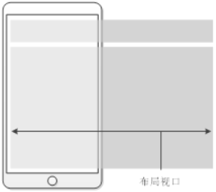
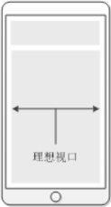
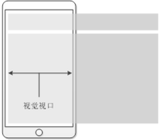

# 移动端适配

## 设备屏幕相关概念

### 屏幕尺寸

对角线的物理长度，单位英寸，1英寸等于2.54厘米。


### 分辨率

屏幕的像素点数

+ 高清：1920 * 1080
+ 4K：也叫QHD或UHD（超高清），最小分辨率为3840 * 2160

iphone6/7/8 分辨率为 1334 * 750，iphone6+/7+/8+的分辨率为1920 * 1080。

> 我们在书写设备分辨率参数时，往往较大数字写在前面。对于PC来说，横向较长，所以第一个参数指代的时宽度。而对于手机和平板而言，纵向较长，所以第二个参数才指代的是宽度。


###  DPI/PPI

Dots Per Inch / Pixels Per Inch，即屏幕上每英寸的像素数量，也就是像素密度

```mathematica
DPI/PPI = 屏幕对角线分辨率 / 屏幕尺寸
```

### 物理像素与逻辑像素

1. 物理像素指的是屏幕设备的一个物理发光单元，每个发光点是由红绿蓝进行组合从而可以显示不同的颜色。
2. 在前端开发中，逻辑像素就是CSS像素。`一个逻辑像素可能对应多个物理像素`。

> 我们常说的分辨率就是设备在长和宽方向物理像素的个数。


### 设备独立像素 DIP

设备独立像素（DIP，device-independent pixel），即`独立于设备的逻辑上衡量像素的单位`，`是对逻辑像素更加官方的、概念化的描述`。在`移动Web开发中`，就是指的是`CSS的逻辑像素`。


### 设备像素比 DPR ⭐

设备像素比（Device Pixel Ratio）是默认`缩放为100%情况下`，`物理像素与逻辑像素的比值`。

> 在移动端，手机和平板很少调节分辨率，即调节逻辑像素的大小。所以DPR就比较固定，就有了两倍屏、三倍屏的说法。

------


## 视口

视口可以理解为设备或文档对象的逻辑尺寸。

前端ppk大神认为，移动设备上有三个viewport（视口）。

但可以换句话说，可以缩放的浏览器中都具有三个视口概念，分别是 布局视口、视觉视口、理想视口。


### 1. 布局视口 layout viewport

布局视口可以理解为文档对象的逻辑尺寸，单位为逻辑像素（CSS像素）。

`在PC端上，布局视口宽度默认等于浏览器窗口的宽度。`而在移动端上，由于要使为PC端浏览器设计的网站能够完全显示在移动端的小屏幕里，此时的布局视口会远大于移动设备的屏幕，就会出现滚动条。

由于历史原因，一些`移动设备的浏览器`具有`默认的布局视口宽度`（单位CSS像素）：

 

获取布局视口的DOM API：

```html
  <script>
      console.log(document.documentElement.clientWidth)
  </script>
```

 


### 2. 理想视口 ideal viewport

理想视口是与设备相关的，是布局视口的一个理想尺寸，只有当布局视口的尺寸等于设备屏幕的尺寸时（`逻辑尺寸，即有多少个逻辑像素`），才是理想视口，此时文档对象宽度与屏幕宽度相同。

移动设备一般具有固定的DPR，即在缩放100%时，用多少个物理像素显示一个逻辑像素，在Web开发中就是用多少个物理像素去显示一个CSS像素。

```mathematica
理想视口宽度 = 移动设备横向分辨率 / DPR
```

 获取理想视口的DOM API：

```html
<script>
    console.log(window.screen.width);
</script>
```


 


### 3. 视觉视口 visual viewport

用户正在看到的网页的区域。用户可以通过缩放来查看网站的内容。如果用户缩小网站，我们看到的网站区域将变大，此时视觉视口也变大了，同理，用户放大网站，我们能看到的网站区域将缩小，此时视觉视口也变小了。`不管用户如何缩放，都不会影响到布局视口的宽度。`

```mathematica
视觉视口的宽度 = 理想视口宽度 / 缩放比例
```

 

 

------


##  利用meta标签控制视口

移动设备的默认布局视口往往大于理想视口，此时就会在横向出现滚动条才能完整的容纳页面。`我们需要的是将页面的布局视口设置为理想视口`，这就改轮到meta标签出场了。

```html
<meta name="viewport" content="width=device-width, initial-scale=1.0, maximum-scale=1.0, user-scalable=no">
```

该meta标签的作用是让layout viewport的宽度等于设备的宽度，同时不允许用户手动缩放。也许允不允许用户缩放不同的网站有不同的要求，但让layout viewport的宽度等于设备的宽度，这个应该是大家都想要的效果，如果你不这样的设定的话，那就会使用那个比屏幕宽的布局视口默认值，也就是说会出现横向滚动条。

meta viewport 标签首先是由苹果公司在其safari浏览器中引入的，目的就是解决移动设备的viewport问题。后来安卓以及各大浏览器厂商也都纷纷效仿，引入对meta viewport的支持，事实也证明这个东西还是非常有用的。

<font color="red">meta viewport 标签只对移动端浏览器有效，对 PC 端浏览器是无效的。</font>

在苹果的规范中，meta viewport 有6个属性(暂且把content中的那些东西称为一个个属性和值)，如下：

| 属性名        | 取值                  | 描述                                                |
| ------------- | --------------------- | --------------------------------------------------- |
| width         | 正整数或device-width  | 定义视口的宽度，单位为像素                          |
| height        | 正整数或device-height | 定义视口的高度，单位为像素，一般不用                |
| initial-scale | [0.0-10.0]            | 定义初始缩放值                                      |
| minimum-scale | [0.0-10.0]            | 定义放大最大比例，它必须小于或等于maximum-scale设置 |
| maximum-scale | [0.0-10.0]            | 定义缩小最小比例，它必须大于或等于minimum-scale设置 |
| user-scalable | yes / no              | 定义是否允许用户手动缩放页面，默认值 yes            |

这些属性可以同时使用，也可以单独使用或混合使用，多个属性同时使用时用逗号隔开就行了。

------


### width属性

width属性用于设置页面的布局视口宽度，属性值不带单位，默认单位为像素。

其`默认值`在不同浏览器中不同，但`大多数为980`。

 

但需要注意的是（以下结论都基于Chrome的测试工具）：

1. `当只设置width属性值，而不指定initial-scale属性值时，大多数浏览器会自动缩放。`

   如果width属性值大于理想视口宽度，则视觉视口放大为width的值，计算得到scale小于1.0；

   如果width属性值小于理想视口宽度，则视觉视口缩小为width的值，计算得到scale大于1.0；

   这么做的目的是让设备屏幕把完整的页面呈现出来（页面横向塞满屏幕，计算得到scale），此时：

   ```mathematica
   布局视口宽度 = 视觉视口宽度 =  理想视口宽度 / 缩放比例
   ```

   > 设置width而不指定initial-scale时， 设置minimum-scale = 1.0会能够阻止浏览器放大视觉视口，设置maximum-scale = 1.0 能够阻止浏览器缩小视觉视口。（这里有点绕，可以联想下放大镜）

2. 将width属性值设置为`device-width`时，大多数浏览器都能把页面的布局视口宽度变为当前设备的理想视口宽度。

   > 但在iphone和ipad上，无论是竖屏还是横屏，`device-width`宽度都是竖屏时理想视口的宽度。


------


### initial-scale属性

initial-scale属性用于设置页面初始的缩放比例，缩放比例为`理想视口`与`视觉视口`的比值。

```mathematica
即：scale = idealViewport / visualViewport
```


**但需要注意的是（以下结论都基于Chrome的测试工具）：**

1. 当只指定`initial-scale属性`，而不设置`width属性`时，浏览器会将`布局视口宽度`设置为视觉视口宽度，以将页面正好铺满屏幕。**可以认为这是一条定律。**
	```mathmetic
	布局视口宽度 = 设备理想视口宽度 / initial-scale
	```

	
	
2. 当指定`initial-scale = 1`，而`不设置width属性`时，大部分浏览器会将`布局视口宽度`设置为`设备理想视口宽度`。**这是由推导得来的。**

  ```mathmatic
  因为 initial-scale = 1
  所以 视觉视口 = 理想视口 ÷ 1.0 = 理想视口
  又因为 没有设置width
  所以 视觉视口 = 布局视口
  所以 视觉视口 = 布局视口 = 理想视口
  ```

   > 但是WP7系统的IE浏览器中使用横屏时，当指定initial-scale = 1，而不指定width属性时，理应的结果应该是视觉视口等于理想视口时，但偏偏此时的布局视口宽度是竖屏时的理想视口宽度。


3.  ❗ 当设置`initial-scale=1 `且同时`设置width属性`时，如果由`理想视口除以init-scale计算得到的视觉视`大于`width`，则`width会被浏览器重置为视觉视口`。（如果计算得到的视觉视口小于布局视口，就不会出现问题，只是会出现滚动条）原因是 👇

	   > 如果视觉视口大于布局视口，就存在逻辑上的问题。
	   >
	   > 比如说，我iphone8设备理想视口为375px，页面init-scale设置为0.75，那么视觉视口等于375/0.75 = 500px，若width设置为375或device-width，也就是出现了视觉视口大于布局视口的情况。
	   >
	   > 那浏览器就纳闷了，你要让我显示500px范围宽的页面，但你告诉我页面实际上只有375px宽，不是奇了怪了吗？所以当视觉视口大于布局视口时，布局视口宽度width会被重置成视觉视口宽度，这应该是浏览器的策略，用于避免显示上的逻辑问题。


------


### width=device-width, initial-scale=1

**目的**：

让我们写的页面在水平方向上恰好与各个设备的屏幕严丝合缝，需要将页面布局视口设置为设备理想视口。

**但是**：

+ 只设置`width = device-width` 苹果移动设备横屏时会有bug
+ 只设置`init-scale = 1` WP7系统IE浏览器横屏会有bug

**终极方案**：

将`meta:vp标签`的属性值设置为`width=device-width, initial-scale=1`就不仅能够将页面的布局视口自动设置为各个移动设备的理想视口，还能够同时兼容iphone、ipad的Safari以及WP7 IE浏览器的横屏问题。

```html
<meta name="viewport" content="width=device-width, initial-scale=1">
```


## 移动端屏幕宽度适配方案

### 1. 固定大小 px

+ 按照最小的屏幕宽度进行布局，让主题内容居中，这样做能保证排版不会发生错误。

  > 大屏幕时两边会存在留白。

+ 配合媒体查询，在大屏幕时进行布局修改，适当减小两边留白。


### 2. 百分比

+ 高度固定
+ border-box


### 3. rem

根据设备屏幕的理想视口动态控制rem大小。

```javascript
/* phone.js */
/* 在设计稿上是n像素，在写css时就是0.01n rem */
(function (doc, win) { 
   let rem;
   let designWidth = 750;  // 根据设计稿进行设置
   let ratio = 100; // ratio为人为放大的比例，防止rem小于浏览器限制的最小尺寸，同时要使计算方便。
   const html = doc.documentElement,
         resizeEvt = 'orientationchange' in window? 'orientationchange' : 'resize';
    
   win.addEventListener(resizeEvt, cb, false);
   doc.addEventListener('DOMContentLoaded', cb, false);
   
   function cb () {
     const _deviceWidth = html.clientWidth; // 获取布局视口大小,meta标签设置的device-width
     if( !_deviceWidth ) return;
     if( _deviceWidth >= 750 ) {  // device-width>=750，平板或者桌面
         rem = '100px'; // 平板或者桌面rem设置为100px;
     } else {
         rem = ratio * _deviceWidth  / designWidth + 'px';
     }
     html.style.fontSize = rem;
   }
    
})(document, window);

```


### 4. vw适配

```scss
/*
计算公式 rem = ratio * 100 / designWidth
*/
html {
    font-size: 15.625vw; /* 设计稿为640， 放大100倍*/
    font-size: 13.333333vw; /* 设计稿为750， 放大100倍 */
    font-size: 9.259259vw; /* 设计稿为1080，放大100倍*/
}
```


## 移动端盒子布局常用方法

### 1. 弹性盒子

### 2. 百分比

### 3. 尺寸大小单位用rem