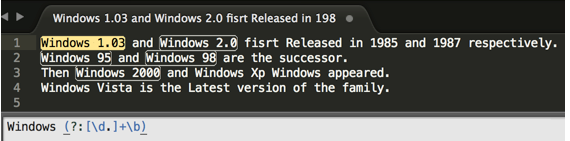
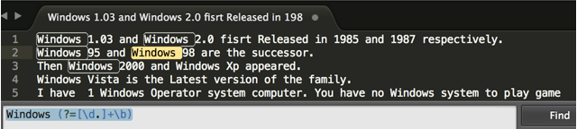
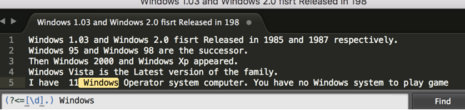
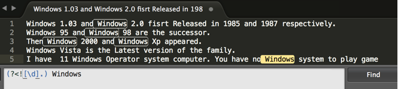

# JS字符串常用方法

## length属性

返回字符串的长度


## 查找子串索引

### indexOf (*substr*, [ *start* = 0 ])

`indexOf`方法搜索并(如果找到)返回字符串中搜索到的字符或子字符串的索引。如果没有找到，则返回`-1`。`start`是一个可选参数，指定字符串中开始搜索的位置，默认值为`0`。

```javascript
//indexOf(char/substring)
var sentence="Hi, my name is Sam!"
if (sentence.indexOf("Sam")!=-1)
alert("Sam is in there!")
```


### lastIndexOf (*substr*, [ *start* = length-1] )

`lastIndexOf()` 方法返回指定文本在字符串中最后一次出现的索引, 如果未找到，则返回`-1`。 “`start`”是一个可选参数，指定字符串中开始搜索的位置, 默认值为`string.length-1`。若指定`start`，则在`0~start`之间的子串中查找目标子串。

```javascript
//lastIndexOf(substr, [start])
var myString = 'javascript rox';
console.log(myString.lastIndexOf('r'));
//output: 11
```


## 子串切片

### charAt (*index*)

`charAt(x)`返回字符串中`x`位置的字符，下标从 `0` 开始。

```javascript
//charAt(x)
var myString = 'jQuery FTW!!!';
console.log(myString.charAt(7));
//output: F
```


### slice (*start*, [ *end* = length-1])

`slice()` 方法可提取字符串的某个部分，返回一个新的字符串。包括字符串从 `start` 开始（包括 start）到 `end` 结束（不包括 `end`）为止的所有字符。

```javascript
//slice(start, end)
var text="excellent"
text.slice(0,4) //returns "exce"
text.slice(2,4) //returns "ce"
```


### substr (*start*, [ *len* = length ])

`substr()` 方法可在字符串中抽取从 `start` 下标开始的指定数目的字符。返回一个新的字符串，包含从 `start`（包括 start 所指的字符） 处开始的 `length` 个字符。如果没有指定 `length`，那么返回的字符串包含从 `start` 到该字符串的结尾的字符。

```javascript
//substr(from, to)
var text="excellent"
text.substr(0,4) //returns "exce"
text.substr(2,4) //returns "cell"
```


### substring (*from*, [ *to* = length -1 ])

`substring()` 方法用于`返回`一个字符串中介于两个指定下标之间的字符，方返回的子串包括 `start` 处的字符，但不包括 `to` 处的字符，`to` 可选，如果省略该参数，那么返回的子串会一直到字符串的结尾。

```javascript
//substring(from, [to])
var myString = 'javascript rox';
myString = myString.substring(0,10);
console.log(myString)
//output: javascript
```


### slice、substr、substring三个方法的区别

1. slice和substring参数分别为(起始位置索引值，结束位置索引值)，substr的参数则为(起始位置索引值，截取长度)；
2. slice不能颠倒参数顺序，substring可以；
   + slice方法中，`start` 不可以大于等于 `end`，否则返回空串。
   + substring方法中，`from`若大于等于`to`，但返回的结果为`[to, from)`范围内的子串。
3. slice和substring的参数为负时，结果不同。
   + slice方法允许参数为负，`负参数与length相加`得到实际的形参值。`如果相加结果仍为负数，则等效为0。`
   + substring方法不允许参数为负，`负实参`的形参值为`0`。

## 内容检测

> 以下方法都是对searchString大小写敏感的。

### includes (*searchString*, [ *position* = 0 ])

`includes()` 方法用于检查字符串是否包含指定的字符串或字符。`position`为从当前字符串的哪个索引位置开始搜寻子字符串，默认值为 `0`。

```javascript
//endsWith()
var mystr = "List of javascript functions";
var n = mystr.endsWith("functions");
//output: True
```


### startsWith (*searchString*, [ *postion* = 0 ])

**参数**

- `searchString`

  要搜索的子字符串。

- `position` 可选

  在 `str` 中搜索 `searchString` 的开始位置，默认值为 0。

**返回值**

如果在字符串的开头找到了给定的字符则返回**`true`**；否则返回**`false`**。


### endsWith ( *searchString*, [ *len* = length] )

`endWith`方法用来判断当前字符串是否是以另外一个给定的子字符串“结尾”的，根据判断结果返回 `true` 或 `false`。

**参数**

- `searchString`

  要搜索的子字符串。

- `length` 可选

  在字符串的前length个字符中进行判断。默认值为 `str.length`。

```javascript
const str1 = 'Cats are the best!';

console.log(str1.endsWith('best', 17));
// expected output: true

const str2 = '12345';
console.log(str2.endsWith('34', 4)); // length = 4
// expected output: true

```

> 注意： 以上两个方法名是end<font color = 'red'>s</font>With 以及 start<font color = 'red'>s</font>With


## 大小写

### toUpperCase ()

### toLowerCase ()

返回一个新的字符串。


## 填充与修剪

> 注意： 以下方法只会返回新字符串，不会修改原字符串。

### padStart (*targetLength* [, *padString*])

该方法用另一个字符串填充当前字符串(如果需要的话，会重复多次)，以便产生的字符串达到给定的长度。从当前字符串的左侧开始填充。

**参数**

`targetLength`

当前字符串需要填充到的目标长度。如果这个数值小于当前字符串的长度，则返回当前字符串本身。

`padString` 可选

填充字符串。如果字符串太长，使填充后的字符串长度超过了目标长度，则只保留最左侧的部分，其他部分会被截断。此参数的默认值为 `" "`（U+0020），`即空格`。

**返回值**

在原字符串末尾填充指定的填充字符串直到目标长度所形成的新字符串。


### padEnd (*targetLength* [, *padString*])

用法与padStart类似


### trim()、trimEnd()、trimStart()

```javascript
const greeting = '   Hello world!   ';

console.log(greeting);
// expected output: "   Hello world!   ";

console.log(greeting.trim());
// expected output: "Hello world!";

console.log(greeting.trimStart());
expected output: "Hello world!   ";

console.log(greeting.trimEnd());
// expected output: "   Hello world!";
```


##  拼接与分割

### concat(*str2*, [, *...strN*])

**参数**

- `str2 [, ...strN]`

  需要连接到 `str` 的字符串。

**返回值**

一个新的字符串，包含参数所提供的连接字符串。

**描述**

`concat` 方法将一个或多个字符串与原字符串连接合并，形成一个新的字符串并返回。 `concat` 方法并不影响原字符串。

如果参数不是字符串类型，它们在连接之前将会被转换成字符串。


### repeat(*count*)

`repeat()` 构造并返回一个新字符串，该字符串包含被连接在一起的指定数量的字符串的副本。

```javascript
//repeat()
var string = "Welcome to Edureka";
console.log(string.repeat(2));
//output: Welcome to EdurekaWelcome to Edureka
```


> 注意： 以上方法只会返回新字符串，不会修改原字符串。


### split([ *separator = ''* ], [ *limit = INFINIT* ] )

**参数**

- `separator`

  指定表示每个拆分应发生的点的字符串。`separator` 可以是一个字符串或[正则表达式](https://developer.mozilla.org/zh-CN/docs/Web/JavaScript/Reference/Global_Objects/RegExp)。

  1. 如果没有找到或者省略了分隔符，则该数组包含一个由整个字符串组成的元素。
  2. 如果分隔符为空字符串，则将str转换为字符数组。
  3. 如果分隔符出现在字符串的开始或结尾，或两者都分开，分别返回的数组以空字符串开头，结尾或两者开始和结束。因此，如果字符串仅由一个分隔符实例组成，则该数组由两个空字符串组成。

- `limit`

  一个整数，限定返回的分割片段数量。当提供此参数时，split 方法会在指定分隔符的每次出现时分割该字符串，但在限制条目已放入数组时停止。如果在达到指定限制之前达到字符串的末尾，它可能仍然包含少于限制的条目。新数组中不返回剩下的文本。

**返回值**

返回源字符串以分隔符出现位置分隔而成的一个 [`Array`](https://developer.mozilla.org/zh-CN/docs/Web/JavaScript/Reference/Array) 


## 替换

> 注意：以下方法只会将替换的结果返回，不会改变原字符串。

### replace( *substr*, *newSubStr*)

**参数**

- `substr `(pattern)

  一个将被 `newSubStr` 替换的 [`字符串`](https://developer.mozilla.org/zh-CN/docs/Web/JavaScript/Reference/String)。其被视为一整个字符串，而不是一个正则表达式。仅第一个匹配项会被替换。

- `newSubStr` (replacement)

  用于替换掉第一个参数在原字符串中的匹配部分的[`字符串`](https://developer.mozilla.org/zh-CN/docs/Web/JavaScript/Reference/String)。


**返回值**

一个部分或全部匹配由替代模式所取代的新的字符串。

**描述**

该方法并不改变调用它的字符串本身，而只是返回一个新的替换后的字符串。


### replaceAll (substr, *replacement* )

该方法返回一个新字符串，即使substr不是一个正则表达式，新字符串所有与 `substr` 相同的部分都会被`replacement` 替换。

> 注意，在Node环境中，Node.js 15.0以上版本才支持此方法

**参数**

- `substr `

  一个将被 `newSubStr` 替换的 字符串。

- `newSubStr` (replacement)

  用于替换掉第一个参数在原字符串中的匹配部分的[`字符串`](https://developer.mozilla.org/zh-CN/docs/Web/JavaScript/Reference/String)。

**返回值**

一个部分或全部匹配由替代模式所取代的新的字符串。

**描述**

该方法并不改变调用它的字符串本身，而只是返回一个新的替换后的字符串。


## String.raw

在JS中，`String.raw`后面跟上一个`反引号`括起的字符串，其作用类似于python中的 `r`修饰符。

```python
# python
s1 = r'c:\home'
```

```javascript
// JavaScript
let s1 = String.raw `c:\home`
```


# JS正则相关

**Regular Expression：RegExp**

## 创建JS正则表达式对象

1. `/正则表达式/修饰符`

   ```javascript
   let reg = /^\d+$/mg;
   ```

   

2. ```javascript
   let reg = new RegExp('正则表达式的字符串形式', [修饰符])
   // 例：
   let reg = new RegExp('^\\d+$', 'gm');
   // 或
   let reg = new RegExp(String.raw`^\d+$`, 'gm');
   或
   let pattern = '^\\d+$';
   let reg = new RegExp(String.raw `${pattern}`, 'gm')
   
   console.log(reg);
   // 输出👉 /^d+$/gm
   ```

   

## 量词元字符

| 元字符  | 匹配出现次数      |
| ------- | ----------------- |
| `*`     | 0到多次           |
| `+`     | 1到多次           |
| `?`     | 0或1次            |
| `{n}`   | 出现n次           |
| `{n,m}` | 出现n到m次，包含m |
| `{n,}`  | 出现n到多次       |


## 特殊元字符

| 元字符          | 含义                                                         |
| --------------- | ------------------------------------------------------------ |
| `\`             | 转义符，`\\`匹配一个反斜杠                                   |
| `.`             | 匹配除`\n`以外的任意单个字符                                 |
| `^`             | 匹配字符串开头位置                                           |
| `$`             | 匹配字符串结尾位置                                           |
| `\n`            | 匹配一个换行符                                               |
| `\d`            | 匹配0~9之间的一个数字字符                                    |
| `\D`            | 匹配除0~9之外的一个字符                                      |
| `\w`            | 匹配数字、字母、下划线中的任意一个字符                       |
| `\W`            | 匹配除了数字、字母、下划线外的一个字符                       |
| `\s`            | 匹配空白字符，包括`\n`,`\r回车`,`\f换页`,`\t`,`\v`等         |
| `\S`            | 匹配除空白字符以外的一个字符                                 |
| `\b`            | 匹配单词边界位置                                             |
| `[xyz]`         | 匹配中括号内的一个字符                                       |
| `[^xyz]`        | 中括号内带`^`表示匹配中括号内以外的一个字符                  |
| `[0-9]`         | 匹配一个0~9数字，还可以写`[0-35-9]`用于排除一个数字          |
| `[a-zA-Z]`      | 匹配一个英文字母，还可以写`[a-cD-Z]`等指定范围内的字母       |
| `\特殊含义字符` | `\.`匹配`.`，此外还有`\*`  `\+`  `\?` `\^` `\$` `\{` `\}` `\(` `\)` |
| `(x|y)`         | 匹配左右中的一种规则，`|`不配合`()`使用会存在歧义            |
| `\数字num`      | 匹配从左到右第num个分组                                      |


## 修饰符

| 修饰符 | 含义       | 作用                                                         |
| ------ | ---------- | ------------------------------------------------------------ |
| `i`    | ignoreCase | 忽略大小写                                                   |
| `g`    | global     | 全局匹配，消除懒惰性                                         |
| `m`    | multiline  | 多行匹配，主要是修改`^`和`$`在正则表达式中的作用，让它们分别表示行首和行尾。 |

```javascript
var str="This is an\n antzone good";
var reg=/an$/;
console.log(str.match(reg));
//以上代码不能够匹配字符串"an"，尽管"an"后面已经换行了，但是并没有采用多行匹配，所以不是字符串行的结尾。

var str="This is an\n antzone good";
var reg=/an$/m;
console.log(str.match(reg));
//以上代码可以匹配字符串"an"，因为采用了多行匹配。
```


## 用括号进行分组

**使用索引进行反向引用**

```javascript
let str = '<div>hello</div>';
let reg = /<([a-z]+)>.*<\/\1>/;  // `\1`可以匹配第一个分组
console.log(reg.exec(str));
//输出👇
[
  '<div>hello</div>',
  'div',
  index: 0,
  input: '<div>hello</div>',
  groups: undefined
]
```


**使用分组名进行反向引用**

> 命名捕获分组自身的语法是 `(?<name>pattern)`，比普通的分组多了一个 `?<name> `字样，其中 name 的起法就和你平时起变量名一样即可（不过在这里关键字也可用）。
>
> 反向引用一个命名分组的语法是 `\k<name>`，注意命名分组同样可以通过数字索引来反向引用。
>
> 比如： `/(?<foo>a)\k<foo>\1/.test("aaa") // true`

```javascript
// 举例
let str = '<div>hello</div>';
let reg = /<(?<group1>[a-z]+)>.*<\/\k<group1>>/;  // \k<group1>可以匹配分组名为group1的分组
console.log(reg.exec(str));
// 输出👇
[
  '<div>hello</div>',
  'div',
  index: 0,
  input: '<div>hello</div>',
  groups: [Object: null prototype] { group1: 'div' } // group1分组保存在了exec返回值的groups属性中
]
```


## 括号的更多作用

1. **提高优先级**

   特别是在与`|`配合使用时，提高优先级避免歧义。

2. **分组匹配**

   在括号内的规则被视为一个分组，在分组捕获时能够提取到分组中的内容。

3. **只匹配不捕获**

   即`(?:)`，只提高优先级，但不会在分组捕获时被捕获

4. **正向预查（定义指定右边界）**

   即`(?=合法边界pattern)`

5. **负向预查（定义排除右边界）**

   即`(?!不合法边界pattern)`

6. **正向预查（定义指定左边界）**

   即`(?<=指定边界pattern)`

7. **负向预查（定义排除左边界）**

   即`(?<!排除边界pattern)`


[正向预查和反向预查](https://www.cnblogs.com/wjw-blog/p/7526994.html)


日常工作当中，大多数IDE自带的查找工作都能满足大多数需要。

加上正则匹配简直如虎添翼。匹配个邮箱，电话号什么的不在话下。有时候我们可能会遇到稍微特殊的场景。

文本：

Windows 1.03 and Windows 2.0 fisrt Released in 1985 and 1987 respectively.
Windows 95 and Windows 98 are the successor.
Then Windows 2000 and Windows Xp Windows appeared.
Windows Vista is the Latest version of the family.

**例如上面这一段话，有几个场景：**

+ 我们想匹配 Windows 后面是数字版本号的Windows 和这些字符。如 Windows 1.03 等等。

  用`?: `捕获不匹配， 即 Windwos (?:[\d.]+\b)如下图，这是直接匹配结果 , 匹配出了Windows 1.03,Windows 2.0, Windows 95,Windows 98,Windows 2000,但是没有匹配到Windows Xp, Windows Vista,等

   

  

+ 我们只想匹配满足这些条件的'Window' ，但不包括后面的字符。

  用` (?= pattern) ` 即 `Windows (?=[\d.]+\b) `他把Windows的空格也匹配了。这一过程就是==正向预查==。

   


+ 如果我想匹配这些Windows 字段，它==后面跟的不是数字或者版本号==，

  我改用`(?!pattern)`即`Windows (?![\d.]+\b)`这一过程叫做==反向预查==, 它匹配后面跟着不满足pattern（ [\d.]+\b) 的Windows。


+ 我想匹配Windows前面是数字的Windows

  我们用 `(?<=[\d].) Windows`这叫==正向预查定义左边界==(`<`左箭头就说明了是从右往左，即负向)，他们匹配Windows==前面是一个或者多个数字==的'Windows'.

  如图这里只匹配到了 和11挨着的 Windows。

   


+ 我想匹配Windows前面不是数字的Windows。我想匹配 Windows 前面不是数字的Windows ，通常叫做==负向预查定义左边界==

  用`(?<![0-9.]+) Windows`匹配前面不是数字和`.`的` Windows`（注意前面带一个空格）

   

  而使用`(?<![0-9.]+\b\s\b)Windows`还会匹配字符串开头的Windows。

  

> 正向预查可以理解成 自定义右边界，这个边界位于匹配内容正向（右侧）。
>
> 负向预查可以理解成 自定义左边界，这个边界位于匹配内容的负向（左侧）。
>
> 正向、负向预查又可以分别可以定义满足条件的边界条件以及需要排除的边界情况。

<font color="red">更需要注意的是： 正向预查和反向预查不消耗字符，也不会捕获，尤其是正向预查。</font>

```javascript
// 举例说明：
let reg = /windows(?=\b\s[0-9.]+)/g
let str = 'windows 8.1 windows';
console.log(reg.test(str));
console.log(reg.lastIndex);
//输出👉 true
//输出👉 7
```


## 懒惰性

非全局匹配的正则表达式在匹配字符串时具有懒惰性，即只会匹配从左到右第一个匹配项。

解决方法：创建正则表达式时加上`g`修饰符。（此时global属性值为true）

```javascript
let reg = /\d+/;
let str = '123abc321';
console.log(str.match(reg));
// 输出 👉 ["123", index: 0, input: "123abc321", groups: undefined]
```

```javascript
// 加上g修饰
let reg = /\d+/g;
let str = '123abc321';
console.log(str.match(reg));
// 输出 👉 ["123", ”321“]
```


## 贪婪性

存在量词元字符的正则表达式进行匹配时，会尽可能多地匹配量词前的普通/特殊元字符，此策略称为正则匹配的==贪婪性==。

取消贪婪性：在量词后面加`?`修饰量词，就会匹配最少量的普通/特殊元字符。

```javascript
let reg = /\d+?/g;
let str = '123abc321';
console.log(str.match(reg));
//输出👉 ["1", "2", "3", "3", "2", "1"]

```


## 正则匹配

+ `RegExp.prototype.test()`

  如果不匹配，则返回false；

  如果传入的字符串匹配正则，则返回true；
  
  > hack：test方法其实也可以用于捕获，上一条匹配的字符串保存在RegExp函数对象的lastInput属性中，上一条捕获到的匹配项保存在lastMatch属性中，捕获到的分组分别保存在$1~$9属性中，所以用test方法最多能捕获9个分组。


## 正则捕获

+ `RegExp.prototype.exec()`

  如果无法匹配，则返回null；

  如果匹配：

  + 如果this.global \=\=\= false，即懒惰匹配，则返回一个数组，数组索引为0的元素是匹配到的第一个字符串，剩余索引元素为分组捕获的内容。此外该数组还具有index，input以及groups属性。

  + 如果this.global \=\=\= true，即全局匹配，则返回一个数组，该数组为基于this.lastIndex的==下一条==匹配内容，同样索引为0的是匹配到的字符串，剩余索引元素为分组捕获的内容。==当this.lastIndex大于等于字符串参数的长度时，返回null，并重置this.lastIndex =0。==

    > 注意：
    >
    > 在全局匹配下，在非必要情况下，避免直接操作RegExp对象的lastIndex属性。
    >
    > 非全局匹配时，修改RegExp对象的lastIndex属性不起作用，仍然懒惰地返回第一个匹配项。


## 字符串的match方法

**`str.match(regexp)`**

**参数**

**regexp：**

一个正则表达式对象。如果传入一个非正则表达式对象，则会隐式地使用 `new RegExp(obj)` 将其转换为一个 [`RegExp`](https://developer.mozilla.org/zh-CN/docs/Web/JavaScript/Reference/RegExp) 。如果你没有给出任何参数并直接使用match() 方法 ，你会得到一 个包含空字符串的 [`Array`](https://developer.mozilla.org/zh-CN/docs/Web/JavaScript/Reference/Array) ：[""] 。

**返回值**

- 如果使用g标志，则将返回与完整正则表达式匹配的所有结果，但不会返回分组捕获的信息。

- 如果未使用g标志，则仅返回第一个完整匹配及其相关的捕获组（`Array`），即正则表达式对象exec方法返回的内容。 在这种情况下，返回的项目将具有如下所述的其他属性。

  附加属性

  - `groups`: 一个捕获组数组 或 [`undefined`](https://developer.mozilla.org/zh-CN/docs/Web/JavaScript/Reference/Global_Objects/undefined)（如果没有定义命名捕获组）。
  - `index`: 匹配的结果的开始位置
  - `input`: 搜索的字符串.

```javascript
let reg = /\{([0-9]+)\}/g;
let str = '{123}abc{456}';
console.log(str.match(reg));
// 输出👉 [ '{123}', '{456}' ]   无法捕获分组中的数字
```


## 字符串的matchAll方法

**`str.matchAll(regexp)`**

**参数**

**regexp：**

正则表达式对象。如果所传参数不是一个正则表达式对象，则会隐式地使用 `new RegExp(obj)` 将其转换为一个 `RegExp` 。

>  RegExp必须是设置了全局模式`g`的形式，否则会抛出异常`TypeError`。

**返回值**

一个迭代器（不可重用，结果耗尽需要再次调用方法，获取一个新的迭代器）。

**强大之处：**

使用 `matchAll` 可以通过如下方式获取分组捕获：

```javascript
let array = [...str.matchAll(regexp)];

array[0];
// ['test1', 'e', 'st1', '1', index: 0, input: 'test1test2', length: 4]
array[1];
// ['test2', 'e', 'st2', '2', index: 5, input: 'test1test2', length: 4]
```

在 `matchAll` 出现之前，通过在循环中调用 `regexp.exec()` 来获取所有匹配项信息（regexp 需使用 `/g` 标志）：

```javascript
const regexp = RegExp('foo[a-z]*','g');
const str = 'table football, foosball';
let match;

while ((match = regexp.exec(str)) !== null) {
  console.log(`Found ${match[0]} start=${match.index} end=${regexp.lastIndex}.`);
  // expected output: "Found football start=6 end=14."
  // expected output: "Found foosball start=16 end=24."
}
```

如果使用 `matchAll` ，就可以不必使用 while 循环加 exec 方式（且正则表达式需使用 `/g` 标志）。使用 `matchAll` 会得到一个迭代器的返回值，配合 `for...of`, `array spread`, 或者 `Array.from()` 可以更方便实现功能：

```javascript
const regexp = RegExp('foo[a-z]*','g');
const str = 'table football, foosball';
const matches = str.matchAll(regexp);

for (const match of matches) {
  console.log(`Found ${match[0]} start=${match.index} end=${match.index + match[0].length}.`);
}
// expected output: "Found football start=6 end=14."
// expected output: "Found foosball start=16 end=24."

// matches iterator is exhausted after the for..of iteration
// Call matchAll again to create a new iterator
Array.from(str.matchAll(regexp), m => m[0]);
// Array [ "football", "foosball" ]
```


⭐⭐`matchAll` 内部做了一个 regexp 的复制，所以不像 [regexp.exec](https://developer.mozilla.org/en-US/docs/Web/JavaScript/Reference/Global_Objects/RegExp/exec), `lastIndex` 在字符串扫描时不会改变。

```javascript
const regexp = RegExp('[a-c]','g');
regexp.lastIndex = 1;
const str = 'abc';
Array.from(str.matchAll(regexp), m => `${regexp.lastIndex} ${m[0]}`);//👈没有改变实参regexp的内容
// Array [ "1 b", "1 c" ]
```


## 字符串的replace方法

**`str.replace(regexp, newSubStr | function)`**

**参数**

+ regexp

  一个RegExp对象或者其字面量，该正则所匹配的内容会被第二个参数的返回值替换掉。

+ newSubStr

  用于替换掉第一个参数在原字符串中的匹配部分的字符串。==该字符串中可以内插一些特殊的变量名==。

+ function

  一个用来创建新字符串的函数，==正则匹配多少次，该函数就调用多少次==。==该函数的返回值将替换掉每次正则匹配的内容==。

  

**返回值：** 一个部分或全部匹配由替代模式所取代的新的字符串。

> 如果regexp没有`g`修饰，则至多执行一次匹配替换。

**特殊变量名**

| 变量名    | 代表的值                                                     |
| --------- | ------------------------------------------------------------ |
| `$$`      | 插入一个 "$"。                                               |
| `$&`      | 插入匹配的子串。                                             |
| $`        | 插入当前匹配的子串左边的内容。                               |
| `$'`      | 插入当前匹配的子串右边的内容。                               |
| `$n`      | 假如第一个参数是 `RegExp`对象，并且 n 是个小于100的非负整数，那么插入第 n 个括号匹配的字符串。提示：索引是从1开始。如果不存在第 n个分组，那么将会把匹配到到内容替换为字面量。比如不存在第3个分组，就会用“$3”替换匹配到的内容。 |
| `$<Name>` | 这里*`Name`* 是一个分组名称。如果在正则表达式中并不存在分组（或者没有匹配），这个变量将被处理为空字符串。只有在支持命名分组捕获的浏览器中才能使用。 |

```javascript
// 举例1
let str = '2020-12-22';
let reg = /^([0-9]{4})-([0-9]{1,2})-([0-9]{1,2})$/;
console.log(str.replace(reg, '$1年$2月$3日'));
//输出👉 2020年12月22日

// 还可以这样做,对分组命名再引用
reg = /^(?<year>[0-9]{4})-(?<month>[0-9]{1,2})-(?<day>[0-9]{1,2})$/;
console.log(str.replace(reg, '$<year>年$<month>月$<day>日'));
```

```javascript
// 举例2
let str = 'aaa123bbb';
let reg = /[0-9]+/;
console.log(str.replace(reg, "-$`-$'-"));
// 输出👉 aaa-aaa-bbb-bbb
```

> 个人感觉：在newSubStr使用 $` 和 $'  ，一般不会配合全局匹配正则表达式使用。


**在第二个参数中使用function**

使用`str.replace(regExp, function(...args) {......})`时

function的形参分别对应regExp.exec(str)返回数组中的每一个元素。

```javascript
// 举例
let str = '123abc 321eee';
let reg = /([0-9]+)([a-z]+)/g;
str = str.replace(reg, (matched, $1, $2) => {
    console.log(matched);
    return $1+$2.toUpperCase()
});
console.log(str);
// 输出👇
123abc
321eee
"123ABC 321EEE"

```


## 字符串的replaceAll方法

replaceAll方法在第一个参数为`RegExp对象`时的功能与replace方法基本一致。

但有不同点：

`replace`方法的第一个参数可以没有`g`修饰，相应地最多执行一次替换操作。而`replaceAll`方法第一个参数没有`g`修饰，则会抛出异常`TypeError`。


## 字符串的split方法

**`str.split(regExp)`**

**参数**

+ regExp 一个正则表达式对象

**返回值**

返回一个数组，数组各元素是由所有匹配到的子串分割后得到的。

```javascript
// 举例
let reg = /-+/;
let str = '123-foo---bar';
console.log(str.split(reg));
//输出👉 [ '123', 'fafas', '413123' ]
```

> 注意：输入到split方法中的正则表达式，在非必要情况下避免使用分组，否则可能出现意想不到的情况。
>
> 例如下面的情况：

```javascript
// 举例
let reg = /(-+)/;
let str = '123-foo---bar';
console.log(str.split(reg));
// 输出👉 [ '123', '-', 'foo', '---', 'bar' ] 
```

