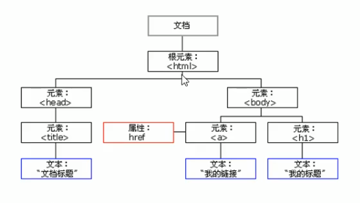
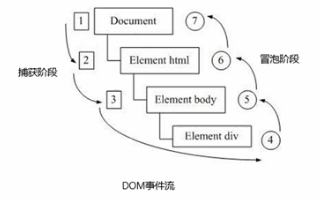
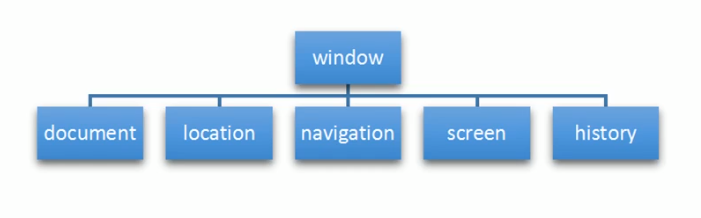

# Web APIs

+ API是为我们程序员提供的一个接口，帮助我们实现某种功能，我们会使用就可以了，不必纠结其内在实现。
+ Web API主要是浏览器提供接口，允许我们操作BOM和DOM元素。
+ API一般都是函数或方法，有输入和输出，Web API也不例外。


## DOM

文档对象模型（Document Object Model），是W3C阻止推荐的处理可扩展标记语言（HTML或XML）的标准编程接口。

W3C已经定义了一系列的DOM接口，通过这些DOM接口可以改变网页的内容、结构和样式。


### DOM 树



#### 概念

1. 节点：网页中的所有内容都是节点（标签、属性、文本、注释等），DOM使用node表示节点，节点也就是一个个节点对象。
2. 元素：HTML标签就是元素，DOM中使用element表示。
3. 文档：一个页面就是一个文档，DOM中用document表示


#### 常用节点

+ 文档节点，特指 document
+ 元素节点，即HTML标签元素
+ 属性节点 , 可以通过element.getAttributeNode(attrName) 获得
+ 文本节点


#### 节点的共有属性

|          | nodeName   | nodeType | nodeValue  |
| -------- | ---------- | -------- | ---------- |
| 文档节点 | \#document | 9        | null       |
| 元素节点 | 标签名 ⭐   | 1        | null       |
| 属性节点 | 属性名     | 2        | 属性值     |
| 文本节点 | \#text     | 3 ⭐      | 文本内容 ⭐ |


------


### DOM 查询

#### 兼容 IE8：

+ `document.getElementById(id)`

+ `element.getElementsByTagName(tageName)`

+ `document.getElementsByName(name)`

#### HTML5新增 IE9+：

+ `element.getElementByClassName(className)`
+ `element.querySelector(selector)`
+ `element.querySelectorAll(selector)`

#### 特殊元素的获取

+ html元素：`document.documentElement`
+ body元素：`document.body`
+ head元素：`document.head`


#### 查询方法分类

1. document的方法：

   + getElementById
   + getElementsByName

2. 可以变化范围的属于一般element的方法：

   + getElementsByTagName
   + getElementsByClassName
   + querySelector
   + querySelectorAll

3. 返回查询到的第一个元素的：

   + getElementById
   + querySelector

4. 返回一个NodeList的：

   + getElementsByName
   + getElementsByTagName
   + getElementsByClassName
   + querySelectorAll

   > NodeList是一个伪数组，只实现了ForEach方法。


------


### 层级关系

#### 1. 子节点

+ `childNodes`属性

  属性值为当前节点的所有子节点所组成的伪数组`NodeList`，包含文本子节点。

+ `firstChild`属性

  属性值为第一个子节点，如果不存在子节点，则值为`null`

+ `lastChild`属性

  属性值为最后一个子节点，如果不存在子节点，则值为`null`

 

+ `children`属性

  属性值为当前节点的所有`子元素节点`所组成的伪数组`NodeList`，不包含文本字节点。

  > children属性是非标准属性，但兼容所有浏览器，放心使用。

+ `firstElementChild`属性 

  IE9+支持，属性值为第一个`子元素节点`，如果不存在子元素节点，则值为`null`

  > 实际开发中尽量使用node.children[0]代替firstElementChild

+ `lastElementChild`属性

  IE9+支持，属性值为最后一个`子元素节点`，如果不存在子元素节点 ，则值为`null`

  > 实际开发中尽量使用node.children[node.children.length-1]代替lastElementChild


#### 2. 父节点

+ `parentNode`属性

  返回当前节点的父节点。

  > html的父节点是document，document的父节点是null。


#### 3. 兄弟节点

+ `previousSibling`属性

  属性值为当前节点的前一个兄弟节点 （可能为文本节点），若不存在则值为`null`

+ `nextSibling`属性

  属性值为当前节点的后一个兄弟节点（可能为文本节点），若不存在则值为`null`


+ `previousElementSibling`属性

  IE9+支持，属性值为当前节点的前一个兄弟`元素节点 `，若不存在则值为`null`

+ `nextElementSibling`属性

  IE9+支持，属性值为当前节点的后一个兄弟`元素节点`，若不存在则值为`null`


------


### DOM 操作

#### 读写文本或HTML片段

通过以下DOM元素的属性，可以操作元素的内容：

1. innerText
2. innerHTML
3. textContent

区别：

+ innerText：返回由css决定的可显示的子节点中所有的文本内容。`display: none的元素的文本子节点会被忽略`，文本节点text两端的空白字符会被忽略（导致全是空白字符的文本节点会被忽略），文本节点text内的换行符当作一个空格来处理，块元素的文本与其他文本节点内容之间用"\n"连接，内联元素的文本与文本节点的文本之间用""连接。由于受css影响，会触发回流。
+ textContent：不受css影响（`display: none的元素不会被忽略`），返回所有子结点中所有的文本内容，保留所有空白字符。文本内容间用""连接。
+ innerHTML：返回元素的HTML代码，不忽略空白字符，保留换行符。

> 以上属性都可以读写。

------


#### DOM 增删改

**1. 创建文本节点**

`document.createTextNode(text)`

返回nodeValue为text的文本节点

```javascript
const tNode = document.createTextNode('hello world');
document.body.appendChild(tNode)
```


**2. 创建元素节点**

+ 使用`document.createElement(tagName)`

  返回标签名为tagName的空元素节点

+ 使用`node.innerHTML`创建子树

  ```javascript
  box.innerHTML = `<div>
  	<ul>
  		<li></li>
  	</ul>
  </div>`
  ```

+ `document.write(htmlText)`

  在body元素中写入新的HTML片段，但如果实在文档流已经解析完的情况下调用该方法，会触发文档的重绘。

  

> 在为元素新增子节点或子树的操作中，相比于createElement创建元素再插入的做法，将html片段字符串赋值给父元素的innerHTML属性的做法效率更高。


**3. 向父节点添加一个子节点（尾插）**

`parentNode.appendChild(childNode)`


**4. 在指定子节点前插入一个子节点**

`parentNode.insertBefore(newChild, targetChild)`


**5. 替换一个子节点**

`parentNode.replaceChild(newChild, oldChild)`

> 如果oldChild不是parentNode的子节点，则会抛出异常。


**6. 删除一个子节点**

`parentNode.removeChild(childNode)`

> 如果childNode不是parentNode的子节点，则抛出异常。

```javascript
node.parent.removeChild(node); // 自杀行为
```


**7. 节点克隆**

`node.cloneNode(deep = false)`

该方法属于DOMNode，返回调用该方法的节点的一个副本。（如果为元素节点，则也会复制元素属性）

deep参数可选，是否采用深度克隆。

+ 如果为`true,`则该节点的所有后代节点也都会被克隆，即会返回一棵节点树。
+ 如果为`false,则只克隆该节点本身。`默认值为false。

> **注意:**为了防止一个文档中出现两个ID重复的元素,使用`cloneNode()方法克隆的节点在需要时应该指定另外一个与原ID值不同的ID` 
>
> 在 DOM4 规范中(实现于Gecko 13.0(Firefox 13.0 / Thunderbird 13.0 / SeaMonkey 2.10))，`deep`是一个可选参数。如果省略的话，参数的默认值为 `true，`也就是说默认是深度克隆。如果想使用浅克隆, 你需要将该参数设置为 `false。`
>
> 在最新的规范里，该方法的行为已经改变了，其默认值变成了 false。虽然该参数仍旧是可选的，但是你必须要为该方法设置 deep 参数，无论是为了向前还是向后兼容考虑。假如开发者没设置参数的话，Gecko 28.0 (Firefox 28 / Thunderbird 28 / SeaMonkey 2.25 / Firefox OS 1.3)) 版本的控制台会发出警告。从 Gecko 29.0 (Firefox 29 / Thunderbird 29 / SeaMonkey 2.26)) 开始该方法默认为浅复制而不是深度复制。


------


#### 读写内置属性与自定义属性

**1.内置属性的读写**

内置属性是HTML各类的标签所拥有的原生属性，包括普通的id、class、title以及img的src等。

内置属性可以直接通过 `element.xxx `读写。

内置属性也可以通过`element.getAttribute`读取，通过`element.setAttribute`修改。

> ❗ 需要注意的是获取class属性值时，需要使用element.className，而不是class


**2.自定义属性的读写**

自定义属性是指内置属性以外的标签属性，开发人员可以自定义属性上保存数据。

自定义属性可以通过element.getAttribute读取，element.setAttribute修改。

> 使用element.getAttribute(attrName)，若属性不存在则返回null


⭐ H5标准 ⭐

H5规范中要求自定义属性必须以`data-`开头。

以`data-`开头的自定义属性，除了可以用上述的`getAttribute`和`setAttribute`读写外，还可以在`element.dataset`中访问。

```html
<div id="box" data-my-prop="123"></div> <!-- 自定义属性 data-my-prop -->

<script>
    console.log(box.getAttribute('data-my-prop')); 
    // 输出 123
    console.log(box.dataset.myProp); // 👈 驼峰命名法，不带 'data'
    // 输入 123
    box.dataset.myProp = '321';
    // 等价于data.dataset['myProp'] = '321';
    // 等价于 box.setAttribute('data-my-prop', '321');
    
</script>
```

> ❗ 兼容性问题：通过`element.dataset`访问自定义属性，只有`IE11+`兼容。


**3. 删除属性**

`element.removeAttribute(attrName)`

如果指定的属性不存在也不会生成错误。

> 若要彻底移除一个属性的效果，应当使用  `removeAttribute()`，而不是使用 [`setAttribute()`](https://developer.mozilla.org/zh-CN/docs/Web/API/Element/setAttribute) 将属性值设置为 `null`。


------


#### 类名的增删查

**1.读取class属性**

+ element.className 属性，返回标签中class属性值，字符串类型。

+ element.classList 属性，返回标签中class属性值，伪数组类型`DOMTokenList`。

+ element.classList.value，返回标签中的class属性，字符串类型。

+ element.getAttribute('class')，返回标签中class属性值，字符串类型。

  

**2.增删类名**

+ 直接修改标签的class属性

  ```js
  element.className = '...';
  element.setAttribute('class', '...');
  ```

  **封装操作className字符串的方法：**

  ```javascript
  // 使用正则表达式 ⭐
  function elHasClassName(el, cn) {
      const reg = new RegExp(String.raw `\b${cn}\b`);
      return reg.test(el.className);
  }
  // 增加一个类名
  function addClassName(el, cn) {
      if(!elHasClassName(el, cn)) {
          el.className = el.className + ' ' + cn;
      }
  }
  // 清除一个类名
  function removeClassName(el, cn) {
      el.className = el.className.replace(new RegExp(`\\b$(cn)\\b`), ''); 
  }
  // 切换一个类名
  function toggleClassName(el, cn) {
      if(elHasClassName(el, cn)) {
          removeClassName(el, cn);
      } else {
          addClassName(el, cn);
      }
  }
  ```

  

+ 通过element.classList的各种方法增删类名

  ```javascript
  // 1. contains()方法，判断一个元素是否具有某一个类名
  element.classList.contains('className');
  
  // 2. add()方法，增加一个或多个类名  兼容性:IE10+
  element.classList.add('className1', 'className2...');
  
  // 3. remove()方法，删除1个或多个类名 兼容性 IE10+
  element.classList.remove('className1', 'className2');
  
  // 4. toggle()方法，切换一个类名的存在状态 兼容性:IE10+
  element.classList.toggle('className');
  
  // 5. replace()方法，将一个类名替换为新类名 ❗ 兼容性不好，尽量不要使用。其实也不好用。
  element.classList.replace('oldClassName', 'newClassName');
  ```

  > element.classList的类型`DOMTokenList`严格意义上是一个只读属性，但能通过该类型的方法（如add、remove）来改变自身的元素。[参考连接](https://developer.mozilla.org/en-US/docs/web/api/element/classlist)


------


#### 读写样式

**1. 读写内联样式**

+ 通过`element.style `读取css字符串，或 `element.style.样式名 `读取样式值。
+ 通过 `element.style.样式名 = 样式值 `修改内联样式

> 通过JS访问元素的style属性只能够读写内联样式，不能读取到css样式表中的样式。


**2.读取元素当前显示的样式**

+ `element.currentStyle.样式名`

  兼容性：**只有IE支持**。

  可访问性：只读。

  若元素未设置该样式，则返回该样式的默认值

+ `window.getComputedStyle(element, null)`

  兼容性：只有IE9+支持。

  可访问性：只读。

  参数：getComputedstyle是window的方法，传入两个参数，第一个参数是所求元素，第二个参数传入一个伪元素（一般设置为null）。

  返回值：返回一个对象，该对象封装了当前元素的样式。

+ `兼容方案`

  ```javascript
  function getStyle(el, prop) {
      if(window.getComputedStyle) {
          return getComputedStyle(el, null)[prop];
      } else {
          return el.currentStyle[prop];
      }
  } 
  ```

  

------


### DOM 事件

事件三要素：

1. 事件源，谁发生了事件。（可以在响应函数中用event.target获取到）
2. 事件类型，发生了什么事件。
3. 事件处理程序，就是事件响应函数。


#### 注册和移除事件的响应函数

**1. 传统方式**

`element.onclick = fn`

`element.onblur = fn`

`....`

+ 这种方式具有唯一性，即同一元素只能对一个事件注册一个响应函数，后面注册的会覆盖前面的。

+ 不存在兼容性问题。

**移除响应函数：**`element.onclick = null`


**2. W3C推荐的方式：监听事件**

`element.addEventListener(事件名， fn)`

+ 事件名不带"on"。
+ 可以为同一事件绑定多个响应函数，先注册的先执行。

+ 允许输入`第三个参数`，如果第三个参数为`true`，则响应函数会在`捕获阶段执行`。

**移除响应函数：**`element.removeEventListener(事件名, fn)`


**3. IE6~8的方式**

`element.attachEvent(on事件名，fn)`

+ 事件名带"on"。
+ 可以为同一事件绑定多个响应函数，`先注册的后执行`。
+ 这种方式绑定的响应函数只会在冒泡阶段执行。

**移除响应函数：** `element.detachEvent(on事件名，fn)`


**4. 兼容性解决方案**

```javascript
// 注册事件响应函数
function addEventListener(el, evt, fn) {
    if(el.addEventListener) {
        el.addEventListener(evt, fn);
    } else if(el.attachEvent) {
        el.attachEvent('on' + evt, fn);
    } else {
        el['on' + evt] = fn;
    }
}
// 移除事件响应函数
function removeEventListener(el, evt, fn) {
    if(el.removeEventListener) {
        el.removeEventListener(evt, fn);
    } else if(el.detachEvent) {
        el.detachEvent('on' + evt, fn);
    } else {
        el['on' + evt] = null;
    }
}
```


------

#### 事件流（事件的传播）

**概念**

事件流描述的是从页面中接收事件的顺序。

事件发生时会在元素节点之间按照`从外至内、从内向外`的顺序传播，这个`传播过程`叫做DOM事件流。

比如我们给一个div注册了单击事件的响应函数：

 

**事件传播的三个阶段**

W3C综合了网景和微软的方案，将DOM事件流分为三个阶段：

1. 捕获阶段：从最外层的祖先元素向目标元素进行捕获，但默认此时不会触发事件的响应函数。（网景提出）
2. 目标阶段：捕获到目标元素，按顺序执行响应函数。
3. 冒泡阶段：向祖先元素传递，依次触发祖先元素上的事件响应函数。（微软提出）

> + 如果希望在捕获阶段执行响应函数，则需要将addEventListener方法的第三个参数设置为true，则该次注册的响应函数会在捕获阶段执行。
> + IE8及以下没有捕获阶段，使用`传统方法`和`attachEvent`方法注册的函数永远`不会在捕获阶段执行`。


❗ **误区** ❗：`在目标阶段`，即使是设置为捕获阶段执行的响应函数，不一定会在冒泡型响应函数之前执行。

举例如下：

```html
<body>
    <div id="box">
        <div id="content"></div>
    </div>
    <script>
        // 为 body 绑定冒泡阶段的响应函数
        document.body.addEventListener('click', e => console.log('bubble body'));
        // 为 body 绑定捕获阶段的响应函数
		document.body.addEventListener('click', e => console.log('capture body'), true); //true
        // 为 div#box 绑定冒泡阶段的响应函数
        box.addEventListener('click', e => console.log('bubble box'));
        // 为 div#box 绑定捕获阶段的响应函数
        box.addEventListener('click', e => console.log('capture box'), true); // true
        // 为 div#content 绑定冒泡阶段的响应函数
        content.addEventListener('click', e => console.log('bubble content'));
        // 为 div#content 绑定捕获阶段的响应函数
       	content.addEventListener('click', e => console.log('capture content'), true); // true
    </script>   
</body>

<!-- 👇 结果输出 👇 -->
capture body
capture box
bubble content   <!-- 👈 关键 --> 原因是在事件传播到了content时已经处于目标阶段
capture content  <!-- 👈 关键 --> 目标阶段会按照函数注册的顺序执行，而不会考虑该函数是在哪个阶段执行
bubble box
bubble body
<!------------------>

```


 

------


#### 事件对象

**概念**

当DOM事件发生时，浏览器都会按照事件流将一个事件对象传递给各元素的响应函数。

在事件对象中封装了当前事件相关的一切信息，比如事件源、事件类型、鼠标的坐标、键盘的键位等。


**兼容性**

IE6~8浏览器将事件对象保存在了window.event属性中。

```javascript
element.onclick = function (evt) {
    evt = evt || window.event;
    console.log(evt);
}
```


**事件对象的常见属性和方法**

| 事件对的属性和方法        | 说明                                                         |
| ------------------------- | ------------------------------------------------------------ |
| e.target                  | 返回触发事件的源对象    ✔ 标准  ⭐                            |
| window.event.srcElement   | 返回触发事件的源对象    ❌ 非标准，IE6~8使用                  |
| e.type                    | 返回时间的类型 比如 click mouseover 不带"on" ⭐               |
| window.event.cancelBubble | 布尔值，该属性值设为false则阻止冒泡 ❌ 非标准 ，IE6~8使用     |
| window.event.returnValue  | 布尔值，该属性值设为false则阻止事件的默认行为 ❌非标准 IE6~8使用， Chrome、火狐兼容，IE9+反而不兼容。                                                                                    反正就不要用这个属性了, 用return false就可以。 |
| e.preventDefault()        | 该方法阻止事件的默认行为         ✔ 标准   ⭐                  |
| e.preventPropagation()    | 该方法阻止事件的传播，包括捕获和冒泡。 ✔ 标准 ⭐              |

> 在事件的响应函数中，要区分this 和 e.target，this不一定是事件源。


------


#### 阻止事件的默认行为

1. `preventDefault()`
2. `return false`
3. `event.returnValue = false` ❌ 兼容性很奇葩，不推荐使用

```javascript
document.querySelector('a').onclick = function (e) {
    e = e || window.event;
    // 第一种方式
    if(e.preventDefault) e.preventDefault();  // IE9+支持
    
    // .....
    // 因为IE6~8 不认识 preventDefault方法

    // 第二种方式
    e.returnValue = false; // ❌ IE9~11不支持，IE6~8支持，其他浏览器支持。
    
    // 第三种方式，兼容所有浏览器的方法 👇
    return false;  // 兼容性做法 
    
}
```


------


#### 阻止事件冒泡

1. `event.preventPropagation()`  👈 IE9+ 不只是阻止冒泡，也会中断事件的捕获。
2. `window.event.cancelBubble = true` 👈 IE6~8

```javascript
document.querySelector('div').onclick = function(e) {
    e = e || window.event;
    if(e.preventPropagation) {
        e.preventPropagation();
    } else {
        e.cancelBubble = true;
    }
}
```


#### 冒泡的应用：事件委托

事件委托也称为事件代理，在jQuery中也叫做事件委派。

**原理：**

不是在每个子节点上单独设置事件监听器，而是在父节点上设置事件监听器，然后利用冒泡原理监听所有子节点的某个事件。


------


#### 常用的鼠标事件

| 鼠标事件     | 触发条件                                           |
| ------------ | -------------------------------------------------- |
| onclick      | 鼠标左键单击一次触发                               |
| ondbclick    | 鼠标左键双击一次触发                               |
| onmouseover  | 鼠标进入元素范围触发，`会进行冒泡`。               |
| onmouseout   | 鼠标离开元素范围触发，`会进行冒泡`。               |
| onfocus      | 获得鼠标焦点                                       |
| onblur       | 失去鼠标焦点                                       |
| onmousemove  | 鼠标在元素范围内移动“1px”触发。                    |
| onmousedown  | 鼠标按下一次触发。滚轮、右键、上下翻页键也会触发。 |
| onmouseup    | 鼠标松开一次触发。滚轮、右键、上下翻页键也会触发。 |
| onmouseenter | 鼠标进入元素范围触发，`不会冒泡`。⭐                |
| onmouseleave | 鼠标离开元素范围触发，`不会冒泡`。⭐                |

+ onmousedown事件，单次点击只会触发一次，直到松开鼠标键后才会触发下一次。

+ onmouseenter/ onmouseleave 和 onmouseover/ onmouseout 之间的区别是 “是否会触发冒泡”。

  前一组不会触发冒泡，所以当鼠标在`父容器`的`后代元素`中进出时，`不会触发`父容器的鼠标enter/ leave。

  后一组会触发冒泡，所以当鼠标在`父容器`的`后代元素`中进出时，`会多次触发`父容器的鼠标over/ out。

  > 鼠标从后代元素范围中挪出，进入父容器独有的范围会先冒泡onmouseout，然后再次触发父容器的onmouseover。


**鼠标事件对象的属性**

+ `type`属性标识了鼠标事件的类型，如click, mousedown, mouseenter等。

+ `which`属性标识了鼠标按键。

  1：没有按键或左键

  2：滚轮按下

  3：右键

+ `clientX` / `clientY` 属性，是鼠标事件发生的位置相对于浏览器视口左上角的偏移量。

+ `pageX` / `pageY` 属性，是鼠标事件发生的位置相对于页面（布局视口）左上角的偏移量。不论页面怎么滚动，鼠标点击页面中同一位置时，event.pageX 和 event.pageY的值不会发生改变。

  > pageX / pageY属性仅在 IE9+中支持。

+ `screenX` / `screenY` 属性，是鼠标事件发生的位置相对于设备屏幕左上角的偏移量。

------


#### 常用的键盘事件

| 键盘事件   | 触发条件                                                     |
| ---------- | ------------------------------------------------------------ |
| onkeyup    | 某个键盘按键松开时会`触发一次`。⭐ 尽可能用onkeyup，因为不会不断触发。 |
| onkeydown  | 某个键盘按键处于按下状态时会`不断触发`。❗                    |
| onkeypress | 某个键盘按键处于按下状态时会`不断触发`。❗                    |

onkeydown和onkeypress的区别在于：

1. onkeypress不会识别功能键。即Backspace、ctrl、alt、shift、箭头方向键按下时，不会触发onkeypress事件。

   而onkeydown能够识别功能键。

2. onkeydown不区分按键的大小写，即按下a和大写A时都认为按下了"a"，keyCode都是97。

3. 在函数执行顺序上，onkeydown事件绑定的响应函数会先于onkeypress事件绑定的响应函数。

> 在input标签中onkeydown/ onkeypress事件的回调函数会先于input标签更新value执行。
>
> 所以要获取键盘输入后的input的value值，应该在onkeyup的响应函数中才能获取。


**键盘事件对象的属性**

+ `keyCode`属性

  键盘键位的asc码值

  

+ `key`属性，IE9+支持

  键盘键位的特征字符串

  1. 回车 Enter
  2. 退格 Backspace
  3. 大写键 CapsLock
  4. 大写键盘开启按a A
  5. ....

------


#### 其他事件

**1. 阻止鼠标右键菜单的显示**

`oncontextmenu`事件

```javascript
document.addEventListener('contextmenu', e => e.preventDefault()); // 这里好像不能用return false
// html.addEventListener('contextmenu', e => e.preventDefault()); 对html绑定也可以
// 对其他指定DOM元素绑定也可以，实现阻止局部范围内右键菜单的显示。
```


**2. 不允许选中内容**

`selectstart`事件

```javascript
document.querySelector('p').addEventListener('selectstart', e => e.preventDefault());
```


## BOM

Browser Object Model，浏览器对象模型，它提供独立于内容而与浏览器窗口进行交互的对象，其`核心+顶级`的对象是window。

简而言之，BOM为我们提供了一组对象，用来完成对浏览器的操作。

> BOM缺乏标准， JavaScript语法的标准化组织是ECMA，DOM的标准化阻止是W3C，而BOM最初是Netscape浏览器标准的一部分。


### BOM的构成

BOM比DOM更大，它包含了DOM。

 

### window对象

<font color="red">window对象是浏览器的顶级对象，它具有双重角色</font>

1. 它是JS访问浏览器的一个接口

2. 它是一个全局对象。定在`全局作用域中的变量和函数`会分别成为`window对象的属性和方法`。

   在调用全局函数、访问全局变量时，可以省略书写window。

   > 注意：window下存在一个特殊属性window.name，所以不要在全局作用域中用"name"作为变量名。

------

#### onload事件

```javascript
window.onload = function () {
    ...
};

// 或者使用标准方法可绑定多个页面加载完成的响应函数
window.addEventListener('load', function () { 
    ...
});
```

window.onload是窗口（页面）加载事件，当文档的内容`完全加载完成`后才会触发该事件，`包括图像的加载、脚本文件、CSS文件等`。

------

#### DOMContentLoaded事件

```javascript
window.addEventListener('DOMContentLoaded', function() {});
// 这个事件只能这样绑定响应函数
```

DOMContentLoaded事件会在`DOM加载完成时`就触发，`不会等待图片、flash、样式表的加载`。

> ❗ 兼容性：IE9+支持，且只能使用标准方法绑定响应函数。

如果`页面的图片很多`的话，从页面打开到onload事件触发可能需要很长的事件，交互效果就不能实现，必然影响用户的体验，此时用DOMContentLoaded事件比较合适。

------

#### onresize事件

```javascript
window.onresize = function() {};
// 
window.addEventListener('resize', function(){});
```

window.onresize是调整浏览器窗口大小的事件。

只要窗口的尺寸发生变化，就会触发这个事件。我们会利用这个事件完成`响应式布局、移动端适配`等，会用到相关的属性有`window.innerWidth`、`window.innerHeigth`。

> ⭐区别：window.innerWidth / window.innerHeight和documentElement.clientWidth、clientHeight都是描述浏览器视口尺寸的属性，他们的区别在于前一组包含html滚动条的宽度，后一组不包含html滚动条的宽度。
>
> 此外，window还有`outerWidth`和`outerHeight`属性，他们表示整个浏览器窗口的尺寸，包含菜单、工具栏等。

------

#### 对话框方法

1. `alert(message)` 显示带有一段消息和一个确认按钮的对话框。

   > 参数message是对话框中要显示的信息。

   

2. `confirm(message)`显示带有一段消息和确认、取消两个按钮的对话框。

   > `message参数`是对话框中的提示信息，confirm方法会`返回一个布尔值`，当用户点击确认会返回`true`，取消会返回`false`。

   ```javascript
   let ret = window.confirm('当前操作会引发危险，是否继续？');
   if(ret) {
       // continue
   } else {
       // stop
   }
   ```

   

3. `prompt(message, value)`显示可提示用户输入的对话框。

   > `message参数`是对话框中的提示信息，`value参数`是输入框中的默认值，默认为空字符串。`prompt方法会返回一个字符串`，该字符串是用户在对话框的输入框中输入的内容。

   ```javascript
   let ret = window.prompt('请输入您想输入的内容');
   console.log(ret);
   ```

   

#### 定时器方法

1. `setTimeout(cb, timeout) / clearTimeout(timer)`

2. `setInterval(cb, interval) / clearInterval(timer)`

   

------

### location对象

location对象是window对象的一个属性，它提供了读写浏览器窗体的URL的接口，并且封装了对URL的解析结果。

URL的一般语法格式为：

`protocol://hostName[:port]/path/[?query]#fagnent`


#### location对象的属性

1. `href` 整个URL
2. `protocol` 协议名 + ":"
3. `host` IP地址 / 域名 + 端口号
4. `hostname` IP地址 / 域名
5. `pathname` path字符串，"/" 开头
6. `search` query字符串，"?" 开头
7. `hash` fragnent字符串，"#" 开头


#### location对象的方法

1. `assign(url)` 

   用于跳转页面，作用和直接修改`location`或`location.href`效果相同。

2. `replace(url)`

   同样是用于跳转页面，用法和`assign`相同，但会重置栈顶并跳转，即无法回退到前一个url对应的页面。

3. `reload([forcedReload])`

   用于刷新页面，作用相当于按下`F5`。forcedReload参数可选，表示是否强制清除缓存，如果为`true`，相当于按下`ctrl+F5`

   ```javascript
   location.reload(true);
   ```

   

#### 通过location对象进行页面跳转

实现跳转的方法有很多：

+ ```javascript
  location = url;
  ```

+ ```javascript
  location.href = url;
  ```

+ ```javascript
  location.assign(url);
  ```

+ ```javascript
  location.replace(url);
  ```

> url要求是一个字符串类型，可以是完整的url，也可以是相对路径，也可以是以"/"开头的根路径。

```javascript
location.assign('https://www.baidu.com');
location.assign('image/1.png');
location.assign('../index.html');
location.assign('/index.html');
```


------

### history对象

window对象的history属性让我们能够与浏览器的历史记录进行交互。

#### history对象的属性

1. `length`

   可以获取到当前访问过的链接数量，其实就是保存访问url顺序的栈结构的长度。


#### 前后跳转页面的方法

1. `history.go(n)`

   传入一个整数参数，表示跳转步长，正为前进，负为后退。

   ```javascript
   history.go(1)
   ```

2. `history.back()`

   回退到上一个页面，作用和浏览器回退按钮一样，相当于`history.go(-1)`。

3. `history.forward()`

   跳转到下一个页面，作用和浏览器前进按钮一样，相当于`history.go(1)`。


#### H5新增方法（与前端路由相关）

🐕 后续补充


------


### navigator对象

navigator对象包含有关客户端的信息，它有很多熟悉，我们最常用的是`navigator.userAgent`。

`navigator.userAgent `是一个只读的字符串，声明了浏览器用于 `HTTP 请求的用户代理头`的值。

`User-Agent`是HTTP请求中的用户标识，一般发送一个能够代表客户端类型的字符串，比如浏览器类型 操作系统等信息。User-Agent 的约定格式是：应用名，跟一个斜线，跟版本号，剩下的是自由的格式。

> 一般都是以 Mozilla/5.0 开头

对于前端而言：

`navigator.userAgent`可以帮助我们识别设备、平台、浏览器，从而进行兼容处理。

> 根据具体情况，到百度查找识别方法。因为navigator.userAgent属性值千奇百怪，缺乏标准。

对于后端而言：

`navigator.userAgent`会赋值给`HTTP`中头部信息的`User-Agent`，用于通知后端HTTP请求来源于什么设备、什么平台、什么浏览器。


------


### screen对象

PC端一般不用。🐕 后续补充内容


------