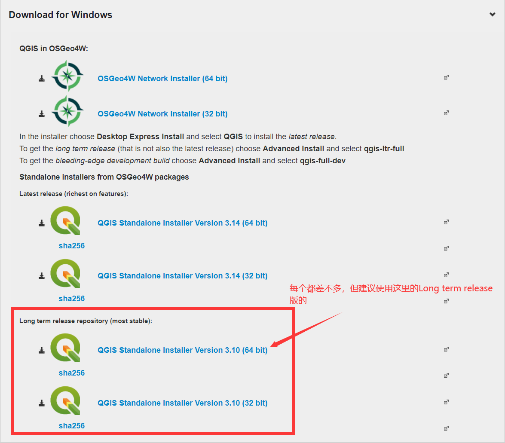
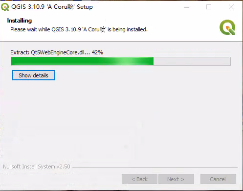
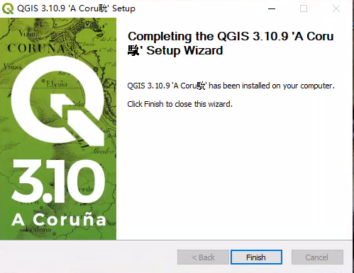
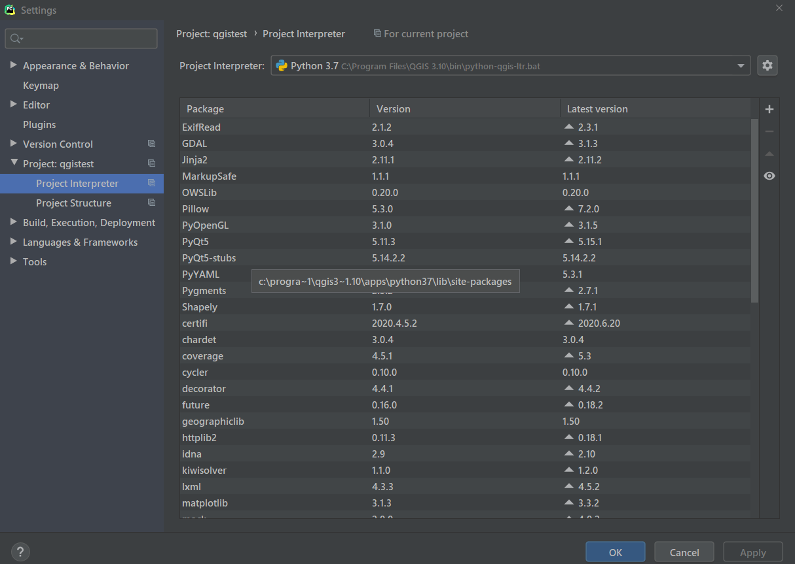
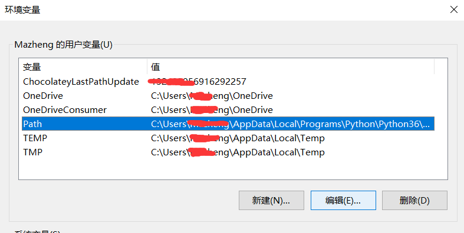
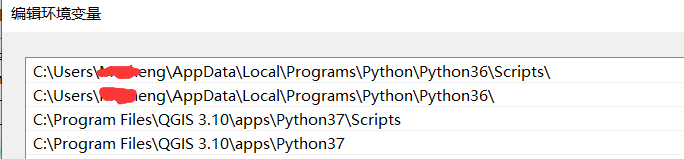
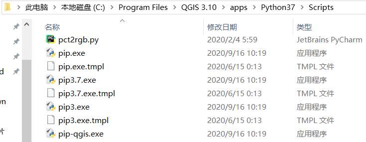
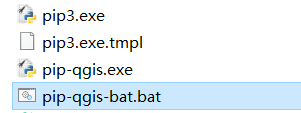
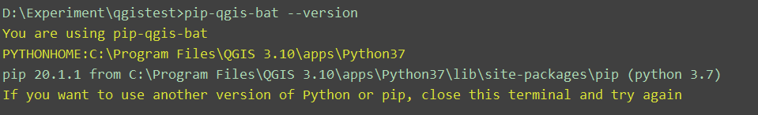

# 配置pyqgis+pycharm开发环境

## 前言

最近导师要求做一个桌面端程序，本来打算使用`python+pyqgis`(运行在pyqt5之上)这一套方案，后来老师又拍脑(pi)袋(gu)决定做BS的架构。虽然不使用了此套方案，但考虑到pyqgis的开发环境配置资料比较少，所以还是把我的配置步骤分享出来，希望能够给大家提供帮助，同时祭奠被导师浪费掉的时间。

本文是在多篇国内外博客的基础上总结出的配置方案，**不需要大量配置环境变量，同时不会污染全局的Python环境。**

鉴于pyqgis这套技术方案的参考资料比较少，官方api文档又没有足够的demo演示，所以开发失败的风险比较高。在决定是否使用pyqgis开发独立应用程序时，请各位自行把握。。。。

## 步骤1.下载QGIS并安装

下载链接：https://www.qgis.org/en/site/forusers/download.html




官网提供了三个下载链接，二三是一样的，第一个好像在网速不好的情况下不太好弄。

我使用的是图示的64位安装包，安装过程和QGIS in OESGeo4W有略微区别。

在此以第三个为例：==不推荐改安装路径，全程next、agree、finish==






完成安装，我采用的是默认安装路径`C:\Program Files\QGIS 3.10`


## 步骤2. 在pycharm中配置qgis内置的python解释器

配置的解释器路径是`C:\Program Files\QGIS 3.10\bin\python-qgis-ltr.bat`




有人会好奇为什么使用的是一个`bat文件`作为解释器，在此做简单解释：

**`python-qgis-ltr.bat`文件中的内容：**

```cmd
@echo off

::配置qgis资源路径
call "%~dp0\o4w_env.bat"
call qt5_env.bat

::下一条语句调用另一个bat批处理文件，在这个文件中配置了PYTHONHOME和PYTHONPATH变量
call py3_env.bat         可以理解为配置了一个临时的系统环境变量

@echo off
path %OSGEO4W_ROOT%\apps\qgis-ltr\bin;%PATH%
set QGIS_PREFIX_PATH=%OSGEO4W_ROOT:\=/%/apps/qgis-ltr
set GDAL_FILENAME_IS_UTF8=YES
rem Set VSI cache to be used as buffer, see #6448
set VSI_CACHE=TRUE
set VSI_CACHE_SIZE=1000000
set QT_PLUGIN_PATH=%OSGEO4W_ROOT%\apps\qgis-ltr\qtplugins;%OSGEO4W_ROOT%\apps\qt5\plugins
set PYTHONPATH=%OSGEO4W_ROOT%\apps\qgis-ltr\python;%PYTHONPATH%

::下一条语句的意思是执行PYTHONHOME目录下的python程序，并输入args
"%PYTHONHOME%\python" %* 
```


**`py3_env.bat`中的内容：**

```cmd
SET PYTHONHOME=%OSGEO4W_ROOT%\apps\Python37
SET PYTHONPATH=%PYTHONHOME%;%PYTHONHOME%\Scripts
PATH %PYTHONPATH%;%PATH%
```


`python-qgis-ltr.bat`该批处理文件的作用就在于配置了一系列环境变量后再执行python命令，使得我们能够使用QGIS内置的python解释器执行py文件，同时可导入pyqgis包以及使用QGIS安装的一些内置资源。


**到这里，已经可以使用pyqgis包了，新建项目文件test.py进行测试：**

```python
# 测试：
from qgis.core import *
from Pyqt5.Qt import *
```


## 步骤3.配置pip

> 其实步骤2已经能够满足基本使用，但如果想在项目中使用pip下载第三方包，由于没有使用虚拟环境，所以还得进行额外的临时环境配置。
>
> 若没有进行步骤3的配置，在本机已经安装python时，使用的是全局的pip命令。


**1.将qgis内置的python安装路径添加到用户环境变量path中**



下图是我的用户环境变量Path，其中python3.6是我本机已经安装的python，python3.7的相关路径是qgis内置的python解释器安装位置。大家在配置时，可参考我这样的做法，把已经安装的全局python路径放在顶层，qgis的python路径搜索路径靠后。

 


**2.复制pip.exe并重命名，添加批处理文件**

打开`C:\Program Files\QGIS 3.10\apps\Python37\Scripts`，也就是qgis内置的python解释器安装路径的下Scripts目录，其中有`pip.exe`、`pip3.exe`等，复制`pip3.exe或pip.exe`并粘贴到该目录，重命名为`pip-qgis.exe`。



新建`pip-qgis-bat.bat文件`，并用文本编辑器打开，书写以下内容：

```ba
@echo off
echo You are using pip-qgis-bat
set PYTHONHOME=C:\Program Files\QGIS 3.10\apps\Python37
SET PYTHONPATH=%PYTHONHOME%;%PYTHONHOME%\Scripts
PATH %PYTHONPATH%;%PATH%
echo PYTHONHOME:%PYTHONHOME%
pip-qgis %*
echo If you want to use another version of Python or pip, close this terminal and try again
```

 

> 以上步骤需要管理员权限。


**<font color="red">至此，所有配置完成。可以使用pip-qigs-bat install xxx进行包下载。</font>**

在终端使用`pip-qgis-bat --version`命令进行测试：



