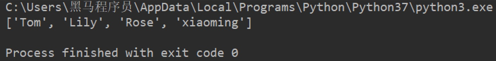

 

# Python3基础


## Python解释器 

作用：运行py文件（代码）

种类：

+ CPython，C语言开发的官方解释器

+ IPython，基于CPython的一种交互式的解释器

+ 其他

  

下载：

​		官方网站下载python解释器


## 虚拟环境

### 准备 

1. 使用本机内任意的pip安装 virtualenv 和 virtualenvwrapper-win

```bash	
$ pip install virtualenv virtualenvwrapper-win
```

2. 在磁盘中新建一个空文件夹，虚拟环境以后将保存在这里。例如 D:\\Envs
3. 在系统环境变量中添加  变量名：WORKON_HOME  值：D:\\Envs 

### 新建、查看、进入、退出


1. 查看当前已有的虚拟环境。

   ```bash
   $ workon  
   ```

2. 新建一个虚拟环境

   ```bash 
   $ mkvirtualenv myfirstEnv
   ```

   使用指定的python解释器新建虚拟环境

   ```bash
   $ mkvirtualenv myfirstEnv2 --python [解释器的完整路径]
   ```

3. 切换到（进入）建立好的虚拟环境

   ```bash
   $ workon myfirstEnv
   ```

4. 退出虚拟环境

   ```bash 
   $ deactivate
   ```

   

## 注释

1. 单行注释

   ```python
   # 注释
   ```

2. 多行注释

   ```python 
   """
   	第一种写法
   ""“
   
   '''
   	第二种写法
   '''
   
   ```

## 标识符命名规则

+ 由数字、字母、下划线组成

+ 不能数字开头

+ 不能使用内置关键字

  

+ 严格区分大小写


## 数据类型


Python中，万物皆对象！万物皆对象！万物皆对象！

每个对象包含3个属性，id，type，value

id就是对象地址，可以通过内置函数id()查看对象引用的地址。

type就是对象类型，可以通过内置函数type()查看对象的类型。

value就是对象的值。


### 不可变类型与可变类型


### 不可变(immutable)类型

- int
- float
- decimal
- complex
- bool
- **str**
- **tuple**
- range
- **frozenset**
- bytes

### 可变(mutable)类型

- list
- dict
- set
- bytearray
- user-defined classes (unless specifically made immutable)


### 判断数据的类型

1. type()

   type函数传入一个对象，返回对象的类型  即其class

2. 使用type函数判断一个对象是否为指定类型

   ```python 
   # 是否为int 类型 
   type(x) == type(1) 
   type(x) is type(1)
   type(x) is int
   
   # 是否为string类型
   type(x) == type('a') 
   type(x) is type('a') 
   type(x) is str
   ```

   

   

3. isinstance(_obj, _class_or_tuple)

   ```python
   """
   其第一个参数为对象，第二个参数为类型名或包含多个类型名的元组。
   其返回值为布尔型。若对象的类型与参数二的类型相同则返回True。
   若参数二为一个元组，则若对象类型与元组中类型名之一相同即返回True。
   """
   
   lst = []
   print(isinstance(lst, list))
   print(isinstance(lst, (int, str,list)))
   
   print(isinstance(1,int))
   
   >>> True
   >>> True
   >>> True
   
   ```

   


### 数据类型转换


```python
# 1. float() -- 将数据转换成浮点型
num1 = 1
str1 = '10'
print(type(float(num1)))  # float
print(float(num1))  # 1.0

print(float(str1))  # 10.0


# 2. str() -- 将数据转换成字符串型
print(type(str(num1)))  # str


# 3. tuple() -- 将一个序列转换成元组
list1 = [10, 20, 30]
print(tuple(list1))


# 4. list() -- 将一个序列转换成列表
t1 = (100, 200, 300)
print(list(t1))


# 5. eval() -- 计算在字符串中的有效Python表达式,并返回一个对象
str2 = '1'
str3 = '1.1'
str4 = '(1000, 2000, 3000)'
str5 = '[1000, 2000, 3000]'
print(type(eval(str2)))
print(type(eval(str3)))
print(type(eval(str4)))
print(type(eval(str5)))
```


### is 和 == 

总体来说，`is`比较的是`id`是不是一样，`==`比较的是`type`和`value`是不是一样。

1. 对于整型、小数、字符串

   此类数据类型是不可变数据类型，理论上，在不存在两个变量间相互赋值的情况下，id是一定不一样的。

   但是python`交互编程时`解释器会缓存[-5,256]间的整数，在`脚本编程时`会先解析脚本，缓存重复使用的值，因此对于此类数据类型使用 `is`时会出现相等的情况（id相等返回True）

2. 对于元组

   在`脚本编程时`，两个元组t1和t2分别`赋以相同的值`，若元组值中不存在可变数据类型，则 t1和 t2 在缓存机制的影响下，id相同。若元组中存在可变数据类型，则id一定不同。

3. 若可变类型的对象之间使用 `==`判断：

   可变类型往往是容器，对两个容器使用`==`比较，需要规定如何比较。

   例如列表、字典以及集合，就是对两个容器中的对应成员使用 `==`比较，成员类型应该规定了使用`==`比较的规则，否则比较失败。

4. 判断一个对象是否为None要使用`is`


## 格式化输出

### 基本使用

```python
"""
1. 准备数据
2. 格式化符号输出数据
"""
age = 18
name = 'TOM'
weight = 75.5
stu_id = 1
stu_id2 = 1000

# 1. 今年我的年龄是x岁 -- 整数 %d
print('今年我的年龄是%d岁' % age)

# 2. 我的名字是x -- 字符串 %s
print('我的名字是%s' % name)


# 3. 我的体重是x公斤 -- 浮点数 %f
print('我的体重是%.3f公斤' % weight)

# 4. 我的学号是x -- %d
print('我的学号是%d' % stu_id)

# 4.1 我的学号是001
print('我的学号是%03d' % stu_id)
print('我的学号是%03d' % stu_id2)


# 5. 我的名字是x，今年x岁了
print('我的名字是%s，今年%d岁了' % (name, age))
# 5.1 我的名字是x，明年x岁了
print('我的名字是%s，明年%d岁了' % (name, age + 1))


# 6. 我的名字是x，今年x岁了，体重x公斤，学号是x
print('我的名字是%s，今年%d岁了，体重%.2f公斤，学号是%06d' % (name, age, weight, stu_id))

# 6.1我的名字是x，今年x岁了，体重x公斤
print('我的名字是%s，今年%s岁了，体重%s公斤' % (name, age, weight))
```

**整数与小数的用'0'补齐**

```python 
print('%04d' %123) 
# 0123       总共占4位，整数位3位，左侧补齐一个0

print('%06.3f' %3.14)
# 03.140      总共占6位，保留小数3位，小数点1位，整数位1位，左侧补齐一个0

# 超出允许的列数时，按其他要求真实输出。

print('%04.3f',3.14)
# 3.140
```

### f-字符串

python3.6新增，效率比上述的%s效率要高

```python	
str1 = 'hello world'
print(f'我想说{str1}')

#相当于 

print('我想说{}'.format(str1))
```


### print结束符


默认end='\n'


## 输入


## 运算符


+ 算数运算符

+ 赋值运算符

+ 复合赋值运算符

+ 比较运算符

+ 逻辑运算符

  

### 算数运算符


### 赋值运算符


```python 
# a和b交换值
a=1
b=2
a,b=b,a
print(a,':',b)
# 2:1
```


### 复合赋值运算符


### 比较运算符


### 逻辑运算符


## 条件语句

### if语句语法


### if else


### if elif else


 

### 三目运算


```python
a = 2
b = 1
print(a) if a > b else print(b)

# 控制台输出 👉 2
```


### 注意

<font color='red' size='4'>Python中没有switch case语法</font>


## 循环语句 

作用：控制代码重复执行

###  while循环 


### break和continue


### for循环


### while else


**语法**


**在while else语法结构中，break与continue退出**


2. continue


### for else

for else的使用以及与break、continue配合的表现都与while else相同。


## 字符串

### 基本使用

可以使用一对双引号`""`、一对单引号`''`、三引号`''' '''`或`""" """`来标识字符串。

三引号的作用在于能够保存编辑代码时的换行符，输出时会显示原原本本的字符串格式。

```python
str1="""i am mz,
hello world
"""
print(str1)

👇
# i am mz,
# hello world


```


### 序列类型

python中的字符串属于常见的序列类型之一，可以通过下标以及切片对其访问。


```python
# 序列名[开始位置的下标:结束位置的下标:步长]

str1 = '012345678'
print(str1[2:5:1])  # 234
print(str1[2:5:2])  # 24
print(str1[2:5])  # 234
print(str1[:5])  # 01234 -- 如果不写开始，默认从0开始选取
print(str1[2:])  # 2345678 -- 如果不写结束，表示选取到最后
print(str1[:])  # 012345678 -- 如果不写开始和结束，表示选取所有

负数测试
print(str1[::-1])  # 876543210 -- 如果步长为负数，表示倒叙选取
print(str1[-4:-1])  # 567 -- 下标-1表示最后一个数据，依次向前类推

# 终极测试
print(str1[-4:-1:1])  # 567

!!!!!
print(str1[-4:-1:-1])  # 不能选取出数据：从-4开始到-1结束，选取方向为从左到右，但是-1步长：从右向左选取
# **** 如果选取方向(下标开始到结束的方向) 和 步长的方向冲突，则无法选取数据

如果想要逆序获取字符串序列
print(str1[-1:-4:-1])  # 876
```


### 常用方法


字符串的常用操作方法由查找、返回新数据（由于不能修改）、判断三大类。


#### **一、查找**

1. find()

   


2. index( )

   用法与find相同，唯一不同的是当字串不存在时，index方法不会返回-1，而是**会报错**，

​	


3. count()


#### **二、返回新内容**

1. **replace()  返回新的字符串 。替换掉字符串内的指定字串。**

   

<font color='red'>由于python中字符串方法不会修改原串，如果需要修改原字符串，需要 str1=str1.replace( .....)</font>


2. **split()  返回一个数组。以指定字串分割字符串。**


3. **join()  以该字符串连接一个字符串序列。**

   


4. **大小写相关**

   

   

   

   

   

   


5. **去除左右空白**

   

   

6. **对齐与补齐**

   

   ​		

   ​		


#### **三、判断**


+ in 和 not in

  判断是否存在某个字串


## 列表 list

``` python
[数据1, 数据2, 数据3, 数据4......]
```

列表可以一次性存储多个数据，且可以为不同数据类型。


### 下标访问与切片 

``` python
name_list = ['Tom', 'Lily', 'Rose']

print(name_list[0])  # Tom
print(name_list[1])  # Lily
print(name_list[2])  # Rose

print(name_list[0::2]) # ['Tom', 'Lily']
```


### 列表长度 

len( ==list==)


### 判断是否存在某个元素 

- in：判断指定数据在某个列表序列，如果在返回True，否则返回False

``` python
name_list = ['Tom', 'Lily', 'Rose']

# 结果：True
print('Lily' in name_list)

# 结果：False
print('Lilys' in name_list)
```


- not in：判断指定数据不在某个列表序列，如果不在返回True，否则返回False

``` python
name_list = ['Tom', 'Lily', 'Rose']

# 结果：False
print('Lily' not in name_list)

# 结果：True
print('Lilys' not in name_list)
```


### 查找元素索引

- index()：返回指定数据所在位置的下标 。

1. 语法

``` python
列表序列.index(数据, 开始位置下标, 结束位置下标)
```

2. 快速体验

``` python
name_list = ['Tom', 'Lily', 'Rose']

print(name_list.index('Lily', 0, 2))  # 1
```

> 注意：如果查找的数据不存在则报错。
>
> 所以在使用index前最好先判断所查找元素是否存在。或者需要处理异常。


### 元素计数

- count()：统计指定数据在当前列表中出现的次数。

``` python
name_list = ['Tom', 'Lily', 'Rose']

print(name_list.count('Lily'))  # 1
```


### 增加与插入

+ **append ( ) 列表结尾添加一个元素**

1. 语法

``` python
列表序列.append(数据)
```

2. 体验

``` python
name_list = ['Tom', 'Lily', 'Rose']

name_list.append('xiaoming')

# 结果：['Tom', 'Lily', 'Rose', 'xiaoming']
print(name_list)
```



> 列表追加数据的时候，直接在原列表里面追加了指定数据，即修改了原列表，故列表为可变类型数据。

3. 注意点

如果append()追加的数据是一个序列，则追加整个序列到列表

``` python
name_list = ['Tom', 'Lily', 'Rose']

name_list.append(['xiaoming', 'xiaohong'])

# 结果：['Tom', 'Lily', 'Rose', ['xiaoming', 'xiaohong']]
print(name_list)
```


+ **extend ( ) 列表结尾追加元素。可传入一个序列类型，列表中的所有元素将逐一添加**

  >  若该数据是一个序列，则这个序列的数据逐一添加到列表。**

  语法：

  1. 添加一个元素

     ```python
     name_list = ['Tom', 'Lily', 'Rose']
     
     name_list.extend('xiaoming')
     
     # 结果：['Tom', 'Lily', 'Rose', 'x', 'i', 'a', 'o', 'm', 'i', 'n', 'g']
     print(name_list)
     ```

  2. 添加一个序列

     ```python
     name_list = ['Tom', 'Lily', 'Rose']
     
     name_list.extend(['xiaoming', 'xiaohong'])
     
     # 结果：['Tom', 'Lily', 'Rose', 'xiaoming', 'xiaohong']
     print(name_list)
     ```

     


+ **insert ( )指定位置新增数据。**

1. 语法

   ```python
   列表序列.insert(位置下标, 数据)
   ```

2. 快速体验

   ```python
   name_list = ['Tom', 'Lily', 'Rose']
   
   name_list.insert(1, 'xiaoming')
   
   # 结果：['Tom', 'xiaoming', 'Lily', 'Rose']
   print(name_list)
   ```

> 插入一个序列类型时，不会对序列进行解构。会在指定位置插入该序列对象。


### 删除

+ **del**

  > 常用del语法删除一个变量，但同时del可以删除列表的某个元素

  1. 语法

     ```python
     del 目标
     ```

  2. 使用

     ```python
     name_list = ['Tom', 'Lily', 'Rose']
     
     del name_list[0]
     
     # 结果：['Lily', 'Rose']
     print(name_list)
     ```

     

+ **pop()：删除指定下标的数据（默认为最后一个），并返回该数据。**

  1. 语法

     ```python
     列表序列.pop(下标)
     ```

  2. 使用

     ```python 
     name_list = ['Tom', 'Lily', 'Rose']
     
     del_name = name_list.pop(1)
     
     # 结果：Lily
     print(del_name)
     
     # 结果：['Tom', 'Rose']
     print(name_list)
     ```

  

+ **remove()：移除列表中某个数据的第一个匹配项。**

  1. 语法

  ``` python
  列表序列.remove(数据)
  ```

  2. 使用

  ``` python
  name_list = ['Tom', 'Lily', 'Rose']
  
  name_list.remove('Rose')
  
  # 结果：['Tom', 'Lily']
  print(name_list)
  ```


### 修改 

+ **下标修改**

  ```python
  name_list = ['Tom', 'Lily', 'Rose']
  
  name_list[0] = 'aaa'
  
  # 结果：['aaa', 'Lily', 'Rose']
  print(name_list)
  ```

  

### 逆置、排序、拷贝

+ **逆置：reverse()**

  ```python
  num_list = [1, 5, 2, 3, 6, 8]
  
  num_list.reverse()
  
  # 结果：[8, 6, 3, 2, 5, 1]
  print(num_list)
  ```

  

+ **排序：sort()**

  1. 语法：

     ```python
     列表序列.sort( key=None, reverse=False)
     ```

  > 注意：reverse表示排序规则，**reverse = True** 降序， **reverse = False** 升序（默认）

  2. 使用

     ```python
     num_list = [1, 5, 2, 3, 6, 8]
     
     num_list.sort()
     
     # 结果：[1, 2, 3, 5, 6, 8]
     print(num_list)
     ```

     ```python
     ls = [{'name': 'mz', 'age': 23}, {'name': 'ley', 'age': 24}]
     ls.sort(key=lambda x: x['age'], reverse=True)
     print(ls)
     >>> [{'name': 'ley', 'age': 24}, {'name': 'mz', 'age': 23}]
     ```
     
     

  

+ **复制：copy()**

  ```python
  name_list = ['Tom', 'Lily', 'Rose']
  
  name_li2 = name_list.copy()
  
  # 结果：['Tom', 'Lily', 'Rose']
  print(name_li2)
  ```

  


## 元组 tuple

> 元组是序列类型，可以存储多个元素，但元组无法被修改。


### 定义元组

元组特点：定义元组使用==小括号==，且==逗号==隔开各个数据，数据可以是不同的数据类型。

```python
# 多个数据元组
t1 = (10, 20, 30)

# 单个数据元组
t2 = (10,)
```

> 注意：如果定义的元组只有一个数据，那么这个数据后面也好添加逗号，否则数据类型为唯一的这个数据的数据类型

```python
t2 = (10,)
print(type(t2))  # tuple

t3 = (20)
print(type(t3))  # int

t4 = ('hello')
print(type(t4))  # str
```


### 常见操作 

元组数据不支持修改，只支持查找，具体如下：

- 按下标查找数据

``` python
tuple1 = ('aa', 'bb', 'cc', 'bb')
print(tuple1[0])  # aa
```


- index()：查找某个数据，如果数据存在返回对应的下标，`不存在时会报错`，语法和列表、字符串的index方法相同。

``` python
tuple1 = ('aa', 'bb', 'cc', 'bb')
print(tuple1.index('aa'))  # 0
```


- count()：统计某个数据在当前元组出现的次数。

``` python
tuple1 = ('aa', 'bb', 'cc', 'bb')
print(tuple1.count('bb'))  # 2
```


- len()：统计元组中数据的个数。

``` python
tuple1 = ('aa', 'bb', 'cc', 'bb')
print(len(tuple1))  # 4
```

> 注意：元组内的直接数据如果修改则立即报错

``` python
tuple1 = ('aa', 'bb', 'cc', 'bb')
tuple1[0] = 'aaa'
```

> 但是如果元组里面有可变数据类型（例如：列表），修改该元组的元素的值是被允许的。

``` python
tuple2 = (10, 20, ['aa', 'bb', 'cc'], 50, 30)
print(tuple2[2])  # 访问到列表

# 结果：(10, 20, ['aaaaa', 'bb', 'cc'], 50, 30)
tuple2[2][0] = 'aaaaa'
print(tuple2)
```


### 元组拆包 

数据装包 <=> 拆包

```python 
# 元组拆包

t = ('mazheng', 23)
name, age = t
print(name, age)
👇
# mazheng 23


```


## 字典 dict

字典特点：

- 符号为==大括号==
- 数据为==键值对==形式出现
- 各个键值对之间用==逗号==隔开

``` python
# 有数据字典
dict1 = {'name': 'Tom', 'age': 20, 'gender': '男'}

# 空字典
dict2 = {}

dict3 = dict()
```


### 增加键值对

写法：==字典序列[key] = 值==

> 注意：如果key存在则修改这个key对应的值；如果key不存在则新增此键值对。
>

``` python
dict1 = {'name': 'Tom', 'age': 20, 'gender': '男'}

dict1['name'] = 'Rose'
# 结果：{'name': 'Rose', 'age': 20, 'gender': '男'}
print(dict1)

dict1['id'] = 110

# {'name': 'Rose', 'age': 20, 'gender': '男', 'id': 110}
print(dict1)
```

> 注意：字典为可变类型。


###  删除

- del() / del：删除字典或删除字典中指定键值对。

``` python
dict1 = {'name': 'Tom', 'age': 20, 'gender': '男'}

del dict1['gender']
# 结果：{'name': 'Tom', 'age': 20}
print(dict1)
```


- clear()：清空字典

``` python
dict1 = {'name': 'Tom', 'age': 20, 'gender': '男'}

dict1.clear()
print(dict1)  # {}
```


+ pop(key)：根据键名取出键值对


### 修改

写法：==字典序列[key] = 值==

> 注意：如果key存在则修改这个key对应的值 ；如果key不存在则新增此键值对。


### 查找

1. 按key值查找

   ``` python
   dict1 = {'name': 'Tom', 'age': 20, 'gender': '男'}
   print(dict1['name'])  # Tom
   print(dict1['id'])  # 报错
   ```

   > 如果当前查找的key存在，则返回对应的值；否则则报错。


2. get()方法

   - 语法

   ``` python
   字典序列.get(key, 默认值)
   ```

   > 注意：如果当前查找的key不存在则返回第二个参数(默认值)，如果省略第二个参数，则返回None。

   - 快速体验

   ``` python 
   dict1 = {'name': 'Tom', 'age': 20, 'gender': '男'}
   print(dict1.get('name'))  # Tom
   print(dict1.get('id', 110))  # 110
   print(dict1.get('id'))  # None
   ```


### 可迭代对象

1. keys()

   ``` python
   dict1 = {'name': 'Tom', 'age': 20, 'gender': '男'}
   print(dict1.keys())  # dict_keys(['name', 'age', 'gender'])
   ```

2. values()

   ``` python
   dict1 = {'name': 'Tom', 'age': 20, 'gender': '男'}
   print(dict1.values())  # dict_values(['Tom', 20, '男'])
   ```

3. items()

   ``` python
   dict1 = {'name': 'Tom', 'age': 20, 'gender': '男'}
   print(dict1.items()) 
   # dict_items([('name', 'Tom'), ('age', 20), ('gender', '男')])
   ```


> **字典对象本身也是可迭代对象，每次迭代返回一个key**


### 字典拆包


**应用：**

```python
#将字典的所有key保存在一个列表中
d = dict({'name': 'mz', 'age': 23, 0: 123})

(*keys,) = d
print(keys,type(keys))
# 👉['name', 'age', 0] <class 'list'>

dictKeys = d.keys()
print(dictKeys,type(dictKeys))
# 👉dict_keys(['name', 'age', 0]) <class 'dict_keys'>


```


##  集合 set

### 创建集合

创建集合使用`{}`或`set()`， 但是如果要创建空集合只能使用`set()`，因为`{}`用来创建空字典。

### 特点

1. 集合可以去掉重复数据；
2. 集合数据是无序的，故不支持下标

### 增加数据

+ **add()**

  add方法传入==一个可哈希类型==的数据，并将该数据添加到集合中，重复值会被去重。

+ **update()**

  update方法传入==一个可迭代==的数据，并将该数据的所有迭代返回值添加到集合中，重复值会被去重。==同时该方法要求传入的可迭代对象的每次迭代的返回值都是可哈希的，否则报错==

  

  > 可哈希的数据类型，即不可变的数据结构，包括：字符串、元组以及对象集objects。
  >
  > 不可哈希的数据类型，即可变的数据结构，包括：字典、列表、集合。

  > 可迭代的数据类型，包括：字符串、列表、元组、字典、集合等。

  ```python
  str1 = '12345'
  s1 = set()
  s2 = set()
  
  s1.add(str1)	# 传入可哈希类型
  s2.update(str1)	# 传入可迭代类型
  
  print('s1:', s1)	>>> s1: {'12345'}
  print('s2:', s2)	>>> s2: {'4', '2', '5', '3', '1'}
  
   
  s3 = set()
  dic1 = {'a': 123, 'b': 321}
  s3.update(dic1)	# 传入可迭代类型，迭代字典返回key
  print(s3)	>>>{'b', 'a'}
  ```

  

### 删除数据

+ **remove()**

  remove方法传入一个可哈希类型的数据，删除集合中的该数据，数据不存在时==报错==。

+ **discard()**

  discard方法传入一个可哈希类型的数据，删除集合中的该数据，数据不存在时==不报错==。

+ **pop()**

  pop方法会取出集合中的第一个迭代值（输出时最左边的值）。

  > 新建一个集合以及由其他容器转来的集合，数据的排列方式各有不同。


### 判断数据是否存在

- **in：**判断数据在集合序列
- **not in：**判断数据不在集合序列

``` python
s1 = {10, 20, 30, 40, 50}

print(10 in s1)
print(10 not in s1)
```


## 容器小结

### 分类

| 容器   | 是否可哈希 | 是否可迭代 | 迭代返回的数据 |
| ------ | ---------- | ---------- | -------------- |
| 字符串 | ✔          | ✔          | 字符           |
| 列表   |            | ✔          | 元素           |
| 元组   | ✔          | ✔          | 元素           |
| 字典   |            | ✔          | key            |
| 集合   |            | ✔          | 元素           |

### 公共函数

>  公共函数要求传入一个可迭代对象，而python内置的容器都是可迭代对象。

1. len() 

   返回容器的长度，即可迭代的次数

2. max()

   返回容器中的最大值，==要求容器的所有迭代值可以相互比较，否则报错==

3. min()

   类似于max，返回容器中的最小值

4. enumerate()

   ```python
   enumerate(可迭代对象,start=0)
   ```

   enumerate方法第一个参数要求传入一个可迭代对象，第二个参数start为一个整数。

   该方法会返回一个可迭代对象，该对象的迭代值为一个元组，元组具有固定格式：

   （整数索引值，第一个参数的每个迭代值）

   ```python
   dic1 = {'a': 123, 'b':321}
   for t in enumerate(dic1,start=0):
       print(t)
   >>> (0,'a')
   >>> (1,'b')
   
   lis = ['a', 'b']
   for index,val in enumerate(lis,start=1):
       print(index,val)
   >>> 1 'a'
   >>> 2 'b'
   ```

   

### 运算符

| 运算符 |      描述      |      支持的容器类型      |
| :----: | :------------: | :----------------------: |
|   +    |      合并      |    字符串、列表、元组    |
|   *    |      倍增      |    字符串、列表、元组    |
|   in   |  元素是否存在  | 字符串、列表、元组、字典 |
| not in | 元素是否不存在 | 字符串、列表、元组、字典 |

+  `*` 是用于==整数==和==序列类型==之间的计算，可以左边使用运算符，也可以右边使用。

+ `in`和`not in`对于==字符串==使用是==判断子串是否存在==；
+ `in`和`not in`对于==字典==使用是==判断键是否存在==；


### 容器类型转换

#### tuple() 

作用：将某个可迭代对象转换成元组

``` python
list1 = [10, 20, 30, 40, 50, 20]
s1 = {100, 200, 300, 400, 500}

print(tuple(list1))
print(tuple(s1))
```


#### list()

作用：将某个可迭代对象转换成列表

``` python
t1 = ('a', 'b', 'c', 'd', 'e')
s1 = {100, 200, 300, 400, 500}

print(list(t1))
print(list(s1))
```


####  set()

作用：将某个可迭代对象转换成集合，并去重。

``` python
list1 = [10, 20, 30, 40, 50, 20]
t1 = ('a', 'b', 'c', 'd', 'e')

print(set(list1))
print(set(t1))
```

> 注意：若传入set方法中的可迭代对象的某个迭代值不可哈希，则会报错。


## 推导式

- 推导式的作用：简化代码
- 推导式写法

``` python
# 列表推导式
[xx for xx in range()]

# 字典推导式
{xx1: xx2 for ... in ...}

# 集合推导式
{xx for xx in ...}
```

### 列表推导式

1. **基本使用**

   ```python
   list1 = [i for i in range(10)]
   print(list1)
   ```

   

2. **带if语句的列表推导式**

   ```python
   list1 = [i for i in range(10) if i % 2 == 0]
   print(list1)
   ```


3. **多个for循环嵌套的列表推导式**

   ```python
   list1 = [(i, j) for i in range(1, 3) for j in range(3)]
   print(list1)
   ```

   

### 字典推导式

1. **基本使用**

   ```python
   list1 = ['name', 'age', 'gender']
   list2 = ['Tom', 20, 'man']
   
   dict1 = {list1[i]: list2[i] for i in range(len(list1))}
   print(dict1)
   ```

2. **带if语句的字典推导式**

   ```python 
   counts = {'MBP': 268, 'HP': 125, 'DELL': 201, 'Lenovo': 199, 'acer': 99}
   
   # 需求：提取上述电脑数量大于等于200的字典数据
   count1 = {key: value for key, value in counts.items() if value >= 200}
   print(count1)  # {'MBP': 268, 'DELL': 201}
   ```

   

### 集合推导式

1. 基本使用

   ``` python
   list1 = [1, 1, 2]
   set1 = {i ** 2 for i in list1}
   print(set1)  # {1, 4}
   ```

   > 注意：集合有数据去重功能。


## 函数

### 基本语法

```python
def 函数名(参数):
    ...
    ...
```


### 先定义，再调用 

在python中，脚本从上到下解释执行，在调用函数前应先定义。


### 函数返回值

```python
def 函数名(参数):
    ...
    [return  ...]
```


在python中函数可以不返回值、返回一个值或返回多个值

1. 没有return语句或使用return但不返回值

   ==返回None==

2. return返回一个值

   ==用一个变量接收==

3. return返回多个值时，会以元组的形式返回

   ==用一个变量接收元组、或使用元组拆包==


```python
def foo():
    return 1, 2, 3


x = foo()
x1, x2, x3 = foo()
(y, *t) = foo()

print(x)
print(x1, x2, x3)
print(y, t)

>>> (1, 2, 3)
>>> 1 2 3
>>> 1 [2, 3]
```


### 函数说明文档

+ 定义函数的说明文档

  ==在函数代码块的第一行以三双引号开始书写函数说明==

  ```python
  def 函数名(参数):
      """ 说明文档的位置 """
      代码
      ......
      
      
  def 函数名(参数):
      """ 
      多行说明文档
      """
      代码
      ......
  ```

  

+ 查看函数的说明文档

  ```python
  help(函数名)
  ```

+ 举例

  ```python
  def sum_num(a, b):
      """ 求和函数 """
      return a + b
  
  
  help(sum_num)
  
  
  >>> sum_num(a,b)
  	求和函数
  ```


### 局部变量与全局变量

根据作用域（变量生效的范围）可以将变量分为==局部变量==和==全局变量==

```python
a = 100 # 全局变量

def foo():
    a = 200 # 局部变量

def bar():
    a = 300
    foo()
    print(a)
    
print(a)
```

> **注意：**
>
> 1. 在不加声明的情况下，python函数中对某个变量进行了定义（初始化、赋值操作），则该变量就成为了局部变量。
> 2. 如果函数内不存在对某个变量的定义，但访问了该变量，则解释器会向全局作用域中查找该变量，若全局作用域中也不存在对该变量的定义，则报错。


**在函数中声明全局变量：**

```python
a = 100

def foo():
    a = 200 
      
def bar():
    global a
    a = 200
    
foo()
print(a)
>>> 100

bar()
print(a)
>>> 200
    
```


### 函数传参

**一、位置参数**

位置参数：调用函数时根据函数定义的形参的位置与含义来传递参数。

```python
def user_info(name, age, gender):
    print(f'您的名字是{name}, 年龄是{age}, 性别是{gender}')


user_info('TOM', 20, '男')
```

> 注意：在使用位置参数进行传参时，实参和形参的顺序及个数必须一致。


**二、使用关键字传参**

函数调用，通过“键=值”形式加以指定。可以让函数更加清晰、容易使用，同时也清除了参数的顺序需求。

```python
def user_info(name, age, gender):
    print(f'您的名字是{name}, 年龄是{age}, 性别是{gender}')


user_info('Rose', age=20, gender='女')
user_info('小明', gender='男', age=16)
```

> 注意：函数调用时，如果有位置参数时，位置参数必须在关键字参数的前面，但关键字参数之间不存在先后顺序。


**三、参数默认值**

为形参提供默认值，调用函数时可不传该默认参数的值（注意：所有位置参数必须出现在默认参数前，包括函数定义和调用）。

```python
def user_info(name, age, gender='男'):
    print(f'您的名字是{name}, 年龄是{age}, 性别是{gender}')


user_info('TOM', 20)
user_info('Rose', 18, '女')
```

> 注意：函数调用时，如果为缺省参数传值则修改默认参数值；否则使用这个默认值。


**四、不定长参数**

不定长参数也叫可变参数。用于不确定调用的时候会传递多少个参数(不传参也可以)的场景。此时，可用包裹(packing)位置参数，或者包裹关键字参数，来进行参数传递，会显得非常方便。

> 无论是包裹位置传递还是包裹关键字传递，都是一个组包的过程。

1. 包裹位置传递

   ```python
   语法：*不定长参数名
   ```

   ```python
   def user_info(*args):
       print(args)
   
   
   # ('TOM',)
   user_info('TOM')
   # ('TOM', 18)
   user_info('TOM', 18)
   ```

   > 传进的所有参数都会被args变量收集，它会根据传进参数的位置合并为一个元组。
   >
   > python编程中也常用args包裹位置不定长参数

2. 包裹关键字传递

   ```python
   语法：**不定长参数名
   ```

   ```python
   def user_info(**kwargs):
       print(kwargs)
   
   
   # {'name': 'TOM', 'age': 18, 'id': 110}
   user_info(name='TOM', age=18, id=110)
   ```

   > kwargs是一个字典类型，以key：val的形式包裹不定长参数。
   >
   > python编程中也常用kwargs包裹关键字不定长参数


### lambda表达式

lambda表达式也称作匿名函数，用于简化函数的书写。

> 使用场景要求：函数可有多个参数，使用一个表达式的结果作为返回值。

语法：

```python
lambda 参数列表:表达式
```


> 所有python函数的传参方式都适用于lambda表达式

1. 无参数

   ```python
   fn1 = lambda: 100
   print(fn1())
   ```

   

2. 位置参数

   ```python
   fn1 = lambda a: a
   print(fn1('hello world'))
   ```

   

3. 关键字参数

   ```python
   func = lambda name, age: (name, age)
   x = func(age=23, name='mz')
   print(x)
   ```

   > 在pep8编码规范中，不建议使用` functioname = lambda表达式 `的型式定义函数。


4. 默认参数

   ```python
   fn1 = lambda a, b, c=100: a + b + c
   print(fn1(10, 20))
   ```


5. 可变参数 args

   ```python
   fn1 = lambda *args: args
   print(fn1(10, 20, 30))
   ```


6. 可变参数 kwargs

   ```py
   fn1 = lambda **kwargs: kwargs
   print(fn1(name='python', age=20))
   ```


### 内置函数

1. **all(==iterable==)**

   传入一个可迭代对象，若所有迭代值为True，则返回True

2. **any**(==iterable==)

   传入一个可迭代对象，若存在一个值为True，则返回True

3. **dir(==object==)**

   传入一个对象，返回对象的所有属性和方法。不传参时，返回全局变量与函数。

4. enumerate(==iterable,  [start = 0]==)

   枚举函数，在迭代对象的时候，额外提供一个序列号的输入。

5. frozenset(==iterable==)

   返回一个不能增加和修改的集合对象。

6. isinstance(==object, classname==)

   判断一个对象是否是某个类的实例

7. issubclass(==sonclass, baseclass==)

   判断一个类是否是另一个类的子类

8. reversed(==iterable==)

   传入一个可迭代对象，返回该可迭代对象的反转对象（即迭代顺序相反）

9. slice(==start, end, step==)

   返回一个切片对象，相当于 start: end: step

   ```python
   ls = [1, 2, 3, 4, 5]
   s = slice(0, 5, 2)
   print(ls[s])
   >>>[1, 3, 5]
   ```

   

### 内置高阶函数 map 、filter、reduce、sorted

**一、map**

```python
map(func, *iterables) #返回一个可迭代对象 <map object>
```

传入一个可迭代对象

```python
list1 = [1, 2, 3, 4, 5]

def func(x):
    return x ** 2

result = map(func, list1)

print(result)  >>> <map object at 0x0000013769653198>
print(list(result)) >>> [1, 4, 9, 16, 25]
```

传入多个可迭代对象

```python
ls = [1, 2, 3]
dict1 = {'a': 0, 'b': 0, 'c': 0}

result = map(lambda item, key: (key, item), ls, dict1 )

print(result)  >>> <map object at 0x0000013769653198>
print(dict(result)) >>> {'a': 1, 'b': 2, 'c': 3}
```


**二、filter**

```python
filter(func, iterable) #返回一个可迭代对象 <filter object>
```


**三、reduce**

```python
import functools
functools.reduce(func, iterable, [initVal]) #返回一个值
```

> 当传入可迭代对象为空时，若不指定initVal，则会报错

```python
import functools

ls = [1, 2, 3]
result = functools.reduce(lambda pre, cur:pre+cur, ls, 0)
print(result) >>> 6
```


**四、sorted（）*

```python
sorted(list, [key , reverse=False])
```

类似于列表的sort方法，返回排序后的列表, ==不会修改参数中的list==。

## 面向对象

面向对象三大特性：封装、继承和多态。

由于python是动态语言，天生具有多态的特性，不需要额外语法实现。

```python
class Animal:
    def speak(self):
        print('xxx')
        
        
class Pig(Animal):
    def speak(self):
        print('hengheng')
        
        
def dospeak(animal):
    animal.speak()
    
p = Pig()
a = Animal()

dospeak(p)  # 鸭子模型
dospeak(a)

```


### 类的定义与实例化

1. 定义类

   ```python
   class 类名:
       # 代码
       # ......
       pass
       
   class Washer():
       def wash(self):
           print('我会洗衣服')
   ```

   > 不由任意内置类型派生出的类，称之为经典类

2. 实例化

   ```python
   对象名 = 类名()
   ```

   ```python
   # 创建对象
   haier1 = Washer()
   
   # <__main__.Washer object at 0x0000018B7B224240>
   print(haier1)
   
   # haier对象调用实例方法
   haier1.wash()
   ```

   

3. self参数

   在python中定义实例方法，第一个位置传入self参数，代表实例对象本身。

   ```python
   class Person():
       def __init__(self):
           self.age = 0
           
       def printAge(self):
           print(self.age)
   
   per = Person()
   per.printAge()
   ```

   

### 实例的属性

> 在python中，实例对象的属性不在类内定义，但可以在类的实例方法中初始化、修改、删除实例的属性。

1. 类内初始化、访问

   ```python
   class Person():
       def __init__(self):
           self.age = 0
           
       def printAge(self):
           print(self.age)
   ```

2. 类外定义

   ```python
   per = Person()
   per.name = 'mz'
   ```

   

### 类的属性（静态属性）

类属性就是 **类对象** 所拥有的属性，它被 **该类的所有实例对象 所共有**。

类属性可以使用 **类对象** 或 **实例对象** 访问。

```python
class Dog(object):
    tooth = 10
    
wangcai = Dog()
xiaohei = Dog()

print(Dog.tooth)  # 10
print(wangcai.tooth)  # 10
print(xiaohei.tooth)  # 10
```


> 类属性的优点
>
> - **记录的某项数据 始终保持一致时**，则定义类属性。
> - **实例属性** 要求 **每个对象** 为其 **单独开辟一份内存空间** 来记录数据，而 **类属性** 为全类所共有 ，**仅占用一份内存**，**更加节省内存空间**。


> 注意：不能通过实例修改类的属性，如果这样操作，实则是创建了一个实例属性。


### 类的方法

需要用装饰器`@classmethod`来标识其为类方法，对于类方法，**第一个参数必须是调用者本身（类对象）**，一般以`cls`作为第一个参数。

> 只有使用类名才能调用类的方法

**使用场景：**

+ 当方法中 **需要使用类对象** (如访问私有类属性等)时，定义类方法

+ 类方法一般和类属性配合使用

```python
class Dog(object):
    __tooth = 10

    @classmethod
    def get_tooth(cls):
        return cls.__tooth

wangcai = Dog()
result = wangcai.get_tooth()
print(result)  # 10
```


### 静态方法

需要通过装饰器`@staticmethod`来进行修饰，**静态方法既不需要传递类对象也不需要传递实例对象（形参没有self/cls）**。

> 使用实例与类名都能够调用静态方法

**使用场景：**

+ 当方法中 **既不需要使用实例对象**(如实例对象，实例属性)，**也不需要使用类对象** (如类属性、类方法、创建实例等)时，定义静态方法

```python
class Dog(object):
    @staticmethod
    def info_print():
        print('这是一个狗类，用于创建狗实例....')


wangcai = Dog()
# 静态方法既可以使用对象访问又可以使用类访问
wangcai.info_print()
Dog.info_print()
```


**优点：**

+ **取消不需要的参数传递**，有利于 **减少不必要的内存占用和性能消耗**

  

------


### 特殊成员与魔法方法

**一、`__init__()`**

作用：初始化对象的属性

```python
class Washer():
    def __init__(self, width, height):
        self.width = width
        self.height = height

    def print_info(self):
        print(f'洗衣机的宽度是{self.width}')
        print(f'洗衣机的高度是{self.height}')


haier1 = Washer(10, 20)
haier1.print_info()


haier2 = Washer(30, 40)
haier2.print_info()
```


**二、`__str__()`**

当使用print输出对象的时候，默认打印对象的内存地址。如果类定义了`__str__`方法，那么就会打印从在这个方法中 return 的数据。

```python
class Washer():
    def __init__(self, width, height):
        self.width = width
        self.height = height

    def __str__(self):
        return '这是海尔洗衣机的说明书'


haier1 = Washer(10, 20)
print(haier1) >>> 这是海尔洗衣机的说明书
```


**三、`__del__()`**

当删除对象时，python解释器也会默认调用`__del__()`方法。（析构函数）

```python
class Washer():
    def __init__(self, width, height):
        self.width = width
        self.height = height

    def __del__(self):
        print(f'{self}对象已经被删除')


haier1 = Washer(10, 20)

del haier1
>>> # <__main__.Washer object at 0x0000026118223278>对象已经被删除
```


**四、`__doc__`**

属性，类的说明

```python
class A:
    """A的说明"""    # __doc__属性是该位置的类的说明
    def print_A(self):
        print('A')
        
print(A.__doc__)

>>> A的说明
```


**五、`__setitem__() ` 、`__getitem__()`、`__delitem__()`**

可以让实例对象像字典一样使用。


**六、`__iter__()`**

返回一个迭代器，使实例可以用for循环遍历。

```python
class A:
    def __iter__(self):
        return iter([1,2,3])
```


**七、`__len__()`**

当对象实例传入len()函数时返回的值。

```python
class A:
    def __init__(self,len):
        this.__len = len
    
    def __len__(self):
        return self.__len
    
a = A(10)
print(len(a))

>>> 10
```


**八、运算符重载**

`__add__()`重载` +` 运算符

`__sub__()`重载`-` 运算符

`__mul__()`重载` *` 运算符

`__div__()`重载` /` 运算符

`__mod__()`重载` %` 运算符

`__pow__()`重载` **` 运算符

`__cmp__()`重载比较运算


**九、``__mro__``**

继承关系，返回一个列表。


**十、`__getattr__()`和`__getattribute__()`**、

控制获取实例的属性的逻辑。


------


### 继承

python中，子类会继承父类**所有方法**（实例方法、类的方法、静态方法、**魔法方法**）。

同时会继承父类的属性（**不包括实例属性**）。

**一、单继承**

```python
class Animal(object):
    def __init__(self, name):
        self.name = name

    def speak(self):
        print('animal:%s' % self.name)


class Horse(Animal):
    def __init__(self, name):
        Animal.__init__(self, name)  # 借用父类的构造函数

    def speak(self):  # 重写父类的实例方法
        print('horse:%s' % self.name)

    def basespeak(self):
        Animal.speak(self)  # 调用父类的实例方法


h = Horse('ley')
h.speak()
h.basespeak()
>>> horse:ley
>>> animal:ley

```


**二、多继承**

在python3中支持多继承，但在实际开发中，一个类往往最多继承两个类。

```python
class Horse():
    pass

class Donkey():
    pass

class Mule(Horse,Donkey):
    pass
```


------


### 实例的方法和属性的查找顺序


> 注意：在一个类中，类的方法、类的静态方法、类的属性、实例的属性以及实例的方法**不能重名，否则会覆盖。**


**一、方法查找**

> **MRO：方法解析顺序 python采用c3算法**

由于多继承机制的存在，在python中调用实例的方法时采用**c3算法**进行解析查找：

1. 首先在实例内部查找，如果没有找到，则向父类中查找。

2. 根据定义继承关系时的顺序，以**深度优先**的方式逐一查找父类。

3. 在多个父类继承自同一个类时，**采用深度优先与广度优先结合的算法**。

4. 在定义的继承关系中都没找到，最后到object中查找。

   ==2和3合在一起成为MRO==

基本继承模型的实例方法查找顺序：

 共有的祖先最后才查找


复杂继承关系拆分成基本继承关系：


**二、属性查找**

在访问实例的属性时，首先会在实例内部查找，如果不存在，则查找类的属性。

如果还不存在，使用c3算法向上查找父类的属性（类的属性）。

> 可以使用实例的`__dict__`属性查看实例自身具有的属性。 
>
> 同时可以使用`dir函数`查看通过实例可访问到的所有属性和方法。


------


### 成员保护和访问限制

私有成员：

1. 属性或方法
2. 不能被外部访问
3. 不会被继承

```python
class MyClass:
    __title = 'myclass'  # 私有的类的属性
    
    @classmethod
    def info(cls):
        print(cls.__title)
    
    def __init__(self, name):
        self.__name = name     # 实例的私有属性
```


> python中不存在完全严格的私有成员，只是做了一层假保护。
>
> 例如 ：上述的私有的类的属性可以通过  Myclass._MyClass__title访问到。(  _类名\_\_属性名 )

```python
class MyClass:
    __title = 'myclass'

    @classmethod
    def info(cls):
        print(cls.__title)

    def __init__(self, name):
        self.__name = name  # 实例的私有属性

MyClass.info()
print(MyClass._MyClass__title)
a = MyClass('mz')
print(a._MyClass__name)
```


**类与下划线：**

1. `_name`、`_name_`、`_name__` 是简易性的私有成员，不要在外部访问。
2. `__name`、`__name_`是强制的私有成员，但是你依然可以蛮横地在外部危险访问。
3. `__name__`是特殊成员，与私有性质无关，例如`__doc__`和`__init__`等。
4. `name_`、`name__`没有任何特殊性，普通的标识符，但最好不要这么取名。


> Tips：在类如 for i in range(10000):的这种循环代码块中，如果在循环体内部使用不到 i ，为了节省内存开辟内存的时间，可以使用 下划线 _ 代替 i 


### 属性装饰器

作用：将方法伪装成属性，常与私有属性配合使用。

```python
class People(object):
    def __init__(self, name, age):
        self.__name = name
        self.__age = age

    @property
    def age(self):
        return self.__age

    @age.setter
    def age(self, val):
        if isinstance(val, int):
            self.__age = val
        else:
            raise ValueError('请输入一个整数')

    @age.deleter
    def age(self):
        del self.__age


p = People('ley', 24)
print(p.age) >>> 24
p.age = 18
print(p.age) >>> 18
del p.age
print(p.age) >>> AttributeError:'People' object has no attribute '_People__age'

```


**property函数**

作用与属性装饰器相同。

```python
# 属性装饰器写法

class C(object):
    def __init__(self):
        self._x = None
 
    @property
    def x(self):
        """I'm the 'x' property."""
        return self._x
 
    @x.setter
    def x(self, value):
        self._x = value
 
    @x.deleter
    def x(self):
        del self._x
```

👇👇👇

```python
# property函数写法

class C(object):
    def __init__(self):
        self._x = None
 
    def getx(self):
        return self._x
 
    def setx(self, value):
        self._x = value
 
    def delx(self):
        del self._x
 
    x = property(getx, setx, delx, "I'm the 'x' property.")
```


## reflect反射机制

使用方法：

1. `getattr(module, member_Str)` 使用字符串获取模块中的成员

						 2. `hasattr(module, member_Str) `判断是否模块有该成员
   						 3. `__import__(module_Str[,fromlist=flase])`  传入一个字符串，加载该字符串标识的模块


工作目录： for_teach

 

commons.py中定义了多个工具函数


```python 
# 在test.py中调用commons.py中的函数

from reflect import commons

def run():
    inp = input('请输入你想要访问的页面url路径:').strip()
    if(hasattr(commons, inp)):
        func = getattr(commons, inp) # inp是一个字符串
    	func()

        
if __name__ == '__main__':
	run()
```


```python
# 根据url路径调用指定模块中的指定函数

def run():
    inp = input('请输入你想要访问的页面url路径:').strip()
    moduleStr, funcStr = inp.split('/')
    m = __import__(module)  # __import__函数可以根据字符串加载一个模块
    if(hasattr(m, funcStr)):
        func = getattr(commons, inp) # inp是一个字符串
    	func()

        
if __name__ == '__main__':
	run()
```


## 异常处理

### 基本语法

```python
try:
    pass
except ErrorType1 as e:
    pass
except ErrorType2 as e:   
# except ErrorType3 as e:   
# ...
except Exception as e:
    print('捕获异常基类,异常信息:', e)
except:
    print('未知异常')

```

```python
try:
    a = 1 / 0
except NameError as e: # 捕获NameError
    print(e)
except (ValueError, ZeroDivisionError) as e: # 捕获异常分组
 	print(e)
except:
    print('未知异常')
```


### 嵌套

```python
try:
    try:
        a = 1 / 0
    except NameError as e:
        print(e)
except ZeroDivisionError as e:   # 可以捕获内部没有捕获的异常
    print(e)
        
```


### 内置异常


### else与finally

```python
try:
    pass
except Exception as e:
    print(e)
else:
    print('没有异常发生')
finally:
    print('无论是否发生异常，执行最后的处理')
    
```


### 自定义异常

```python
class MyError(Exception):
	
    def __init__(self, msg):
        self.msg = msg
    
    def __str__(self):
        return self.msg

try:
    raise MyError('自定义异常')
except MyError as e:
    print(e)
```


## 文件读写

### open方法

`open`(*file*, *mode='r'*, *buffering=-1*, *encoding=None*, *errors=None*, *newline=None*, *closefd=True*, *opener=None*)

返回一个file-like对象

```python
f = open(filepath,mode='r') # f即为一个文件句柄
pass
f.close()
```


**mode:**


### 文件对象的方法

1. read()

   读取所有内容

2. readline()

   读取一行内容，返回一个字符串（二进制时是byte类型）最后一个字符是`\n`

   （最后一行不一定有`\n`）

3. readlines()

   读取所有行，返回一个列表，每个元素的最后一个字符是换行符`\n`

   （最后一行不一定带`\n`）

4. tell()

   返回当前文件指针距离文件开头位置的字节数。

5. seek()

   移动文件指针

> 文件对象是一个可迭代对象，每个迭代值返回一行的内容。


### 二进制读写

```python
f = open('./test.txt', 'wb')
f.write('人生苦短，我用python'.encode('gbk'))
f.close()
```

```python
f = open('/test.txt', 'rb')
content = f.read().decode('gbk')
f.close()
```


### 使用with关键字

with关键字用于python的上下文管理器机制

```python
with open(r'd:\test.txt) as f:
	data = f.read()
	print(data) 
    # 不需要使用close方法，上下文管理器会帮助我们合理关闭文件
```

打开多个文件：

```python
with open(filepath1, mode='r') as f1, open(filepath2, mode='w') as f2:
    f2.write(f1.read())
```


## 模块和包

一个模块就是一个py文件。

分为：内置模块、第三方模块、自定义模块

### 导入模块的方式

1. import 

   ```python
   import 模块名
   # 使用👇
   模块名.功能/成员
   ```

   

2. from ... import ...

   ```python
   from 模块名 import 功能1, 功能2, 成员1...
   # 使用👇
   功能1()
   功能2()
   print(成员1)
   ```

   ```python
   # 导入所有功能 
   # ❌ 但不建议使用
   from 模块名 import * 
   ```

3. as 定义别名

   ```python
   import 模块名 as 模块别名
   from 模块名 import 功能 as 功能别名
   ```


### 模块的\_\_name\_\_属性

`__name__`是系统变量，是模块的标识符：

1. 模块作为入口文件时，其`__name__`属性的值为`__main__`

2. 当模块是作为导入模块时，该模块的`__name__`的值为该模块的文件名（相对于执行文件所在目录的`包名.模块名`）


可以利用该属性，为模块添加测试信息

```python
if __name__ == '__main__':
    test()
```


### 绝对导入

在python的执行文件或模块中，使用类似`import 模块名`、`import 包名.模块名` 、

`from 包名.模块名 import 内容`等导入语法时，就是在用绝对路径导入模块。

**执行绝对导入时的模块搜索顺序：**

1. 执行文件所在的目录（执行文件可以理解为入口脚本，或者main函数所在的脚本。）

2. PYTHONPATH的环境变量里的路径 

   https://blog.csdn.net/csdnhuizhu/article/details/104525634/

3.  如果都找不到，Python会察看默认路径，在python安装时已经配置好。

4. 虚拟环境中的第三方包路径。

> 简而言之，使用绝对导入，python会：
>
> 先从内存找，
>
> 再从sys.path中找，sys.path是一个列表，保存了上述的1-4的所有绝对路径。
>
> 
>
> 一定要分清楚谁是执行文件，谁是被导入文件。


### 相对导入

使用相对导入，就不需要考虑执行文件到底是谁了，只需要知道模块与模块之间的相对位置。

**语法**：

```python
from . import module  # 导入当前目录下的module
from .. import module # 导入上一级目录下的module
from ... import module # 导入爷爷目录下的module
```

```python
from .module import content # 导入当前目录下模块的内容
from ..dir1.module import content # 导入父级目录下的dir1目录下的模块中的内容
from ..dir1.dir2 import module # 导入父级目录下的dir1目录下的dir2目录下的模块
...
```

⭐⭐⭐⭐⭐⭐⭐⭐⭐⭐⭐⭐⭐⭐

**相对导入的语法很强大，但是需要注意的是：**

1. 相对导入不能在执行文件中使用，只能在被导入的模块中使用。

2. 根据相对路径的查找过程中的目录不一定得是一个python包，可以是一个普通目录。

3. 但是，**顶级包之间不能互相访问**——与执行文件处于一个目录下的包是顶级包。

   例如目录结构：

   `myPackage/`

   ----`A/`

   --------`__init__.py`

   --------`a.py`

   ----`B/`

   --------`__init__.py`

   --------`b.py`

   ----`main.py`  

    

   执行main.py，即main.py所在目录下的A包和B包是顶级包，不能互相访问，所以a.py不能导入B包中的b.py。

   如果出现顶级包之间的互相访问,python解释器会报错：

   `ValueError: attempted relative import beyond top-level package`
   
   
   
   不得已的方法：
   
   ​	实在是想实现顶级包之间的相互访问，就需要向sys.path添加目标模块所在的目录，再使用绝对导入来加载目标模块。
   
   

<font size='5'>参考文章</font>https://blog.csdn.net/qq_39852676/article/details/102502320

​		

  

### 模块和包的\_\_all\_\_属性

在模块中写上一句:

```python
__all__ = [content1, content2,...]
```

表示当使用*导入该模块的所有内容时，所允许加载的内容。


在包的\_\_init\_\_.py中写上一句:

```python
__all__ = [module1, module2,...]
```

表示当使用*导入该模块的所有模块时，所允许加载的模块。


# python3高级

## object、class以及type的关系

在python中，函数和类是一等公民。

以下的type、object、list、str等都是类，其继承关系以及实例化顺序如图：

`<class 'type'>是克隆怪，自己实例化自己，同时也实例化除object以外的其他类`

`除object外的其他类都继承自object类`

`<class 'object'>是上帝，创造了一切，不继承任何父类`


> **到这里就可理解，** **内置函数type传入一个对象，返回的是该对象是哪个类的实例**


## 多继承时的super方法

https://blog.csdn.net/qq_26442553/article/details/81775449


## mixin 

*查阅资料*


## 上下文管理协议

*查阅资料*


## 迭代协议

迭代器是访问容器内元素的一种方式，一般用来遍历实例内部的数据。

但迭代器和下标访问不同，它提供了一种惰性访问数据的方式。

### 关键魔法函数

可迭代类型的`__iter__()`，相当于需要部署该接口

迭代器类型的`__next__()`，相当于迭代器要具有一个next方法。


### 为一个类部署迭代接口

```python
from collections.abc import Iterator


class Company:

    def __init__(self, employees):
        self.employees = employees
        
	# 部署迭代器
    def __iter__(self): 
        return MyIterator(self.employees) # 返回一个迭代器实例


# 实现一个按下标访问的迭代器
class MyIterator(Iterator): # 继承Iterator抽象类，必须实现抽象类中的__next__方法

    def __init__(self, lis):
        self.__lis = lis
        self.__index = 0

    def __next__(self):
        try:
            item = self.__lis[self.__index]
        except IndexError:
            raise StopIteration
        else:
            self.__index += 1
            return item


c = Company(['mz', 'ley'])
for p in c:
    print(p)
```


## 生成器

生成器函数：函数里只要有yield关键字，就是一个生成器函数。

**生成器实现原理：**   *查阅资料*

> 简单说是生成器对象保存了两个指针，一个指向字节码对象，一个指向保存在堆中的栈帧对象，栈帧对象中保存了**当前函数运行到的字节码位置**以及函数中的局部变量。由于保存了函数代码运行到的位置(已执行的字节码长度)，所以可以控制函数的暂停和运行。

**应用**

```python
# 斐波那契数列
def fib(count):
    index = 0
    a, b = 0, 1
    while index < count:
        yield a
        index += 1
        a, b = b, a+b
    return a


g = fib(10)
print(g.gi_frame.f_lasti)
for _ in range(10):
    i = next(g)
    print(i)

```


```python 
# 分段读取大文件
def myreadlines(f, length, sep):
    """f为文件句柄，length为每次读取的字节长度，sep为分隔标识字符串"""
    buf = ""
    while True:
        while newline in buf:
            pos = buf.index(newline)
            yield buf[:pos]
            buf = buf[pos + len(newline):]
		chunk = f.read(length)
        
        if not chunk:
            yield buf
            break
	    buf += chunk

        
with open('input.txt') as f:
    for line in myreadlines(f, 4096, '<>')
```


**生成器的send方法**

生成器的send方法调用时相当于对生成器调用了一次next函数。

但是send方法比next函数更高级，它可以传入一个参数，作为上一次`yield表达式的左值`。

1. send()方法的传入值由生成器外部逻辑决定，可以将上一次生成器的yield返回值作为参考。
2. 生成器内部下一次yield的返回值，可以根据send方法传入的参数决定。

> 但注意的时，如果一个生成器刚刚启动（没有返回第一个值），调用send方法时必须传入None。

```python
# 例1
def my_generator(init_val):
    sended = init_val
    while sended:
        ret = sended
        sended = yield ret


if __name__ == '__main__':
    
    g = my_generator('hello') # 调用生成器函数时传入一个参数，作为第一个yield表达式的值。
    print(g.send(None)) # 生成器刚刚启动，返回第一个值时必须传入None。
    print(g.send('world'))
    
>>> hello
>>> world
```

```python
# 例2
def my_generator(dic):
    while not dic['end']:
        dic = yield dic['val']


if __name__ == '__main__':

    g = my_generator({'end': False, 'val': 'hello'})
    print(g.send(None))
    print(g.send({'end': False, 'val': 'world'}))
```


## 正则表达式

正则表达式时一个特殊的字符序列，它能帮助你方便的检查一个字符串是否与某种模式匹配。

正则表达式的设计思想时用一种描述性的语言来给字符串定义一个规则。


### re模块


### 匹配模式

**一、特殊元字符**

| 字符    | 功能                               |
| ------- | ---------------------------------- |
| `\`     | 转义字符                           |
| `.`     | 匹配任意一个字符，除了 \n          |
| `[]`    | 匹配[]中列举的字符                 |
| `[0-9]` | 数字                               |
| `[a-z]` | 小写字母                           |
| `[A-Z]` | 大写字母                           |
| `\d`    | 匹配数字，即[0-9]                  |
| `\D`    | 匹配非数字                         |
| `\s`    | 匹配空白，即空格、制表符、换页符   |
| `\S`    | 匹配非空白                         |
| `\w`    | 匹配单词字符，即数字、字母、下划线 |
| `\W`    | 匹配非单词字符                     |
| `\.`    | 匹配`.`                            |
| `\*`    | 匹配`*`                            |
| `\+`    | 匹配`+`                            |
| `\?`    | 匹配`?`                            |
| `\b`    | 匹配单词边界                       |


**二、量词元字符**

| 数词    | 功能                                                 |
| ------- | ---------------------------------------------------- |
| `* `    | 匹配前一个字符串出现0次或n次，即可有可无             |
| `+ `    | 匹配前一个字符串出现1次或n次，即至少有1次            |
| `?`     | 匹配前一个字符串出现1次或0次，即是否出现在该位置未知 |
| `{m}`   | 匹配前一个字符出现m次                                |
| `{m,n}` | 匹配前一个字符出现m到n次，包括n次                    |
| `{m,}`  | 匹配前一个字符出现m到多次                            |


> `?` 相当于{0,1}
>
> `+` 相当于{1,}
>
> `*` 相当于{0,}


**三、匹配开头和结尾**

| 字符 | 功能           |
| ---- | -------------- |
| `^ ` | 匹配字符串开头 |
| `$`  | 匹配字符串结尾 |

> 在中括号`[]`中，如果出现`^`，`^`修饰的后面字符作为排除字符。
>
> 注意：在中括号内部，需要排除的字符要写在可匹配字符的前面。

**四、匹配分组**

| 字符             | 功能                                                         |
| ---------------- | ------------------------------------------------------------ |
| `|`              | 匹配左右任意一个字符，例如：`a|b`                            |
| `() `            | 将括号中的规则作为一个分组, 例如：`r'@(126|163)\.com'`       |
| `\分组号`        | 使用指定的分组.当规则被重复使用时，可将其放在小括号内作为分组，再匹配时，用`\分组号`匹配该分组。例如`r'<(div)>.*</\1>'`可匹配一个div标签（`div`是由`()`括起来的第一个分组）。<br>`r'<(div)><(span)></\2><(/\1)>'`可匹配`<div><span></span></div>` |
| `(?P<name>)    ` | 给分组起别名                                                 |
| `(?P=name)`      | 引用别名为name的分组                                         |

分组别名的使用举例：

```python
# 匹配<div><span>hello world</span></div>
import re
#           定义分组别名									使用分组别名			
#    			👇											👇
pattern = r'<(?P<d>div)><(?P<s>span)>hello world</(?P=s)></(?P=d)>'
target = '<div><span>hello world</span></div>'

result = re.match(pattern, target)

print(result.group()) >>> <div><span>hello world</span></div>

# 使用分组号
print(result.group(1)) >>> div
print(result.group(2)) >>> span

# 使用分别名
print(result.group('d')) >>> div
print(result.group('s')) >>> span
```


启发：打印分组信息的作用：

```python
pattern = r'.*@(126|163|qq)\.com'
target = 'mzLeman@126.com'
result = re.match(pattern, target)
print('邮箱代号：%s' % result.group(1))
>>> 邮箱代号：126
```

