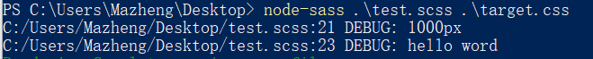

# SCSS

## 不依赖于IDE的sass安装

### node-sass

```bash
npm i -g node-sass
```


**基本使用**

+ 单文件编译

  ```bash
  $node-sass  原有的scss文件 生成的css文件
  $node-sass  原有的scss文件 -o 生成目录
  
  # example:
  $node-sass a.scss b.css
  $node-sass a.scss css_files
  ```

+ 多文件编译

  ```bash
  $node-sass 原有的scss文件目录 -o 生成的css文件目录
  
  # example:
  $node-sass c -o d
  ```

+ 文件监听模式

  ```bash
  # 在"1"和"2"的基础上填加"-w"命令行参数即可
  $node-sass -w 原有的scss文件 -o 输出目录 #编译的结果会保存在输出目录的同名文件
  $node-sass -w 原有的scss文件目录 -o css文件输出目录
  
  # example:
  $node-sass -w a.scss -o css
  $node-sass -w scss -o css
  
  # 效果：编译进程不结束，监听文件内容
```
  
  

> -o 相当于--output，之后跟输出的目录
>
> -w 参数相当于--watch， 不跟参数值，用于监听目标文件/目录


## 注释

1. Sass 支持标准的 CSS 多行注释 `/* */`，以及单行注释 `//`，前者会被完整输出到编译后的 CSS 文件中，而后者则不会, 所以后者亦称作`静默注释`。

2. 将 `!` 作为多行注释的第一个字符表示在压缩输出模式下保留这条注释并输出到 CSS 文件中，通常用于添加版权信息。

3. 插值语句 (interpolation) 也可写进多行注释中输出变量值

例如：

```scss
/* 
	hello
	world!
*/

// compile scss files to css
// it's ready to do it.
$pink: #f3e1e1;
html{
    background-color: $pink;
}

$author: 'gdream@126.com';
/*!
	Author: #{$author}.   语法👉 #{插值内容}
*/
```

开发模式编译后：

```css
/* 
	hello
	world!
*/
html{
    background-color: #f3e1e1;
}
/*!
	Author: 'gdream@126.com'.
*/
```


## 变量

### 1.定义

变量以美元符号开头，赋值方法与 CSS 属性的写法一样

~~~scss
$width: 1600px;
$pen-size: 3em;
~~~

### 2.使用

直接使用变量的名称即可调用变量

~~~scss
#app {
    height: $width;
    font-size: $pen-size;
}
~~~

### 3.作用域

变量支持块级作用域，嵌套规则内定义的变量只能在嵌套规则内使用（局部变量），不在嵌套规则内定义的变量则可在任何地方使用（全局变量）。将局部变量转换为全局变量可以添加 `!global` 声明 

~~~scss
#foo {
  $width: 5em !global;
  width: $width;
}

#bar {
  width: $width;
}
~~~

编译后：

~~~css
#foo {
  width: 5em;
}

#bar {
  width: 5em;
}
~~~


### 数据类型

SassScript 支持 7 种主要的数据类型：

- 数字，`1, 2, 13, 10px, 5a` 

  > 整数/小数 [+ 英文单位]

- 字符串，有引号字符串与无引号字符串，`"foo", 'bar', baz`

  > 尽量使用带双引号的字符串

- 颜色，`blue, #04a3f9, rgba(255,0,0,0.5)`

- 布尔型，`true, false`

- 空值，`null`

  > 不常用，一般用在逻辑判断中

- 数组 (list)，用空格或逗号作分隔符，`1.5em 1em 0 2em, Helvetica, Arial, sans-serif`

- maps, 相当于 JavaScript 的 object，`(key1: value1, key2: value2)`

SassScript 也支持其他 CSS 属性值，比如 Unicode 字符集，或 `!important` 声明。然而Sass 不会特殊对待这些属性值，一律视为无引号字符串。


判断数据类型的方式：`type-of($value)`


### 1.字符串 (Strings)

SassScript 支持 CSS 的两种字符串类型：`有引号字符串 (quoted strings)`，和`无引号字符串 (unquoted strings)`。

~~~scss
$name: 'Tom Bob';
$container: "top bottom";
$what: heart;
~~~

> 注：在编译 CSS 文件时不会改变其类型。只有一种情况例外，使用 `#{}` (interpolation)  /ɪnˌtɜːpəˈleɪʃn/ 时，有引号字符串将被编译为无引号字符串，这样便于在 mixin 中引用选择器名

```scss
$div: "div";
@mixin boxFontSize($index, $fontSize) {
	.box-#{$index} {
		font-size: $fontSize;
	}
};

html {
	@include boxFontSize(1, 16px);
}

// 编译结果 👇
html .box-1 {
  font-size: 16px; }
```


### 2.数字(Numbers)

SassScript支持两种数字类型：`带单位数字`和`不带单位数字`。（可正可负可为零，可整可浮点）

~~~scss
$my-age: 19;
$your-age: 19.5;
$height: 120px;

// 注：单位会和数字当做一个整体，进行算数运算
~~~


### 3.空值(Null)

只有一个取值`null`

~~~scss
$value: null;

// 注：由于它代表空，所以不能够使用它与任何类型进行算数运算
~~~


### 4.布尔型(Booleans)

只有两个取值：`true`和`false`

~~~scss
$a: true;
$b: false;
~~~

> 注：只有自身是false和null在逻辑判断时才会返回false，其他一切都将返回true

### 5.数组 (Lists)

通过空格或者逗号分隔的一系列的值。事实上，独立的值也被视为数组 —— 只包含一个值的数组。索引从`1`开始

~~~scss
$list0: 1px 2px 5px 6px;
$list1: 1px 2px, 5px 6px;
$list2: (1px 2px) (5px 6px);
~~~

数组中可以包含子数组，比如 `1px 2px, 5px 6px` 是包含 `1px 2px` 与 `5px 6px` 两个数组的数组。如果内外两层数组使用相同的分隔方式，需要用圆括号包裹内层，所以也可以写成 `(1px 2px) (5px 6px)`。变化是，之前的 `1px 2px, 5px 6px` 使用逗号分割了两个子数组 (comma-separated)，而 `(1px 2px) (5px 6px)` 则使用空格分割(space-separated)。

当数组被编译为 CSS 时，Sass 不会添加任何圆括号（CSS 中没有这种写法），所以 `(1px 2px) (5px 6px)` 与 `1px 2px, 5px 6px` 在编译后的 CSS 文件中是完全一样的，但是它们在 Sass 文件中却有不同的意义，前者是包含两个数组的数组，而后者是包含四个值的数组。

用 `()` 表示不包含任何值的空数组（在 Sass 3.3 版之后也视为空的 map）。空数组不可以直接编译成 CSS，比如编译 `font-family: ()` Sass 将会报错。如果数组中包含空数组或空值，编译时将被清除，比如 `1px 2px () 3px` 或 `1px 2px null 3px`。

基于逗号分隔的数组允许保留结尾的逗号，这样做的意义是强调数组的结构关系，尤其是需要声明只包含单个值的数组时。例如 `(1,)` 表示只包含 `1` 的数组，而 `(1 2 3,)` 表示包含 `1 2 3` 这个以空格分隔的数组的数组。


### 6.映射(Maps)

Maps必须被圆括号包围，可以映射任何类型键值对（任何类型，包括内嵌maps，不过不推荐这种内嵌方式）

~~~scss
$map: ( 
  key1: value1, 
  key2: value2, 
  key3: value3,
  "1" : value4,
   1: value5     // "1"和1 是不同数据类型，是不同的键
)
~~~

> Maps可视为键值对的集合，键被用于定位值 在css种没有对应的概念。 和Lists不同Maps必须被圆括号包围，键和值之间用`冒号`连接，键值对之间用`逗号`分割 。
>
>  Maps中的`keys和values`可以是sass script的`任何数据类型`。（包括任意的sassscript表达式 arbitrary SassScript expressions）
>
>  和Lists一样，Maps主要为sass script函数服务，
>
> 如 map-get函数用于查找键值，
>
> map-get($map, key1)、map-get($map, "key1")
>
> map-merge函数用于map和新加的键值融合，
>
> @each命令可添加样式到一个map中的每个键值对。
>
>  Maps可用于任何Lists可用的地方，在List函数中 Map会被自动转换为List ， 如 (key1: value1, key2: value2)会被List函数转换为 key1 value1, key2 value2 ，反之则不能。

### 7.颜色 (Colors)

CSS原有颜色类型，十六进制、RGB、RGBA、HSL、HSLA和色彩单词。

SCSS提供了与颜色有关的内置函数，从而使用户能够更方便地使用颜色。

~~~scss
$color0: green;
$color1: lighten($color, 15%);
$color2: darken($color, 15%);
$color3: saturate($color, 15%);
$color4: desaturate($color, 15%);
$color5: (green + red);
~~~


## 运算

### 1.算数运算符

SassScript 支持数字的加减乘除、取整等运算 (`+, -, *, /, %`)，如果必要会在不同单位间转换值

如果要保留运算符号，则应该使用插值语法

- `+`

  ~~~scss
  // 纯数字
  $add1: 1 + 2;	// 3
  $add2: 1 + 2px; // 3px
  $add3: 1px + 2; // 3px
  $add4: 1px + 2px;//3px
  
  // 纯字符串
  $add5: "a" + "b"; // "ab"
  $add6: "a" + b;	  // "ab"
  $add7: a + "b";	  // ab
  $add8: a + b;	  // ab
  
  // 数字和字符串
  $add9: 1 + a;	// 1a
  $adda: a + 1;	// a1
  $addb: "1" + a; // "1a"
  $addc: 1 + "a"; // "1a"
  $addd: "a" + 1; // "a1"
  $adde: a + "1"; // a1
  $addf: 1 + "1"; // "11"
  ~~~

  ~~~scss
  // 总结：
  a.纯数字：只要表达式中某个数字值带有单位，则结果必有单位。
  b.纯字符串：第一个字符串有无引号决定结果是否有引号
  c数字和字符串：结果一定为字符串。数字与字符串的加法表达式中，最靠左的字符串字面量是否带引号，将决定相加的结果字符串是否带引号。
  ~~~

  

- `-`

  ~~~scss
  $add1: 1 - 2;	// -1
  $add2: 1 - 2px; // -1px
  $add3: 1px - 2; // -1px
  $add4: 1px - 2px;//-1px
  
  $sub1: a - 1;  // a-1
  $sub2: 1 - a;  // 1-a
  $sub3: "a" - 1;// "a"-1
  $sub4: a - "1";// a-"1"
  ~~~

  > 减法表达式中出现字符串类型， 则整个表达式视作一个字符串。
  
  
  
- `*`

  ~~~scss
  $num1: 1 * 2;    // 2
  $mul2: 1 * 2px;  // 2px
  $num3: 1px * 2;  // 2px
  $num4: 2px * 2px;// 编译不通过
  
  $num5: 1 * 2abc; // 2abc
  ~~~

  > 允许至多一个带单位的数字出现在乘号两侧。

  

- `/`

  > 不会四舍五入，精确到小数点后5位。
  >
  > 被除数允许带单位，除数不允许带单位。

  

- `%`

  > 表达式两侧的值与"%"之间必须要有空格，否则会被看做字符串
  
  

### 2.关系运算符

大前提：两端必须为`数字类型`， 单位不同的数字之间无法比较。 

返回值：`true` or `false`


- `>`

  ~~~scss
  $a: 1 > 2; // false
  ~~~

- `<`

  ~~~scss
  $a: 1 > 2; // true
  ~~~

- `>=`

  ~~~scss
  $a: 1 >= 2; // false
  ~~~

- `<=`

  ~~~scss
  $a: 1 <= 2; // true
  ~~~

  

### 3.相等运算符

作用范围：相等运算 `==, !=` 可用于所有数据类型

返回值：`true` or `false`

~~~scss
$a: 1 == 1px; // true
$b: "a" == a; // true
~~~

> 数字类型相比较，只比较数字部分，不比较单位。
>
> 字符串类型相比较，有无引号不影响结果，只比较各个位置字符是否相同。


### 4.布尔运算符

SassScript 支持布尔型的 `and` `or` 以及 `not` 运算。

~~~scss
$a: 1>0 and 0>=5; // fasle
~~~

~~~scss
// 总结：
值与"and"、"or"和"not"之间必须要有空格，否则会被看做字符串
~~~


### 5.颜色值运算

颜色值的运算是分段计算进行的，也就是分别计算红色，绿色，以及蓝色的值

- `颜色值与颜色值`

  ~~~scss
  p {
    color: #010203 + #040506;
  }
  
  // 计算 01 + 04 = 05 02 + 05 = 07 03 + 06 = 09，然后编译为
  // p {
    color: #050709; }
  ~~~

- `颜色值与数字`

  ~~~scss
  p {
    color: #010203 * 2;
  }
  
  // 计算 01 * 2 = 02 02 * 2 = 04 03 * 2 = 06，然后编译为
  // p {
    color: #020406; }
  ~~~

- `RGB和HSL`

  ~~~scss
  // 如果颜色值包含 alpha channel（rgba 或 hsla 两种颜色值），必须拥有相等的 alpha 值才能进行运算，因为算术运算不会作用于 alpha 值。
  
  p {
    color: rgba(255, 0, 0, 0.75) + rgba(0, 255, 0, 0.75);
  }
  
  // p {
    color: rgba(255, 255, 0, 0.75); }
  ~~~


### 6.运算优先级

0. `()`

1. `*`、`/`、`%`
2. `+`、`-`
3. `>` 、`<`、`>=`、`<=`

---


## 嵌套语法

### 选择器嵌套

scss允许css选择器进行嵌套，表示父子关系。

```scss
div {
    a { color: red; }
}
// 编译后 👇 css
div a { color: red; }
```

### CSS属性嵌套

```scss 
div {
    font: {  // 👈 注意这里有个冒号，是与选择器嵌套的区别
        family: Arial;
        size: 16px; }
    margin: {
		left: 20px;
		right: 40px; }
}

// 编译后👇 css
div {
  font-family: Arial;
  font-size: 16px;
  margin-left: 20px;
  margin-right: 40px; }

```


## 模板字符串(插值语法)

通过 `#{}` 插值语句可以在选择器、属性名和属性值中使用变量。

但大多数情况下，这样使用属性值可能还不如直接使用变量方便，但是使用 `#{}` 可以避免 Sass 运行运算表达式，直接编译 CSS。

~~~scss
$name: foo;
$attr: border;
p.#{$name} {
  #{$attr}-color: $name;
}

// 编译后：
p.foo {
  border-color: foo;
}
~~~

## 父选择器

`&`为父选择器

~~~scss
a {
    color: yellow;
    &:hover{
        color: green;
    }
    &:active{
        color: blank;
    }
}
~~~


## !default 和 !global

### !default 

可以在变量的结尾添加 `!default` 给一个未通过 `!default` 声明赋值的变量赋值，此时，如果变量已经被赋值，不会再被重新赋值，但是如果变量还没有被赋值，则会被赋予新的值。

> 这个语法主要在scss的文件模块化时起作用。

~~~scss
$content: "First content";
$content: "Second content?" !default;
$new_content: "First time reference" !default;

#main {
  content: $content;
  new-content: $new_content;
}

// 编译为：
#main {
  content: "First content";
  new-content: "First time reference"; }
~~~

注意：变量是 null 空值时将视为未被 `!default` 赋值。 


### !global

将局部变量提升为全局变量

```scss
#foo {
    $width: 5em !global;
}
#bar {
    width: $width;
}
```


## 模块化指令 @import

### 基本使用与注意点

Sass `拓展了css的 @import` 的功能，允许其导入 SCSS 或 SASS 文件。被导入的文件将合并编译到同一个 CSS 文件中，另外，被导入的文件中所包含的变量或者混合指令 (mixin) 都可以在导入的文件中使用。

> 通常，`@import` 寻找 Sass 文件并将其导入，但在以下情况下，`@import` 仅作为普通的 CSS 语句，不会导入任何 Sass 文件。即以下情况的`@import`被当作css语句执行。
>
> - 文件拓展名是 `.css`；
> - 文件名以 `http://` 开头；
> - 文件名是 `url()`；
> - `@import` 包含 media queries。

如果不在上述情况内，文件的拓展名是 `.scss` 或 `.sass`，则导入成功。没有指定拓展名，Sass 将会试着寻找文件名相同，拓展名为 `.scss` 或 `.sass` 的文件并将其导入。

~~~scss
@import "foo.scss";
@import "foo";
@import "a/bar.scss";
@import "a/bar"
// 以上两种方式均可


// 以下方式均不可行
@import "foo.css";
@import "foo" screen;
@import "http://foo.com/bar";
@import url(foo);
~~~


### 导入多个文件

Sass 允许同时导入多个文件，例如同时导入 rounded-corners 与 text-shadow 两个文件：

~~~scss
@import "rounded-corners", "text-shadow";
~~~


### 路径插值

导入文件也可以使用 `#{ }` 插值语句，但不是通过变量动态导入 Sass 文件，只能作用于` CSS `的 `url()` 导入方式：

~~~scss
$family: unquote("Droid+Sans");
@import url("http://fonts.googleapis.com/css?family=\#{$family}");

// 编译为：
@import url("http://fonts.googleapis.com/css?family=Droid+Sans");
~~~


### 模板

如果你有一个 SCSS 或 Sass `模板文件`需要引入， 但是你又不希望它被编译为一个 CSS 文件， 这时，你就可以`在文件名前面加一个下划线`，就能避免被编译。 这将告诉 Sass 不要把它编译成 CSS 文件。 然后，你就可以像往常一样引入这个文件了，而且还可以省略掉文件名前面的下划线。

```scss
@import "template/_bar.scss"; 
@import "template/bar";  // 等价于上面的写法
```

> 当使用 @import "template/bar" 时，template目录下不允许存在_bar.scss和bar.scss，否则编译器不知道该导入哪个scss文件（出现歧义）

### 支持在嵌套语法中使用@import

--b.scss

--_a.scss

```scss
// _a.scss的内容
div {
	margin: 0:
}
```

```scss
// b.scss的内容
.b {
    @import "a.scss"
}
// 编译b.scss的结果 👇
.b div {
    margin: 0;
}
```


## 继承指令 @extend

```scss
// 使用方法1
#app {
    color: red;
}
#app2 {
    @extend #app;
}
// 编译结果👇
#app, #app1 { color: red; }
```

```scss
// 使用方法2
%colorred {    // “%”开头的选择器叫做占位选择器，本身不会起实际作用，只能被继承
	color: red;
}
.b {
	@extend %colorred;
	background-color: black;
}
// 编译结果👇
.b {
  color: red; }

.b {
  background-color: black; }

```


## 媒体查询扩展 @media

Sass 中 `@media` 指令与 CSS 中用法一样，只是增加了一点额外的功能：允许其在 CSS 规则中嵌套。如果 `@media` 嵌套在 CSS 规则内，编译时，`@media` 将被编译到文件的最外层，`包含嵌套的父选择器`。这个功能让 `@media` 用起来更方便，不需要重复使用选择器，也不会打乱 CSS 的书写流程。

~~~scss
.sidebar {
  width: 300px;
  // 👇 这里的媒体查询规则是作用域父级选择器，即 .sidebar， 而不是.sidebar的子元素
  @media screen and (orientation: landscape) {   
    width: 500px;
  }
}
// 编译为 👇    实际编译后的格式可能与下面不同，但一定是将媒体查询规则提到顶层。
.sidebar {
  width: 300px; 
}
@media screen and (orientation: landscape) {  
    .sidebar {
      width: 500px; } 
}
~~~


`@media`的 queries 允许互相嵌套使用，编译时，Sass 自动添加 `and`

~~~scss
@media screen {
  .sidebar {
    @media (orientation: landscape) {
      width: 500px;
    }
  }
}
// 编译为：
@media screen and (orientation: landscape) {
  .sidebar {
    width: 500px; } }
~~~

`@media` 甚至可以使用 SassScript（比如变量，函数，以及运算符）代替条件的名称或者值

~~~scss
$media: screen;
$feature: -webkit-min-device-pixel-ratio;
$value: 1.5;

@media #{$media} and ($feature: $value) {
  .sidebar {
    width: 500px;
  }
}
// 编译为：
@media screen and (-webkit-min-device-pixel-ratio: 1.5) {
  .sidebar {
    width: 500px; } }
~~~


## 调试

### @debug

```scss
$max: 1000px;
@debug $max;
div {
    @debug "hello word";
}

👇 会在控制台输出
1000px
hello world;
```




### @warn 

没试过

### @error

没试过


## 条件指令

### 三目运算符

*`if()`语句就是SassScript中的三目运算符*

表达式：`if(expression, value1, value2)`

~~~scss
p {
    color: if(1 + 1 = 2, green, yellow);
}

// compile:
p{
    color: green;}
~~~


### @if @else if  @else

*条件语句*

当 `@if` 的表达式返回值不是 `false` 或者 `null` 时，条件成立，输出 `{}` 内的代码

`@if` 声明后面可以跟多个 `@else if` 声明，或者一个 `@else` 声明。如果 `@if` 声明失败，Sass 将逐条执行 `@else if` 声明，如果全部失败，最后执行 `@else` 声明

- `单@if`

    ~~~scss
    p {
        @if 1 + 1 == 2 {
            color: red;
        }
    }

    // compile:
    p {
      color: red;
    }
    ~~~

- `@if - @else`

  ~~~scss
  p {
      @if 1 + 1 != 2 {
          color: red;
      } @else {
          color: blue;
      }
  }
  
  // compile:
  p {
    color: blue;
  }
  ~~~

- `@if - @else if - @else`

  ~~~scss
  $age: 19;
  
  p {
      @if $age == 18 {
          color: red;
      } @else if $age == 19 {
          color: blue;
      } @else {
          color: green;
      }
  }
  
  // compile:
  p {
    color: blue;
  }
  ~~~


## 循环指令

### @for

表达式：`@for $var from <start> through <end>` 或 `@for $var from <start> to <end>`


through 和 to 的相同点与不同点：

- 相同点：两者均包含<start>的值
- 不同点：through包含<end>的值，但to不包含<end>的值


~~~scss
@for $i from 1 through 3 {
  .item-#{$i} { width: 2em * $i; }
}

// compile:
.item-1 {
  width: 2em; }
.item-2 {
  width: 4em; }
.item-3 {
  width: 6em; }
~~~


### @while

表达式：`@while expression`

`@while` 指令重复输出格式直到表达式返回结果为 `false`。这样可以实现比 `@for` 更复杂的循环，只是很少会用到。

~~~scss
$i: 6;
@while $i > 0 {
  .item-#{$i} { width: 2em * $i; }
  $i: $i - 2;
}

// compile:
.item-6 {
  width: 12em; }
.item-4 {
  width: 8em; }
.item-2 {
  width: 4em; }
~~~


### @each

表达式：`@each $var in $vars`

`$var` 可以是任何变量名

`$vars` 只能是`Lists`或者`Maps`


- 一维列表

  ~~~scss
  @each $animal in puma, sea-slug, egret, salamander {
    .#{$animal}-icon {
      background-image: url('/images/#{$animal}.png');
    }
  }
  
  // compile:
  .puma-icon {
    background-image: url('/images/puma.png'); }
  .sea-slug-icon {
    background-image: url('/images/sea-slug.png'); }
  .egret-icon {
    background-image: url('/images/egret.png'); }
  .salamander-icon {
    background-image: url('/images/salamander.png'); }
  ~~~

- 二维列表

  ~~~scss
  @each $animal, $color, $cursor in (puma, black, default),
                                    (sea-slug, blue, pointer),
                                    (egret, white, move) {
    .#{$animal}-icon {
      background-image: url('/images/#{$animal}.png');
      border: 2px solid $color;
      cursor: $cursor;
    }
  }
  
  // compile:
  .puma-icon {
    background-image: url('/images/puma.png');
    border: 2px solid black;
    cursor: default; }
  .sea-slug-icon {
    background-image: url('/images/sea-slug.png');
    border: 2px solid blue;
    cursor: pointer; }
  .egret-icon {
    background-image: url('/images/egret.png');
    border: 2px solid white;
    cursor: move; }
  ~~~

- maps

  ~~~scss
  @each $header, $size in (h1: 2em, h2: 1.5em, h3: 1.2em) {
    #{$header} {
      font-size: $size;
    }
  }
  
  // compile:
  h1 {
    font-size: 2em; }
  h2 {
    font-size: 1.5em; }
  h3 {
    font-size: 1.2em; }
  ~~~


## 混合指令@mixin与@include

> 混合指令（Mixin）用于定义可重复使用的样式，避免了使用无语意的 class，比如 `.float-left{float: left}`。混合指令可以包含所有的 CSS 规则，绝大部分 Sass 规则，甚至通过参数功能引入变量，输出多样化的样式。

注意：这不是函数！没有返回值！！

### 1.定义普通的mixin

混合指令的用法是在 `@mixin` 后添加名称与样式，以及需要的参数（可选）。

~~~scss
// 格式：
@mixin name {
    // 样式....
}
~~~

~~~scss
// example：
@mixin large-text {
  font: {
    family: Arial;
    size: 20px;
    weight: bold;
  }
  color: #ff0000;
}
~~~


### 2.引用混合样式

使用 `@include` 指令引用混合样式，格式是在其后添加混合名称，以及需要的参数（可选）。

~~~scss
// 格式：
@include name;

// 注：无参数或参数都有默认值时，带不带括号都可以
~~~

~~~scss
// example：
p {
    @include large-text;
}

// compile:
p {
  font-family: Arial;
  font-size: 20px;
  font-weight: bold;
  color: #ff0000;
}
~~~


### 3.带参数的mixin

格式：按照变量的格式，通过逗号分隔，将参数写进Mixin名称后的圆括号里

支持默认值；支持多参数；支持不定参数；支持位置传参和关键词传参


#### a. 位置传参

~~~scss
@mixin mp($width) {
    margin: $width;
}

body {
    @include mp(300px);
}
~~~


#### b.关键词传参

~~~scss
@mixin mp($width) {
    margin: $width;
}

body {
    @include mp($width: 300px);
}
~~~


#### c.参数默认值

~~~scss
@mixin mp($width: 500px) {
    margin: $width;
}

body {
    @include mp($width: 300px);
    // or
    @include mp(300px);
}
~~~


#### d.不定参数

> 有时，不能确定混合指令需要使用多少个参数。这时，可以使用参数变量 `…` 声明（写在参数的最后方）告诉 Sass 将这些参数`装包为一个数组类型的参数`处理。

~~~scss
@mixin mar($value...) {
    margin: $value;
}
~~~


### 4.mixin中的"插槽"

在引用混合样式的时候，可以先将一段代码插入到mixin的插槽中，然后再输出完整的mixin，插入内容将填充 `@content` 标志的地方

~~~scss
@mixin example {
    html {
        @content; 👈 // 占位"插槽"
    }
}
@include example{  👈 // 用{}括起，向插槽中填充内容
    background-color: red;
    .logo {
        width: 600px;
    }
}

// 编译成css的结果👇
html {
  background-color: red;
}

html .logo {
  width: 600px;
}

~~~


## 函数指令

### 1.内置函数

#### a. 字符串函数

SassScript提供的字符串函数包括 引号处理、大小写转换、查询、插入、切片等功能。

| 函数名和参数类型                        |                  函数作用                   |
| :-------------------------------------- | :-----------------------------------------: |
| quote($string)                          |                  添加引号                   |
| unquote($string)                        |                  除去引号                   |
| to-lower-case($string)                  |                  变为小写                   |
| to-upper-case($string)                  |                  变为大写                   |
| str-length($string)                     |        返回$string的长度(汉字算一个)        |
| str-index($string，$substring)          |        返回$substring在$string的位置        |
| str-insert($string, $insert, $index)    |       在$string的$index处插入$insert        |
| str-slice($string, $start-at, $end-at） | 截取$string的$start-at和$end-at之间的字符串 |

> 字符串的索引第一个为1，最后一个为-1；切片两边均为闭区间

```scss
// str-slice 函数测试
$str: "abc";
@debug str-slice($str, 1, 3);  >>> abc
```


#### b. 数字函数

| 函数名和参数类型        |                           函数作用                           |
| ----------------------- | :----------------------------------------------------------: |
| percentage($number)     |                       转换为百分比形式                       |
| round($number)          |                        四舍五入为整数                        |
| ceil($number)           |                         数值向上取整                         |
| floor($number)          |                         数值向下取整                         |
| abs($number)            |                          获取绝对值                          |
| min($number...)         |                          获取最小值                          |
| max($number...)         |                          获取最大值                          |
| random($number?:number) | 不传入值：获得0-1的`随机小数`；<br>传入`正整数n`：获得0-n的`随机整数`（`左开右闭`） |

> round、ceil、floor、abs、max、min这些函数若传入带单位的数字，其返回值也会带单位。


#### c. 数组函数

提供了访问数组元素、查询指定元素、尾插、合并、对位组合等功能。

| 函数名和参数类型                 |                           函数作用                           |
| -------------------------------- | :----------------------------------------------------------: |
| length($list)                    |                         获取数组长度                         |
| nth($list, n) ⭐                  |                      获取指定下标的元素                      |
| set-nth($list, $n, $value)⭐      |  返回一个新数组，其值为$list的$n处设置为$value后的新数组。   |
| join($list1, $list2, $separator) | 返回一个新数组，其值为拼接$list1和list2后的结果；<br>$separator为新list的分隔符，默认为auto，可选择comma、space |
| append($list, $val, $separator)  | 向$list的末尾添加$val；$separator为新list的分隔符，默认为auto，可选择comma、space |
| index($list, $value)             |                返回$value值在$list中的索引值                 |
| zip($lists…)                     | 将几个列表结合成一个多维的列表；要求每个的列表个数值必须是相同的 |

```scss
// zip 函数测试
$l1: 1px solid black; 
$l2: 2px dashed red;
@debug zip($l1, $l2);  >>> 1px 2px, solid dashed, black red // 这里表现为上下两两结合
```


#### d. 映射函数

| 函数名和参数类型        |                 函数作用                 |
| ----------------------- | :--------------------------------------: |
| map-get($map, $key)  ⭐  |        获取$map中$key对应的$value        |
| map-merge($map1, $map2) |     合并$map1和$map2，返回一个新$map     |
| map-remove($map, $key)⭐ |     从$map中删除$key，返回一个新$map     |
| map-keys($map)⭐         |            返回$map所有的$key            |
| map-values($map)⭐       |           返回$map所有的$value           |
| map-has-key($map, $key) | 判断$map中是否存在$key，返回对应的布尔值 |
| keywords($args)         |  返回一个函数的参数，并可以动态修改其值  |


#### e. 颜色函数

- **RGB函数**

  | 函数名和参数类型                |                           函数作用                           |
  | ------------------------------- | :----------------------------------------------------------: |
  | rgb($red, $green, $blue)        |                     返回一个16进制颜色值                     |
  | rgba($red,$green,$blue,$alpha)⭐ | 返回一个rgba；$red,$green和$blue可被当作一个整体以颜色单词、hsl、rgb或16进制形式传入 |
  | red($color)                     |                   从$color中获取其中红色值                   |
  | green($color)                   |                   从$color中获取其中绿色值                   |
  | blue($color)                    |                   从$color中获取其中蓝色值                   |
  | mix($color1,$color2,$weight?)⭐  |     按照$weight比例，将$color1和$color2混合为一个新颜色      |

- **HSL函数**

  | 函数名和参数类型                         | 函数作用                                                     |
  | ---------------------------------------- | ------------------------------------------------------------ |
  | hsl($hue,$saturation,$lightness)         | 通过色相（hue）、饱和度(saturation)和亮度（lightness）的值创建一个颜色 |
  | hsla($hue,$saturation,$lightness,$alpha) | 通过色相（hue）、饱和度(saturation)、亮度（lightness）和透明（alpha）的值创建一个颜色 |
  | saturation($color)                       | 从一个颜色中获取饱和度（saturation）值                       |
  | lightness($color)                        | 从一个颜色中获取亮度（lightness）值                          |
  | adjust-hue($color,$degrees)              | 通过改变一个颜色的色相值，创建一个新的颜色                   |
  | lighten($color,$amount)                  | 通过改变颜色的亮度值，让颜色变亮，创建一个新的颜色           |
  | darken($color,$amount)                   | 通过改变颜色的亮度值，让颜色变暗，创建一个新的颜色           |
  | hue($color)                              | 从一个颜色中获取亮度色相（hue）值                            |

- **Opacity函数**

  |                                                              |                  |
  | ------------------------------------------------------------ | ---------------- |
  | alpha($color)/opacity($color)                                | 获取颜色透明度值 |
  | rgba($color,$alpha)                                          | 改变颜色的透明度 |
  | opacify($color, $amount) / fade-in($color, $amount) ⭐        | 使颜色更不透明   |
  | transparentize($color, $amount) / fade-out($color, $amount) ⭐ | 使颜色更加透明   |


#### f. Introspection函数

| 函数名和参数类型               |                           函数作用                           |
| ------------------------------ | :----------------------------------------------------------: |
| type-of($value)⭐               |                       返回$value的类型                       |
| unit($number)⭐                 |                      返回$number的单位                       |
| unitless($number)⭐             |          判断$number是否不带单位，返回对应的布尔值           |
| comparable($number1, $number2) | 判断$number1和$number2是否可以做加、减和合并，返回对应的布尔值 |


### 2.自定义函数

> Sass 支持自定义函数，并能在任何属性值或 Sass script 中使用
>
> Params: 与Mixin一致
>
> 函数的作用在于将函数返回值作为scss规则的一部分。

**基本格式：**

~~~scss
@function fn-name($params...) {
    @return $params;
}
~~~


~~~scss
// example:
@function fn-name($params...) {
    @return nth($params, 1);
}
p {
    height: fn-name(1px);
}

// compiled:
p {
  height: 1px;
}
~~~


------

## 细节与展望

### 1.细节

a. @extend、@Mixin和@function的选择

[原文链接](https://csswizardry.com/2016/02/mixins-better-for-performance/)

> `minxins`在网络传输中比`@extend` 拥有更好的性能.尽管有些文件未压缩时更大，但使用`gzip`压缩后，依然可以保证我们拥有更好的性能。


**所以@extend我们就尽量不要使用了，而@Mixin和@function的差别在定义和使用上**


> 定义方式不同： `@function` 需要调用`@return`输出结果。而 @mixin则不需要。
>
> 使用方式不同：`@mixin` 使用`@include`引用，而 `@function` 使用小括号执行函数。


### 2.展望

>
>
>以上内容算是"基础"部分，但是对于日常开发，我觉得是足够使用的了。
>
>如果想要进一步了解，就必须先去学习下Ruby，使用Ruby相关模块进行更丰富地学习