# Vue

Vue是一个渐进式JavaScript框架。

高级功能和特点：

+ 解耦视图和数据
+ 可复用的组件
+ 前端路由技术
+ 状态管理
+ 虚拟DOM


**Vue.js的Hello world**

```html
<!DOCTYPE html>
<html lang="en">
<head>
    <meta charset="UTF-8">
    <meta name="viewport" content="width=device-width, initial-scale=1.0">
    <title>Document</title>
</head>
<body>
    <div id="app">
        <h2>{{message}}</h2>   
    </div>  
    <script src="https://cdn.jsdelivr.net/npm/vue@2.6.11"></script>
    <script>
        let app=new Vue({
        el:"#app",
        data:{
            message:"Hello world"
        } 
        });
        <!-- 新建一个Vue对象，在构造函数中传入options对象-->
    </script>
</body>
</html>
```

<font size="4" color="red">Vue采用声明式编程，不同于jQuery以及原生JS操作DOM的命令式编程</font>

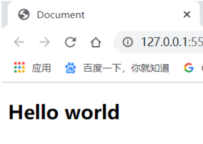 


## Vue中的MVVM 

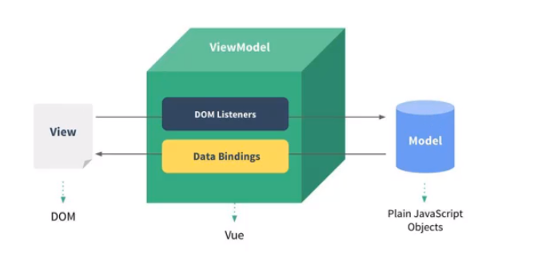

## Options对象 

+ **el：**

  类型：string | HTMLElement

  作用：决定Vue实例会管理哪一个DOM对象

+ **data：**

  类型：Object | Function

  作用：Vue实例对应的数据对象

+ **methods**：

  类型：｛key : Function｝

  作用：定义属于Vue实例的一些方法，可以在其他地方调用，也可以在指令中使用。

+ **computed：**

  计算属性

  类型：{key : Function}

  作用：定义一些计算属性值供使用。<font color="red">计算属性具有缓存机制，如果计算属性使用的数据没有被修改，则计算属性不会计算多次，当访问该计算属性时，直接从缓存中取值。</font>

  ==由于缓存机制的存在，当页面中显示的内容只是需要对数据进行简单变换时，尽量使用计算属性，而不是使用函数计算==

  ```html
  
  <h2>书籍购物车的总价格:{{totalPrice}}</h2>
  
  <script>
  	new Vue({
  		el:"h2",
  		data:{
  			books:[
  				{name:'代码大全',price:20},
  				{name:'现代操作系统',price:50}
  			]
  		},
  		computed:{
  			totalPrice:function (){
          		return this.books.reduce((pre,cur)=>{
                      pre+=cur.price;
                      return pre;
                  },0);
      		}
              /*
              也可以使用ES6方法的简写
              totalPrice(){
              	return this.books.reduce((pre,cur)=>{
                      pre+=cur.price;
                      return pre;
                  },0);
              }
              */
  		}
  	})
  </script>
  ```

  <font color='red'>computed中的计算属性底层的原理 可能 是使用了Proxy</font>

  ```javascript
  comuputed:{
      //totalPrice:handler
      totalPrice:{
          get{
              return this.books.reduce((pre,cur)=>{
                      pre+=cur.price;
                      return pre;
                     },0);
          }
          //get:function(){....}
          //还可以设置set方法
      }
  }//这种写法同样可以。
  ```

  

+ **filters：**

  类型：Function

  作用：允许传入一个value，对该值进行过滤或附加处理，返回新的值。

  使用： value | filterFunctionName 

  ```html
  <h2>{{grade | assessment}}</h2>
  
  data:{
  	grade:'A'
  }
  filters:{
  	assessment(value){
  		if(value==='A') return '优秀';
  		else   return '其他';
  	}
  }
  ```

  效果：

  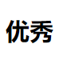 

+ **components**：

  类型：Object

  作用：定义局部组件

+ **watch：**

  类型：Object

  作用：监听data中的数据以及props中的通信属性的变化。

+ **生命周期函数**：

  如：beforeCreate、created、Mounted、Destroyed.....


## Vue的生命周期

 

## Mustache语法 


```html	
<div id="app">
    <h2>{{message}}</h2>
    <h2>{{message}},Mazheng</h2>
    
    <!--Mustache语法不仅仅可以写变量，还可以写表达式-->
    <h2>{{firstName + '' + lastName}}</h2>
    
    <!--另一种写法,不会忽略语法变量之间的空格，会忽略语法变量两端的空格-->
    <h2>{{firstName}} {{lastName}}</h2> 
    
    
    <!--数值表达式-->
    <h2>总价：{{price * 2}}</h2>
</div>
```


## 常用指令

### 文本指令 

1. **v-once** 

   布尔属性，数据渲染一次后就不再保持绑定，内容不会再随数据改变。

2. **v-html**

   v-html="==data=="，会将字符串类型的字面量、变量或表达式当做html内容进行渲染。

   （覆盖标签内原有的内容）。

3. **v-text **

   v-text="==data=="，会将字符串类型的字面量、变量或表达式作为使用该指令的dom元素的文本（覆盖标签内原有的内容）。

4. **v-pre**

   v-pre布尔指令，会将标签中包裹的内容原原本本的展示。（忽略mustache语法）

```html
<div id="app">
    <h2>{{message}}</h2>
    <h2 v-pre>{{message}}</h2>
    <h2 v-html="message"></h2>
    <h2 v-text="message">hahaha</h2><!--会覆盖hahaha v-text不如mustache语法灵活-->
</div>  

<script>引入vue</script>
<script>
	let app = new Vue({
       el:"#app",
       data:{
           message:"<p>P标签</p>"
       } 
    });

</script>
```

------


### v-cloak指令

防止闪动

```css
[v-cloak]{
	display:none;
}
```

```html
<div id="app" v-cloak>
	
</div>

<!--  在vue解析后会将v-cloak属性去掉  -->
```


### v-bind指令

​	v-bind指令用于将DOM元素的属性值与数据绑定。

​	语法糖 ==使用冒号代替v-bind==

1. **动态绑定a元素的href属性以及img元素的src属性**

   ```html
   div#app
   </img>
   <!--语法糖写法-->
   </img>
   
   <a v-bind:href="aHref"></a>
   <!--语法糖写法-->
   <a :href="aHref"></a>
   div#app
   
   app=new Vue({
   	el:"#app",
   	data:{
   		imgURL:https://XXXXX.img,
   		aHref:https://www.baidu.com
   	}
   })
   ```

   

2. **动态绑定HTML元素的class属性**

   + 对象写法

     ```html
     <h2 v-bind:class="{属性名1:boolean,属性名2:boolean}"></h2>
     
     <!--例：-->
     <h2 v-bind:class="{active:isActive,line:isLine}"></h2>
     
     <!--与既有的class属性共存,v-bind使用语法糖写法-->
     <h2 class="red" :class="{active:isActive,line:isLine}"></h2>
     👇
     <h2 class="red active"></h2>  <!--isLine为false-->
     
     <!--v-bind:class取函数返回值-->
     <h2 :class="getClasses()"></h2>
     <!--总之,v-bind绑定class的对象写法，属性值的形式为 "Obeject"  -->
     
     <script>
         new Vue({
             el:'#app',
             data:{
                 isActive:true,
                 isLine:false
             }
             
             methods:{
             	getClasses (){
             		return {active:this.isActive,line:this.isLine};//返回一个对象
         		}
         	}
         })
     </script>
     ```

     

   + 数组写法

     ```html
     <!--语法-->
     <h2 :class="list"></h2>  <!--list为一个含有字符串类型元素的数组-->
     
     <!--例子-->
     <h2 :class="[class1,class2,...classN]"></h2>
     <h2 :class="getClasses()"></h2>
     data:{
     	class1:'active',
     	class2:'red'
     }
     
     methods:{
     	getClasses(){
     		return [this.class1,this.class2];
     	}
     }
     ```

     

3. **动态绑定样式**

   + 对象写法

     ```html
     <!--
     基本语法        
     -->
     <h2 :style="{css属性名:属性值(string类型)...}">Title</h2>
     
     <!--
     例：     css属性名只能使用驼峰命名法!!!!!!
     -->
     <h2 :style="{color:'red',fontSize:'16px'}">标题2</h2>
     <h2 :style="{backgroundColor:backColor}">
         
         new Vue({
         	el:'#app',
         	data:{
         		backColor:'#fff'	
         	}
         })
     ```

     

   + 数组写法（是基于对象写法）

     ```html
     <!--
     基本语法        
     -->
     <h2 :style="[...Obejects]">Title</h2>
     
     <!--
     例：     
     -->
     <h2 :style="[style1,style2]">标题</h2>
     <h2 :style="[...styles]">标题</h2>    
     
         new Vue({
         	el:'#app',
         	data:{
         		style1:{backgroundColor:'#bfa'},
         		style2:{color:'red'}
     			styles:[{backgroundColor:'#bfa'},{color:'red'}]
         	}
         })
     ```


------


   ### v-on 事件监听 

   语法糖   ==用@代替v-on== 

   **基本使用**：v-on:==事件名.修饰符== ="函数/单句表达式/Object"

   ```html
   <div id="app">
       <button v-on:click="count++">+</button>
       <button @click="add">+</button>
       <button v-on:click="count--">+</button>
       <button @click="decrease">+</button>
   </div>
   
   
   new Vue({
   	el:"#app",
   	data:{
   		count=0
   	}
   	methods={
   		add(){
   			this.count++;
   		},
   		decrease(){
   			this.count--;
   		}
   	}
   })
   ```

   

   **事件响应函数的传参问题**

   ```html
   <div id="app">
       
       
       <!--实参和形参匹配时的正常调用-->
       <button @click="printf">没有实参和形参,当函数不带参数时，可省略括号</button> 
       <button @click="printf()">没有实参和形参</button>
       <button @click="y-printf("hello"," world!")">处理两个参数</button>
       
       <!--实参和形参不匹配时的处理策略-->
       <button @click="x-printf(123)">有形参，输入实参，带括号调用</button>   
       <!--val=123-->
       <button @click="x-printf">有形参，但不输入实参，且不带括号调用</button>   
       <!--val=$event,会把事件对象当做第一个参数传入-->
       <button @click="x-printf()">有形参，但不输入实参，带括号调用</button>   
       <!--val=undefined-->
       <button @click="x-printf($event)">有形参，输入实参$event，带括号调用</button> 
       <!--val=$event 强制输入事件对象-->
          
   </div>
   
   
   new Vue({
   	el:"#app",
   	data:{
   		count=0
   	}
   	methods={
   		printf(){
   			console.log("hello world");
   		},
   		x-printf(val){
   			console.log(val);
   		}
   		y-printf(val,event){
   			console.log(val,event);
   		}
   	}
   })
   ```

   

   **修饰符**：

 + **.stop**  取消事件冒泡

   @click.stop="==fun=="

 + **.prevent** 取消默认行为

   @click.prevent="==fun==" 取消dom元素的默认行为

 + **.键盘键号   **

   @keyup.enter="==fun==" 指定当enter键松开时的行为

   @keyup.13="==fun=="      enter的代号为13

 + **.native **    监听组件根元素的原生事件

 + **.once **  只触发一次该事件

   @click.once="==fun=="

------


### 条件判断指令

**具有条件判断指令的标签，如果逻辑条件不符合，不会存在于DOM树中** 

```html
<span v-if="score>=90">
    成绩：优秀
</span>
<span v-else-if="score>=60">
    成绩：及格
</span>
<span v-else>
    成绩：不及格
</span>


<span>
    成绩:{{grade}}
</span>

data:{
	score:70
}
computed:{
	grade(){
		if(this.score>=90) return "优秀";
		else if (this.score>=60) return "及格";
		else return "不及格";
	}
}


```

------


### v-show指令 

v-show="false"时，标签存在于DOM树中，但会添加内联样式 display:none

```html
<h2 v-show="false">Title</h2>
```

+ 当需要在显示与隐藏之间切换很频繁时，使用v-show指令

+ 当只有一次切换，或元素互斥存在时，使用v-if

  

------


### 循环指令 

可以使用v-for指令遍历数组和JS普通对象。

```html
<ul>
    
    <!--根据需要，在Vue里可以使用类似"元祖"的语法遍历数组的元素及索引-->
    <li v-for="(item,index) in lis">{{ `${index}.${item}` }}</li>
    
    <!--遍历对象的属性值、属性名及属性名的索引-->
    <li v-for="(val,key,index) in obj">{{ `${key}:${val}` }}</li>
    
</ul>
```

<font color="red">在v-for绑定的数据可能存在动态修改的情况时（如动态增加删除一个元素），建议为标签添加一个key属性，key的属性值应能唯一标识数据中的各个元素。添加key属性可以提高dom动态渲染性能。</font>

```html
<li v-for="(item,index) in lis"  :key="item.id">{{item.text}}</li>
```


==Vue是响应式的，当数据变化时，Vue会检测到数据的变化，并反应到视图上。==

==我们常用v-for指令绑定数组数据，Vue中包含了一组观察数组变化的方法。==

==当调用数组某些方法改变元素时，会触发视图的更新==

​	包括：所有改变数组自身的方法(pop,push,unshift,sort,reverse等等)

​	注意：使用下标改变数组元素的方法不会被Vue监听到，<font color="red">数据会发生改变，但视图不会发生改变。</font>

​	❌  lis[0]=xxx;

​	✔  Vue.set(lis,'0',xxx)    **使用Vue的set方法改变对象的属性值会被检测到，并反应到视图上**

------


### 案例1

==要求：当点击一个li时，该li的color为红色，其他为默认颜色==

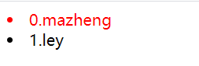 

```html
<!DOCTYPE html>
<html lang="en">
<head>
    <meta charset="UTF-8">
    <meta name="viewport" content="width=device-width, initial-scale=1.0">
    <title>Document</title>
    <script src="https://cdn.jsdelivr.net/npm/vue@2.6.11"></script>
    <style>
        .active{
            color: red;
        }
    </style>
</head>
<body>
    <div id="app">
        <li  v-for="(item,index) in lis" 
             :class="{active:currentIndex===index}"
             @click="beActive(index)"
         >
         {{`${index}.${item}`}}
         </li>
    </div>
    <script>
        let app=new Vue({
            el:'#app',
            data:{
                lis:['mazheng','ley'],
                currentIndex:0         //使用currentIndex记录上次点击的元素索引
            },
            methods:{
                beActive(index){
                    this.currentIndex=index;
                }
            }
        })
    </script>
</body>
</html>
```

------


### 案例2 

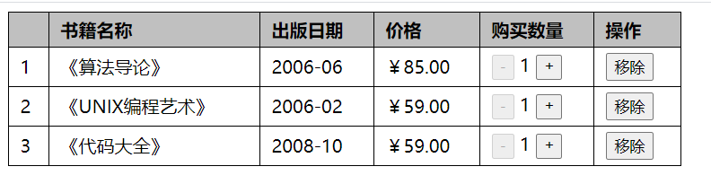 

```html
<!DOCTYPE html>
<html lang="en">
<head>
    <meta charset="UTF-8">
    <meta name="viewport" content="width=device-width, initial-scale=1.0">
    <script src="https://cdn.jsdelivr.net/npm/vue@2.6.11"></script>
    <title>Document</title>
    <style>
        table{
            width: 600px;
            border-collapse: collapse;
        }
        th,td{
            padding:5px 10px;
            text-align: left;
            border: 1px black solid;
        }
        th{
            background-color: silver;
        }
    </style>
</head>
<body>
    <div id="app">
        <table>
            <thead>
                <th></th>
                <th>书籍名称</th>
                <th>出版日期</th>
                <th>价格</th>
                <th>购买数量</th>
                <th>操作</th>
            </thead>
            <tbody>
                <tr v-for="(item,index) in books">
                    <td>{{index+1}}</td>
                    <td>《{{item.title}}》</td>
                    <td>{{item.releaseDate}}</td>
                    <td> {{item.price | showPrice}}</td>
                    <td>
                        <!--当书籍数量小于等于1时，按钮不可用-->
                        <button :disabled="item.num <= 1" @click="decOne(index)">
                            -
                        </button>
                        {{item.num}}
                        <button  @click="addOne(index)">
                            +
                        </button>
                    </td>
                    <td>
                        <button @click="removeBook(index)">
                            移除
                        </button>
                    </td>
                </tr>
            </tbody>
        </table>
    </div>
    <script>
        let app=new Vue({
            el:'#app',
            data:{
                books:[
                    {
                        title:'算法导论',
                        releaseDate:'2006-06',
                        price:85,
                        num:1
                    },
                    {
                        title:'UNIX编程艺术',
                        releaseDate:'2006-02',
                        price:59,
                        num:1
                    },
                    {
                        title:'代码大全',
                        releaseDate:'2008-10',
                        price:59,
                        num:1
                    }
                ]
            },
            filters:{  //过滤器。跟计算属性类似，但是调用的方法不太一样
                //<td> {{item.price | showPrice}}</td>     使用" | "调用过滤器,左边为参数
                showPrice(price){
                    return `￥${price.toFixed(2)}`;
                }
            },
            methods:{
                addOne(index){
                    this.books[index].num+=1;
                },
                decOne(index){
                    this.books[index].num-=1;
                },
                removeBook(index){
                    this.books.splice(index,1);
                }
            }
        });
    </script>
</body>
</html>
```

------


### v-model 指令

实现表单元素的双向绑定。绑定的数据主要用于自定义的ajax请求，也可以供其他功能使用。

如果表单元素仍然使用表单提交请求，则请求发送的仍然是表单元素的value值，跟v-model绑定的数据并无关系。

==1.与文本类表单元素结合使用==

将input的value和message变量进行绑定。文本框改变value，message的值也随之改变。改变message的值，文本框中的内容也随之改变。（双向绑定）

```html
//只使用v-model绑定数据，但不使用name标识表单元素，这种表单元素不会被表单提交（因为没有name属性）
<input type="text" v-model="message">

data:{
	message:''
}
```

**原理**

v-model其实是一个语法糖，它的背后本质是包含两个操作：

1. 监听表单元素的特征事件，根据情况更新绑定的数据
2. 监测数据的变化，更新表单元素的属性值 如value checked...（属性值的改变会体现到视图上）。

​    例如：

```html
//使用两个命令的组合实现input标签的v-model的功能
<input type="text" :value="message" @input="message=$event.target.value">

data:{
	message:''
}
```


<u>textarea标签与input标签类似可以使用v-model指令实现上述功能</u>


==2.与单选按钮结合使用==

```html
<!--应当为每个单选按钮设置value属性-->

<input type="radio" value="0" v-model="radioVal">
<input type="radio" value="1" v-model="radioVal">

<!--这类没有name属性的radio不会随表单提交-->

<script>
data:{
	radioVal:0   // 初始值为0，代表默认第一个按钮选中。数字、字符串都可以。
}
</script>
```


==3.与checkbox结合使用==

+ 单个复选框，宜使用v-model绑定一个bool类型的变量

  ```html
  <input type="checkbox" v-model="isChecked">
  //当选中时，isChecked值会为true,不选中时为false
  <script>
  data:{
  	isChecked=false   //isChecked默认值设为false，代表默认不选中
  }
  </script>
  ```

+ 多个复选框（绑定同一个数据），宜使用v-model绑定一个**空数组,**或**具有初始值的数组**。

  <font color="red">（可以为数组指定初始元素，以表示默认选中的复选框，但初始元素的值应出自默认选中复选框的value。因为checkbox取消选中时只会删除数组中的响应value，而不会删除不存在于所有复选框value中的其他值。即初始化数组时，初始元素若不存在于所有value中，则会始终存在于绑定的数组里）</font>

  ```html
  <input type="checkbox" value="basketball" v-model="balls">
  <input type="checkbox" value="football" v-model="balls">
  <input type="checkbox" value="badminton" v-model="balls">
  
  <script>
      data:{
          balls:['basketball'] //默认选中第一个复选框
      }
  </script>
  ```

  ```html
  <label v-for="item in origins">
      <input type="checkbox" :value="item" v-model="balls"> {{item}}
  </label>
  
  <script>
      data:{
          balls:[],
          origins:['basketball','football','badminton']//从后台获取
      }
  </script>
  ```

  

<u>checkbox标签中使用v-model属性，会使checked属性失效。复选框是否**默认**选中，只与v-model绑定的数据有关。</u>


==4.与select标签结合使用==

```html
<!--单选select--> 类似于radio button
<select v-model="ball">
    <option value:"basketball">篮球</option>
    <option value:"football">足球</option>
    <option value:"badminton">羽毛球</option>
</select>

<script>
    data:{
        ball:"basketball"
    }
</script>
```


```html
<!--多选select,添加multiple布尔属性--> 类似于checkbox
<select v-model="balls" multiple>    
    <option value:"basketball">篮球</option>
    <option value:"football">足球</option>
    <option value:"badminton">羽毛球</option>
</select>

<script>
    data:{
        balls:['basketball']
    }
</script>
```


**修饰符**

1. lazy修饰符，常与input text标签使用

   作用：让标签在失去焦点或在input中敲回车时才更新数据

   （默认情况下，v-model是在input事件发生时立刻更新数据，lazy可以减少更新次数）

   ```html
   <input type="text" v-model.lazy="message">
   ```

   

2. number修饰符，常与input text标签使用

   作用：获取input text标签内的value，转为number类型后再更新数据，即v-model绑定的数据会是number类型

   （input text的value永远是string类型）

   ```html
   <input type="text" v-model.number="marks">
   ```

   

3. trim修饰符，常与input Text标签使用

   作用：获取input text的value，去除首尾的空格后再更新数据。

   ```html
   <input type="text" v-model.trim="name">
   ```


-------


## 组件化 

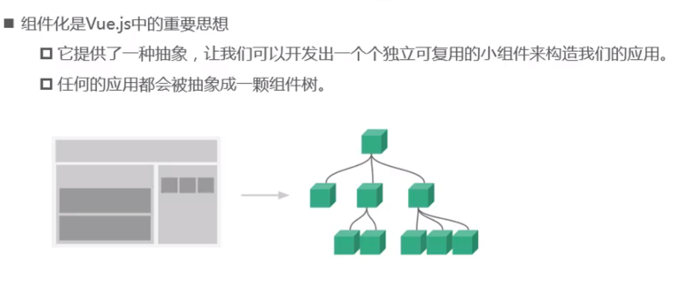

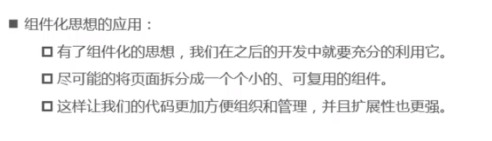  

### 全局组件

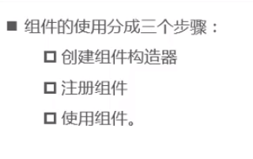  

全局组件可以在多个不同的Vue实例中使用。但<font color="red">Vue实例才是根组件</font>，因为全局组件必须在Vue实例中才能使用。


 1. **调用Vue.extend()方法<font color="red">创建组件构造器</font>**

    👇

	2. **调用Vue.component()方法<font color="red">注册组件</font>**

    👇

	3. **在Vue实例或其他组件内<font color="red">使用组件</font>**

```html
<!--全局组件的demo-->
<body>
    <div id="app">
        <cpn></cpn>   <!--在Vue实例中使用全局组件-->
        <div>
            <cpn></cpn>  <!--再次使用-->
        </div>
    </div>
    
    <script>
        
        //---------------------------------------------------------
        
 		//创建组件构造器对象
        
        let template=`
            <div>
                <p>P element</p>
            </div>   `;               //创建组件模板
        let option={                 //创建extendOptions对象
            template:template
        }
        let cpnC=Vue.extend(option);  //传入该对象，创建组件构造器
        
        //----------------------------------------------------------
        
        //注册全局组件，注册后cpn标签就可以在vue的实例以及各个组件内使用了
        
        Vue.component('cpn',cpnC);//注册全局组件。第一个参数是组件标签名，第二个参数是组件构造器
        
        //----------------------------------------------------------
        
        let app=new Vue({
            el:'#app'
        })
    </script>
</body>
```

```html
    <!--注册全局组件的简写方式-->

    <script>
        let template=`
            <div>
                <p> P element </p>
            </div>   `;               //创建组件模板
        let option={                 //创建extendOptions对象
            template:template
        }
        
		Vue.component('cpn',option); //将extendOptions对象直接传入，而不是组件构造器对象
        
    </script>

```


### 局部组件 

1. 创建模板

   👇

2. 创建extendOptions对象

   👇

3. 在Vue实例或父组件中注册

   👇

4. 在Vue实例或父组件中使用

```html
<!--局部组件的demo-->
<body>
    <div id="app">
        <cpn></cpn>   <!--在Vue实例中使用局部组件-->
        <div>
            <cpn></cpn>  <!--再次使用-->
        </div>
    </div>
    

    <script>
        let template=`
            <div>
                <p>P element</p>
            </div>   `;               //创建组件模板
        let option={                 //创建extendOptions对象
            template:template
        };
        
        let app=new Vue({
            el:'#app'
            components:{
            	cpn:option            //在components属性中注册组件
        	}
        });
    </script>
</body>
```


### 父组件与子组件 

<font color="red">子组件本质上就是局部组件</font>

<font color="red">祖先组件和后代组件之间不能越级使用，除非后代组件在祖先组件中注册过</font>

```html
<div id="app">
    <cpn1></cpn1> <!--父组件的使用-->
</div>
<script>
    
	//创建子组件的构造器对象
	let temp2=`
        <div>
        <p>子组件</p>
        </div>`;
    let cpn2=Vue.extend({
        template:temp2
    });
    
	//创建子组件的构造器对象
    let temp1=`
        <div>
            <p>父组件</p>
            <cpn2></cpn2>  <!--子组件的使用-->  
        </div>   `;        
    let cpn1=Vue.extend({
        template:temp1,
        components:{
            cpn2
        }
    });


    let app=new Vue({
        el:'#app',
        components:{
            cpn1     //挂载cpn1父组件
        }
    })
</script>
```

```html
<!--使用传入extendOptions直接注册组件-->

<script>
    let cpn1={
        template:`
            <div>
                <p>父组件</p>
                <cpn2></cpn2>
            </div>`,
        components:{
            cpn2:{
                template:`
                    <div>
                        <p>子组件</p>
                    </div>`
            }
        }
    };
    
    let app=new Vue({
        el:'#app',
        components:{
            cpn1
        }
    })
</script>
```


### 模板的抽离

1. 第一种写法

   ```html
   <script type="text/x-template" id="temp1">
   	<div>
   		<h2>我是组件的模板</h2>
   	</div>
   </script>
   
   
   <script>
       //注册组件
       Vue.component('cpn',{
           template:'#temp1'    //使用id选择器
       })
   </script>
   ```

   

2. 第二种写法

   ```html
   <template id="temp2">
       	<div>
   		<h2>我是组件的模板</h2>
   	</div>
   </template>
   
   <script>
       //注册组件
       Vue.component('cpn',{
           template:'#temp2'    //使用id选择器
       })
   </script>
   ```

   

### 组件的data

组件拥有自己的数据，组件中**不能直接访问**父级组件以及子组件的数据。

组件的extendOptions中的data属性的属性值必须是Function，这个Function是一个工厂函数，返回一个对象，对象中包含组件自己的数据。

（利用工厂函数的特点，即每次返回一个新的包含数据的对象，来防止相同组件数据相互干扰）

 

```html
<body>
    <div id="app">
        <cpn></cpn>
    </div>

    <template id="temp2">
        <div>
            <h2>{{message}}</h2>
        </div>
    </template>

    <script>
        //注册组件
        Vue.component('cpn', {
            template: '#temp2',   //使用id选择器
            data: () => ({  //用小括号把返回的对象扩起来，防止解析成代码块
                message: 'hello world'
            })
        })
        let app=new Vue({
            el:'#app',
            data:{
                message:'hello Vue'
            }
        });
    </script>
</body>
```


### 父子组件之间的通信 


==<font size="4">一、父传子：在子组件props属性挂载通信属性</font>== 

子组件的props属性挂载通信属性，父组件使用子组件时，在子组件标签中使用v-bind为通信属性绑定父组件的数据，在子组件中通信属性的同名变量就获取到了父组件传来的数据。

```html
<div id="app">
    <cpn :message-c="message" :today="time"></cpn>  <!--   驼峰命名法→连字符   -->
</div>

<template id="temp">
    <div>
        <h2>{{today}}</h2>
        <button @click="console.log(messageC)">通信</button>
    </div>
</template>

<script>
    //注册组件
    Vue.component('cpn', {
        template: '#temp',   //使用id选择器
        data: () => ({
            
        }),
        props:['messageC','today']
    })
    let app=new Vue({
        el:'#app',
        data:{
            message:'hello Vue',
            time:'2020-08-18'
        }
    });
</script>
```

<font color="red">由于dom标签中不区分大小写，当props挂载的通信属性名有大写字母时，应注意：</font>

1. 使用驼峰命名法时（第一个字符小写，后面单词首字母大写），v-bind绑定的组件标签属性的属性名使用**连字符写法**。例如，上面的demo中 messageC   ,在绑定该属性时使用了  v-bind:message-c 。若子组件属性标签中绑定"messageC"，则默认传的通信属性实际为 "messagec"。

2. 若通信属性第一个字母大写，则v-bind绑定的子元素标签属性名第一个字母大小写都可以。

<u>归纳：通信属性名第一个字母不要大写，尽量使用一个单词命名通信属性。若使用驼峰命名法，v-bind绑定时在大写字母前使用连字符。</u>


**props属性的写法**

1. 数组写法

   由于数组写法功能没有对象写法强大，所以较少使用。

   ```html
   props:['messageC','today']
   ```

2. 对象写法

   ```javascript
   //指定通信属性的类型  type
   props:{
       messageC: String,
       today: String,
       age: Number,
       books: [Array, String], //指定Array或String类型
       owner: Object
   }
   
   //指定默认值  default 当指定Object以及Array类型的默认值时，default应是一个工厂函数返回默认值
   //要想子组件在一开始时使用default中的默认值，则父组件传来的数据初始值应为undefinded
   props:{
       messageC:{
           type: String,
           default: 'hello wolrd'
       }
       books:{
           type: [Array, String]
           default(){
               return [];
           }
       }
       owner:{
           type: Object,
           default(){
               return {};
           }
       }
   }
   
   //指定必须传入 required
   props:{
       books:{
           type: Array,
           default(){
               return [];
           }
           required: true
       }
   }
   
   //自定义验证函数 validator
   
   ```


+ **props属性挂载的通信属性（变量），从设计的初衷来看，应该是只读属性。**

  **所以在组件里避免有代码可以修改通信属性的值。**

+ **通信属性的值和父组件的数据是动态绑定的，一旦父组件数据发生改变，会立刻传递给子组件。**


==<font size="4">二、子传父：发射（emit）自定义事件</font>== 


1.子组件监听DOM事件（如click），在事件响应函数中处理逻辑，然后发射自定义事件并传入通信数据。

👇

2.父组件在子组件的标签内监听自定义事件并接收通信数据。自定义事件的响应函数不需要传参。

<font color="red">（虽然没有使用括号调用，但自定义事件的响应函数不会像dom事件一样默认传入事件对象，因为自定义事件没有事件对象。）</font>


<font color="red" size="5">注意：由于dom标签无法识别大小写，在没有使用Vue cli的情况下，自定义事件名不允许出现大写字母。例如 不允许出现"clickLi"这种事件名</font>


```html
<div id="app">
    <cpn @clickli="getClick"></cpn>  <!--  父组件监听子组件的自定义事件clickli   -->
</div>

<template id="temp">
    <div>
        <li v-for="item in categories" @click="myClick(item.id,item.name)"> <!--事件响应函数-->
            {{item.name}}
        </li>
    </div>
</template>

<script>
    //注册组件
    Vue.component('cpn', {
        template: '#temp',   
        data: () => ({
            categories:[
                {
                    id:1,
                    name:'mz'
                },
                {
                    id:2,
                    name:'ley'
                }
            ]
        }),
        methods:{
            myClick(id,name){
                this.$emit('clickli',id,name);  //发生自定义事件，这里传入了两个通信数据id和name。
            }
        }
    })
    let app=new Vue({
        el:'#app',
        data:{
            message:'hello Vue',
            time:'2020-08-18'
        },
        methods:{
            getClick(id,name){
                console.log(id,name);
            }
        }
        
    });
</script>
```


### 案例3

实现父子组件之间的双向通信。

在父组件的输入框输入要传递的数据，在子组件的文本框显示。

在子组件的输入框输入要传递的数据，在父组件的文本框显示。

在子组件的watch属性中定义要监听的数据的同名函数，以监听子组件数据的变化，并发送给父组件。

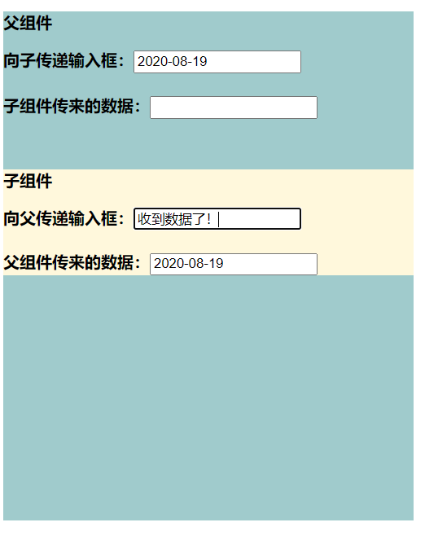 

```html
<body>
    <div id="app">
        <p>父组件</p>
        <label for="">
            向子传递输入框：<input type="text" v-model="today">
                    <br>
                    <br>
            子组件传来的数据：<input type="text" readonly v-model="ctoday">
        </label>
        <div id="child">
            <cpn :today="today" @cinput="getCtoday"></cpn>
        </div>
    </div>
    <template id="temp">
        <div>
            <p>子组件</p>
            <label for="">
                向父传递输入框：<input type="text" v-model.lazy="inputDate"> <!--懒监听-->
                        <br>
                        <br>
                父组件传来的数据：<input type="text" readonly v-model="today">
            </label>
        </div>
    </template>
    <script>
        let app=new Vue({
            el:'#app',
            data:{
                today:'2020-08-19',
                ctoday:'',
            },
            methods:{
                getCtoday(value){
                    this.ctoday=value;
                }
            },
            components:{
                cpn:{
                    template:'#temp',
                    data(){
                        return {
                            inputDate:''
                        }
                    },
                    props:{
                        today:{
                            type:String
                        }
                    },
                    watch:{
                        //在watch中定义inputDate的同名函数，监听该数据的变化，处理逻辑
                        inputDate(newValue,oldValue){ 
                            console.log(oldValue,'=>',newValue);
                            this.$emit('cinput',newValue);
                        }
                    }
                }
            }
        });
    </script>
</body>
```


### 父子组件之间的直接访问


==一、父组件直接访问子组件==

在父组件中，可以通过this.$children或this.$refs拿到所有子组件。

+ $children属性是一个数组，可以像this.$children[index]的型式通过下标拿到子组件对象。（不常用）

+ $refs属性是一个对象，子组件标签中设置ref属性标识自己，父组件可以通过this.$refs[ref]的形式获取特定的子组件对象。（更常用）

可访问到的子组件内容：几乎所有内容（数据、方法）。

==二、子组件直接访问父组件==

在子组件中，可以通过this.$parent拿到父组件对象。

同时可以使用this.$root直接拿到Vue实例对象。（Vue实例是根组件）

由于组件之间耦合度不应该太高，所以很少在子组件中访问父组件。


### 插槽

**基本使用**

```html
<div id="app">
    <cpn> <button>按钮</button> </cpn>
    <cpn> <input type="text"> </cpn>
</div>

<template id="cpn">
    <h2>以下是一个插槽</h2>
    <slot> <p>插槽默认内容</p>  </slot>
</template>

```

+ 在组件的模板中留下slot标签标识插槽

+ 插槽中可以留有默认内容

+ 使用时在组件标签内为插槽填充内容

  

**具名插槽**

定义：具有name属性的slot标签。

```html
 

```

使用方法：

```html
<div id="app">
    <cpn> 
    	<div slot="left">
            <!---->
            左插槽的div
        </div>
        <div slot="center">
            <!---->
        </div>
        <div slot="right">
            <!---->
        </div>
        <span slot="left">左插槽的span</span>
    </cpn>
</div>
```


+ 为组件的各个插槽标签填写name属性，标识具名插槽。
+ 在使用组件时，在组件标签内为插槽填充内容，各个内容（html标签）的slot属性标明要往哪个插槽添加内容。
+ 可以为同一个插槽添加多条内容（标签），具有相同slot属性的内容会全部添加到同一个插槽中。
+ 如果添加的内容（标签）没有slot属性，则添加到所有不具名的插槽中。


**作用域插槽**

应用情景：在父组件中为子组件的插槽中添加内容，但内容中需要访问子组件的内容。


旧版Vue方法：

1. 子组件模板中在作用域插槽绑定子组件数据，语法为 :data1="==子组件数据1==" :data2="==子组件数据2=="。data1、data2可以改各种任意名字，前面使用v-bind，代表作用域插槽中的变量名。

2. 要想使用作用域插槽，必须使用template标签来替换插槽中的内容。

3. template标签中为slot-slope属性赋值，值为作用域对象变量名，之后便可以使用该对象拿到作用域插槽中的子组件数据。

   <template  slot="s1" slot-scope="s1scope">
       <span>{{s1cope.data1}}</span>
       <span>{{s1cope.data2}}</span>
   </template>

   

```html
<body>
    <div id="app">
        <cpn></cpn>
        <cpn>
            <template slot="s1" slot-scope="s1scope">
                <span>{{s1scope.lans.join('-')}}</span>
            </template>
        </cpn>
    </div>
    <template id="temp">
        <slot name="s1" :lans="languages">
            <ul>
                <li v-for="lan in languages">
                    {{lan}}
                </li>
            </ul>
        </slot>
    </template>

    <script>
        let app=new Vue({
            el:'#app',
            components:{
                cpn:{
                    template:'#temp',
                    data(){
                        return {
                            languages:['C#','Java','Go']
                        }
                    }
                }
            }
        })
    </script>
</body>
```


新版Vue的写法：

使用v-slot指令代替原本的slot属性+slot-scope属性。

v-slot:==插槽的name==="==作用域对象变量名=="

<template  v-slot:s1="s1scope">
    <span>{{s1cope.data1}}</span>
    <span>{{s1cope.data2}}</span>
</template>

```html
<body>
    <div id="app">
        <cpn></cpn>
        <cpn>
            <template v-slot:s1="s1scope">
                <span>{{s1scope.lans.join('-')}}</span>
            </template>
        </cpn>
    </div>
    <template id="temp">
        <slot name="s1" :lans="languages">
            <ul>
                <li v-for="lan in languages">
                    {{lan}}
                </li>
            </ul>
        </slot>
    </template>

    <script>
        let app=new Vue({
            el:'#app',
            components:{
                cpn:{
                    template:'#temp',
                    data(){
                        return {
                            languages:['C#','Java','Go']
                        }
                    }
                }
            }
        })
    </script>
</body>
```


## Webpack 

At its core,webpack is a static module bundler for modern JavaScript applications.

webpack是一个现代的JS应用的静态模块打包工具。

**核心：让我们可能进行模块化开发，并帮助处理模块间的依赖关系。**

而且不仅仅是js文件，css、图片、json等等在webpack中都可以被当做模块来使用。

支持AMD、CMD、CommonJS以及ES6模块化规范。

### 安装与配置

+ 依赖于Node环境。Node版本>8.9。

+ 全局安装webpack 

  ```bash
  npm install webpack@3.6.0 -g
  ```

+ 局部安装（开发时依赖）

  ```bash
  npm install webpack@3.6.0 --save-dev
  ```

-----

### 起步

1. 在项目目录新建文件夹

   dist    发布

   src     源码

2. ```bash
   webpack ./src/main.js ./dist/bundle.js
   ```

   根据main.js中的依赖，去打包所有需要的模块。


------

### webpack.config.js与package.json


**webpack的配置**

需求：设置默认的入口文件，执行webpack命令时打包该文件。

```javascript
//webpack.config.js  配置webpack的文件

const NodePath=require('path');

module.exports={
    entry:'./src/main.js',//默认的入口文件，路径可以是相对路径
    output:{
        path:NodePath.join(__dirname,'dist'),//输出文件的目录，必须使用绝对路径
        filename:'bundle.js'//输出的文件名
    }  
}
```


**将webpack命令与npm命令绑定映射**

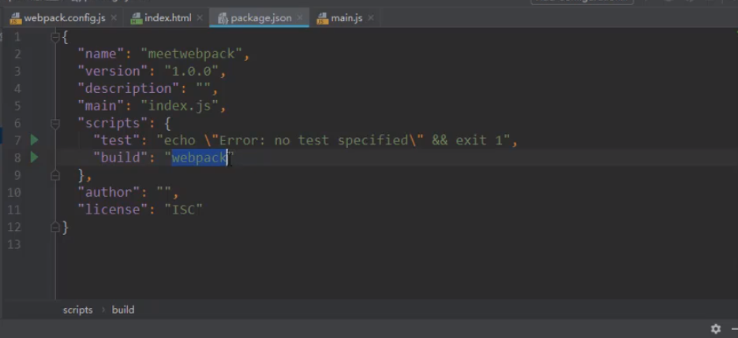

```bash
npm run build
```

相当于执行了 webpack指令，同时只有这样配置并使用该指令，才会优先使用局部（本地）中的webpack。（node_modules的bin目录下的控制台指令）

```bash
webpack
```


## Vue CLI

### 安装

1. 依赖于Node环境，并全局安装webpack
2. npm intsall -g @vue/cli

以上是安装脚手架3的步骤，如果需要兼容脚手架2的语法，需要额外执行第三条：

3. npm install -g @vue/cli-init

```bash
#测试
vue --version
```


### 使用cli2初始化一个项目

1. ```dos
   vue init webpack $项目名称   👉会在当前目录创建同名文件夹
   ```

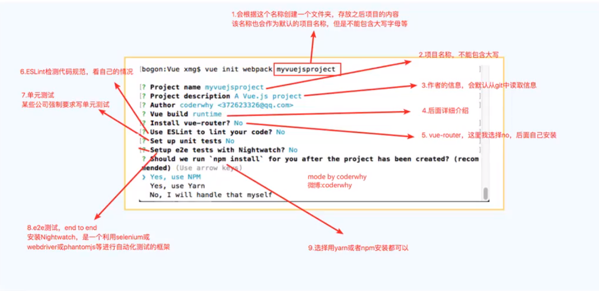


### 使用cli3初始化一个项目

1. ```dos
   vue create $项目名称
   ```

   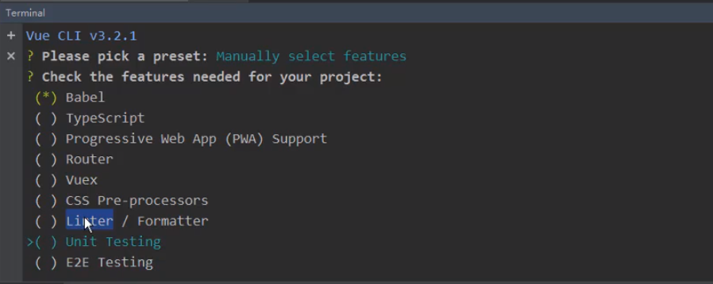


------

## Vue-router 前端路由 

### 前端路由原理 

路由的概念来源于服务端，在服务端中路由描述的是 URL 与处理函数之间的映射关系。

在 Web 前端单页应用 SPA(Single Page Application)中，路由描述的是 URL 与 UI 之间的映射关系，这种映射是单向的，即 URL 变化引起 UI 更新（无需刷新页面）。


后端渲染阶段

👇   +ajax

前后端分离阶段

👇   +前端路由

SPA 单页面富应用阶段


**如何实现前端路由？**

要实现前端路由，需要解决两个核心：

+ 如何改变 URL 却不引起页面刷新？
+ 如何检测 URL 变化了？

下面分别使用 hash 和 history 两种实现方式回答上面的两个核心问题。

1. ##### hash实现

   + hash 是 URL 中 hash (#) 及后面的那部分，常用作锚点在页面内进行导航，改变 URL 中的 hash 部分不会引起页面刷新。
   + 通过 hashchange 事件监听 URL 的变化，改变 URL 的方式只有这几种：通过浏览器前进后退改变 URL、通过`<a>`标签改变 URL、通过window.location改变URL，这几种情况改变 URL 都会触发 hashchange 事件

2. ##### history 实现

   - history 提供了 pushState 和 replaceState 两个方法，这两个方法改变 URL 的 path 部分不会引起页面刷新。
   - history 提供类似 hashchange 事件的 popstate 事件，但 popstate 事件有些不同：通过浏览器前进后退改变 URL 时会触发 popstate 事件，通过pushState/replaceState或`<a>`标签改变 URL 不会触发 popstate 事件。好在我们可以拦截 pushState/replaceState的调用和`<a>`标签的点击事件来检测 URL 变化，所以监听 URL 变化可以实现，只是没有 hashchange 那么方便。

==参考资料：==[https://www.cnblogs.com/lguow/p/10921564.html]


------

### vue-router 安装与基本使用 

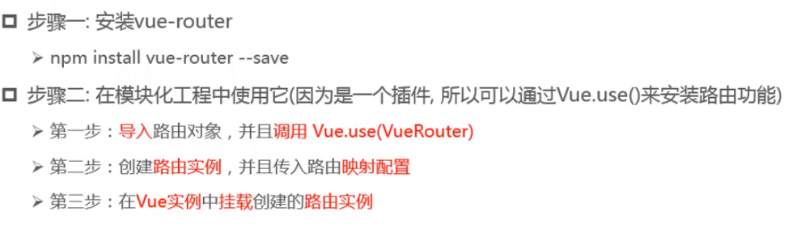

目录结构：

project

---components目录

------Home.vue	//组件

------About.vue   //组件

---router目录

------index.js    //路由配置文件

---main.js

---App.vue


```javascript
# main.js

import Vue from 'vue'
import App from './App'   //根组件
import router from './router/index.js'  //可省略index.js

Vue.config.productionTip=false;

new Vue({
    el:'#app',
    router:router,  //挂载路由
    render:(h)=>h(App)
})

```


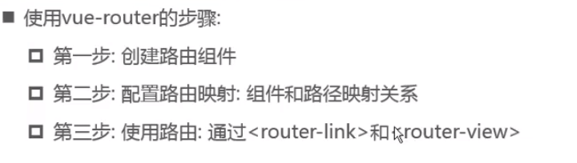


```javascript
# index.js

//事先准备好Home和About两个组件

/*路由组件与路由的映射 
	/home  👉  Home.vue
	/about 👉  About.vue
*/

import Vue from 'vue'
import VueRouter from 'vue-router' 

import Home from '../components/Home.vue'
import About from '../components/About.vue'


// 1.通过Vue.use(插件)，安装插件
Vue.use(VueRouter);

const routes=[
    {
        path:'/home',
        component:Home
    },
    {
        path:'/about',
        component:About
    }
]

const router=new VueRouter({
    routes:routes,
    mode:'hash'
})

export default router;
```


```vue
# App.vue

<template>
	<div id="app">
        
        //router-link是由vue-router注册的全局组件，控制前端路由。默认会渲染为一个a标签
        <router-link to="/home"></router-link>    
        <router-link to="/about"></router-link>
        
        //router-view是占位组件，可显示前端路由绑定的组件
        <router-view></router-view>
        
    </div>
</template>

<script>
    import router from './router/index.js'   // 导入路由，index.js可以省略
    
    export default {
        name:'App',
    }
</script>

<style>
    
</style>
```

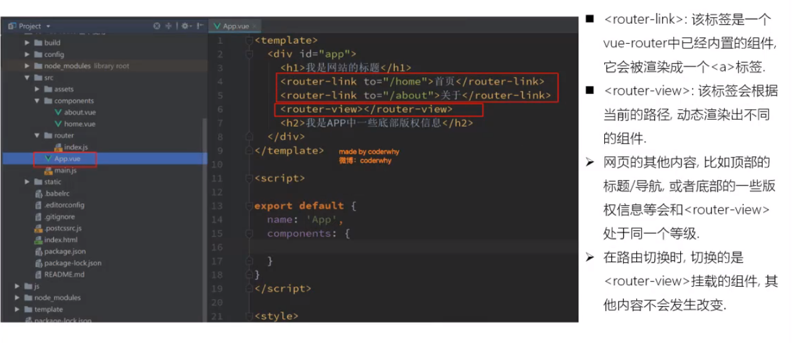


### 默认路由（路由重定向） 

```javascript
# router目录下的index.js
const routes=[
    {
        path:'/',
        redirect:'/home'    //   根目录重定向到'/home'
    },
    {
        path:'/home',
        component:Home
    },
    {
        path:'/about',
        component:About
    }
];

const router=new VueRouter({
    routes:routes,
    mode:'hash'
});

export default router;
```


### hash与HTMl5的history模式

在不刷新页面的前提下，改变URL有两种方式：

1.改变url的hash（锚点），本质上是改变location对象的hash属性。（location.hash=xxx）

2.使用HTML5的history模式中的API。

​	BOM中使用栈结构保存访问资源的历史记录，并使用一个指针指向当前的URL。

+ history.pushState( { } , '' ,'home')    =='/home' 压栈==
+ history.back( )              ==指针下移==
+ history.forward( )         ==指针上移==
+ history.go(n)                 ==指针跳转==
+ history.replaceState({ },'', 'home')      =='/home' 替换栈顶==


### 在vue-router中使用history模式

```javascript
# router目录下的index.js
const routes=[
    {
        path:'/',
        redirect:'/home'    
    },
    {
        path:'/home',
        component:Home
    },
    {
        path:'/about',
        component:About
    }
];

const router=new VueRouter({
    routes:routes,
    mode:'history'                    //在创建路由对象时，配置history模式。默认值为'hash'
});

export default router;
```


### router-link的属性

1. **to属性**

   用于声明式前端路由跳转，to属性指定跳转的绝对path、query以及hash。

   <router-link ==to==="/home">     </ router-link>

   

2. **tag属性**

   用于指定router-link标签最终被渲染成的dom标签类型，默认情况下会被渲染成a标签。

   <router-link to="/home" ==tag==="button">   </ router-link>

3. **replace布尔属性**

   在url跳转时使用history.replace方法，替换BOM历史记录栈结构的栈顶记录。

   <router-link to="/home" tag="button" ==replace==>   </ router-link>

4. **active-class属性**

   用于指定router-link渲染出的标签在活跃（被点击）时的class属性值。默认为router-link-active。

   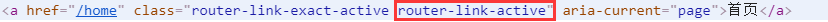

   👇

   <router-link to="/home" tag="button" ==active-class="active"==>   </ router-link>

   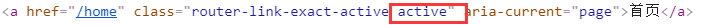

   

   *在路由对象中全局修改所有router-link的active-class：*

   ```javascript
   const router=new VueRouter({
       routes,
       mode:'history',
       linkActiveClass:'active'  //修改linkActiveClass属性
   })
   ```

   

### $router和$route

**一、区别**

`this.$router`是VueRouter的实例。

当导航到不同url，可以使用`this.$router.push`方法，这个方法则会向history栈里面添加一条记录，当点击浏览器回退按钮或者`this.$router.back()`就会回退之前的url。

`this.$route`相当于当前激活的路由对象，包含当前url解析得到的数据，可以从对象里获取一些数据，如name,path,query,params等。


**二、联系**

`$router`和`$route`是Vue原型对象上的属性，而所有组件都是Vue类的实例，所以我们能通过组件的隐式原型链访问到这两个属性。


**三、常见使用**

`this.$router`

1. push方法

   push方法其实和`<router-link :to="...">`是等同的，会向 history 栈添加一个新的记录，当我们点击浏览器的返回按钮时可以看到之前的页面。

   ```javascript
   this.$router.push(path)
   ```

2. go方法

   ```javascript
   //页面路由跳转 前进或者后退
   this.$router.go(n)
   ```

3. replace方法

   push方法会向 history 栈添加一个新的记录，而replace方法是替换当前的记录，并置为history栈顶。

   ```javascript
   this.$router.replace(path)
   ```


`this.$route`

$route对象表示当前的路由信息，包含了当前 URL 解析得到的信息。包含当前的路径，参数，query对象等。

1. $route.path
      字符串，对应当前路由的路径，总是解析为绝对路径，如 "/foo/bar"。

2. $route.params
      一个 key/value 对象，包含了 动态片段 和 全匹配片段，
      如果没有路由参数，就是一个空对象。

3. $route.query
      一个 key/value 对象，表示 URL 查询参数。
      例如，对于路径 /foo?user=1，则有 $route.query.user == 1，
      如果没有查询参数，则是个空对象。
4. $route.hash
      当前路由的 hash 值 (不带 #) ，如果没有 hash 值，则为空字符串。锚点
5. $route.fullPath
      完成解析后的 URL，包含查询参数和 hash 的完整路径。
6. $route.matched
      数组，包含当前匹配的路径中所包含的所有片段所对应的配置参数对象。
7. $route.name  当前路径名字
8. $route.meta 路由元信息


### 编程式前端路由跳转

即通过代码调用api跳转路由。

而在router-link标签中通过to属性跳转路由称作声明式前端路由跳转，其本质还是调用了$router.push方法。

```vue
# App.vue

<template>
	<div id="app">
        
        <button @click="clickhome">去主页</button>  //使用按钮而不是router-link
        <router-view></router-view>
        
    </div>
</template>

<script>
    import router from './router/index.js'   // 导入路由，index.js可以省略
    
    export default {
        name:'App',
        router:router,
        methods:{
            clickHome(){
                //调用组件的$router的push方法跳转路由
                //相当于执行了history.pushState('/home')
                //相应的还有$router.replace(path)方法
                this.$router.push('/home');    
                //this.$router.replace('/home');
            }
        }
    }
</script>
```


**Vue官方解析**

`router.push(location, onComplete?, onAbort?)`

**注意**：在 Vue 实例内部，你可以通过 `$router` 访问路由实例。因此你可以调用 `this.$router.push`。

想要导航到不同的 URL，则使用 `router.push` 方法。这个方法会向 history 栈添加一个新的记录，所以，当用户点击浏览器后退按钮时，则回到之前的 URL。

当你点击 `<router-link>` 时，这个方法会在内部调用，所以说，点击 `<router-link :to="...">` 等同于调用 `router.push(...)`。

| 声明式                    | 编程式             |
| ------------------------- | ------------------ |
| `<router-link :to="...">` | `router.push(...)` |


push/replace方法的参数可以是一个字符串路径，或者一个描述地址的对象。例如：

```js
// 字符串
router.push('home')

// 对象
router.push({ path: 'home' })

// 命名的路由
router.push({ name: 'user', params: { userId: '123' }})

// 带查询参数，变成 /register?plan=private
router.push({ path: 'register', query: { plan: 'private' }})
```

**注意**：如果提供了 `path`，`params` 会被忽略，上述例子中的 `query` 并不属于这种情况。取而代之的是下面例子的做法，你需要提供路由的 `name` 或手写完整的带有参数的 `path`：

```js
const userId = '123'
router.push({ name: 'user', params: { userId }}) // -> /user/123
router.push({ path: `/user/${userId}` }) // -> /user/123
// 这里的 params 不生效
router.push({ path: '/user', params: { userId }}) // -> /user
```


**注意：**push方法中的`path`可以是相对路径。例如：

   1. 若当前`path`为`/user`,则使用`$router.push('./user/mz')`可以跳转到`/user/mz`。

      原因是`/user`的当前目录仍然为==根目录 /== 。

2. 若当前path为`/user/`,则使用`$router.push('./mz')`就能跳转到`/user/mz`


同样的规则也适用于 `router-link` 组件的 `to` 属性。


**注意**： 如果目的地和当前路由相同，只有参数发生了改变 (比如从一个用户资料到另一个 `/users/1` -> `/users/2`)，你需要使用 [`beforeRouteUpdate`](https://router.vuejs.org/zh/guide/essentials/dynamic-matching.html#响应路由参数的变化) 来响应这个变化 (比如抓取用户信息)。


**坑**🕳：

<font color='red'>在vue-router中，使用$router.push/replace时会检查是否重复跳转至当前所在路由，如果是，则会抛出异常，但不影响功能使用</font>

解决方法：

方法1.

```js
# 在router目录下的index.js (路由文件最后加载以下代码片段)

/*
    let router = new VueRouter({...})
    ....
*/
const originalPush = VueRouter.prototype.push; //解决push方法的bug
VueRouter.prototype.push = function push (location) {
  return originalPush.call(this, location).catch(err => err)
};

const originalReplace = VueRouter.prototype.replace;  //解决replace方法的bug
VueRouter.prototype.replace = function push (location) {
  return originalReplace.call(this, location).catch(err => err)
};

// export default router
```

方法2.

​	下载指定版本的vue-router  

``` 
npm i vue-router@3.0 --save
```


[https://blog.csdn.net/weixin_43202608/article/details/98884620?utm_medium=distribute.pc_relevant.none-task-blog-BlogCommendFromMachineLearnPai2-1&depth_1-utm_source=distribute.pc_relevant.none-task-blog-BlogCommendFromMachineLearnPai2-1]


### 动态路由与路由参数

==（以动态二级路由为例）==

动态路由的配置

```js
# router👉index.js

import User from 'xxx'  //导入User组件
import Login from 'xxx'

const routes=[
    {
    	path:'/user',
        component:Login,
        children:[
            {
                name:'userInfo1',
                path:':userId',
                component:User
            }
        ]
    },
    
    {
        name:'userInfo2'
        path:'/user/:userId', //二级路由，只有当userId占位处不为空串时，才匹配该条路由
        component:User
    }
]
```

一级路由组件向二级路由传递参数

```vue 
# Login.vue

<template>
	<div class="login">
        
        <!-- 指定跳转的完整绝对路径 -->
        <router-link :to="`/user/${userId}`">登录1</router-link>
        <!--相当于👇-->
        <router-link :to="{path:`/user/${userId}`}">登录1</router-link>
        
        
        <!-- 指定跳转到名为userInfo2的路由，并设置参数 -->
        <router-link :to="{name:'userInfo',params:{userId}}">登录2</router-link>
        
        <router-view></router-view>
        
    </div>
</template>

<script>
    export default {
        name:'login',
        data(){
            return {
                userId:'mzleman'
            }
        }
    }
</script>
```

二级路由组件获取路由参数

```vue	
# User.vue

<template>
	<div class="user">
        <div>头像</div>
        <!-- 获取当前路由中的参数  $route.params  -->
        <h2>id:<span>{{$route.params.userId}}</span>  
    </div>
</template>

<script>
    export default {
        name:'login',
        data(){
            return {
                userId:'mzleman'
            }
        }
    }
</script>
```


### 路由嵌套

```js
# router👉index.js
import App from 'xxx.vue'
import Home from 'xxx.vue'
import User from 'xxx.vue'

const routes=[
    {
        name:'root',
        path:'/',
        component:App,
        //开始嵌套
        children:[                 //在路由配置对象中的children属性，可以设置子路由
            {
                //   -> /home
                name:'homepage',
                path:'home',       //子路由配置中，路径使用相对路径 
                component:Home
            },
            {
                //   -> /user/...
                name:'userinfo',      //为路由设置name属性 唯一标识该条路由
                path:'user/:userId',  // 子路由配置中，使用动态路由
                component:User
            }
        ]
    }
]
```

`路由的嵌套只是用一种结构化的方式配置前端路由信息，将逻辑上有层次关系的路由放在一起，但相应的路由组件不存在绝对的层次化渲染关系。`

`子路由对应的component如何显示，只与该路由是在哪一个组件中跳转有关，子路由组件在该组件中的router-view中显示。`

<font color='red'>为了避免组件渲染后的层次关系混乱，父级路由对应的组件与子路由对应的组件也应该具有相应的父子关系。</font>


### 路由组件懒加载

https://router.vuejs.org/zh/guide/advanced/lazy-loading.html

在Vue Cli的默认配置情况下，所有的开发组件vue文件 (包括main.js)会被打包到一个app.js中，这就使得该js文件十分庞大。

(除了app.js会被第一时间请求外，还有第三方包的打包文件vendor.js以及模块化底层支撑的文件manifest.js会被第一时间请求至前端)

在使用组件懒加载后，每个懒加载的组件会被单独打包到一个js文件中（而不是app.js），浏览器会根据前端路由，按需向服务器请求组件的js打包文件。

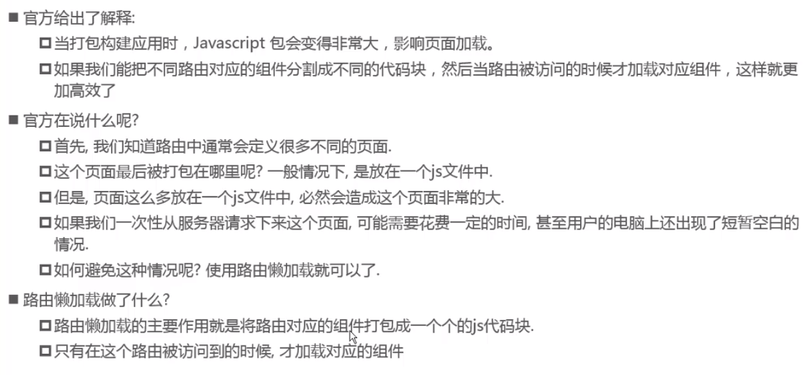

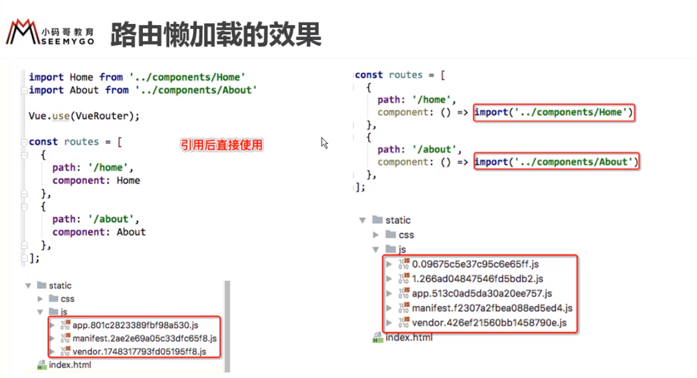

**基本语法**

```js
# router👉index.js
import VueRouter from 'vue-router'

const Home=()=>import('../components/Home.vue')

const routes=[
    {
        path:'/home',
        component:Home
    }
]

export default new VueRouter({
    routes,
    mode:'history'
})
```


### 导航守卫 

参考资料：https://router.vuejs.org/zh/guide/advanced/navigation-guards.html

**一、全局导航守卫（钩子）**

```js
# router 👉 index.js

const routes=[
    {
        path:'/',
        component:Index,
        meta:{    //在元数据meta中保存一些路由信息
            title:'首页'
        }
        children:[
            {
                path:'home',
                component:Home,
                meta:{
                    title:'主页'
                }
            }
        ]
        
    }
];

let router=new VueRouter({
    routes,
    mode:'history'
});

/* beforeEach方法加载前置守卫 */
router.beforeEach( guard:Function );  //钩子（守卫）的用法类似于中间件，可挂载多个钩子

/*afterEach方法加载后置钩子*/
router.afterEach(hook:Function);

export default router;
```

**注意：** 前置钩子（守卫）要传入三个参数，分别为：

   1. to：Route对象 ，将要跳转到的下一个活跃路由

   2. from： Route对象，当前的活跃路由，即$route对象

   3. next ：Function  下一个钩子函数，必须使在钩子内调用一下 next( )

      ​	后置钩子要传入两个参数，分别为to  和from。

      

**案例：在跳转到各条路由时更新标签页的标题**

```js
router.beforeEach((to,from,next)=>{
    
    console.log(to);
    console.log(from);
    
    document.title=to.meta.title;
   
    //document.title=to.matched[0].meta.title 
   //matched是一个数组，保存了所有匹配的路由
    
    next();
});
```


**二、路由独享守卫**

你可以在路由配置上直接定义 `beforeEnter` 守卫：

```js
const router = new VueRouter({
  routes: [
    {
      path: '/foo',
      component: Foo,
      beforeEnter: (to, from, next) => {
        // ...
      }
    }
  ]
})
```

这些守卫与全局前置守卫的方法参数是一样的。


**三、组件内的守卫**

[https://router.vuejs.org/zh/guide/advanced/navigation-guards.html#%E7%BB%84%E4%BB%B6%E5%86%85%E7%9A%84%E5%AE%88%E5%8D%AB](https://router.vuejs.org/zh/guide/advanced/navigation-guards.html#组件内的守卫)


**四、完整的导航解析流程**

[https://router.vuejs.org/zh/guide/advanced/navigation-guards.html#%E5%AE%8C%E6%95%B4%E7%9A%84%E5%AF%BC%E8%88%AA%E8%A7%A3%E6%9E%90%E6%B5%81%E7%A8%8B](https://router.vuejs.org/zh/guide/advanced/navigation-guards.html#完整的导航解析流程)


### keep-alive包裹router-view

`keep-alive是Vue内置的一个组件，可以使被包含的组件保留状态，或避免重新渲染（维持生命周期）。`

使用keep-alive包裹一个需要反复使用的一个组件，可以避免组件在不活跃时被销毁，在活跃时被新建。同时该组件会具有新的生命周期函数actived和deactived。

**案例：组件在失活时记录组件状态，组件重新活跃时返回至上一状态**

```vue
# Home.vue
# <keep-alive>标签包裹了Home.vue的父级组件中的<router-view>

<template>
</template>

<script>
    export default {
        name:'Home',
        data(){
            return {
                path:'/home'
            }
        },
        actived(){
            this.$router.replace(this.path);   //返回至失活前的状态
        },
        beforeRouteLeave(to,from,next){         //组件内的后置勾子
            this.path=this.$route.path;
            next();
        }
    }
</script>    
```


**keep-alive标签的exclude和include属性**

keep-alive标签可以利用exclude与include属性指定排除或包含哪些组件的生命周期会被维持，属性值为逗号分隔的字符串，对应组件定义时的name属性。

```vue 
<router-link to="/home"></router-link>
<keep-alive exclude="Profile,User">
    <router-view/>
</keep-alive>
```


## Vuex

 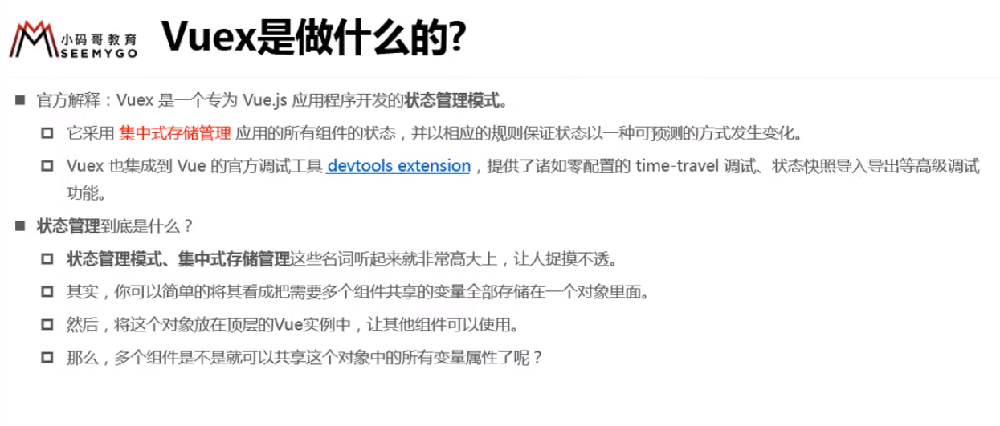

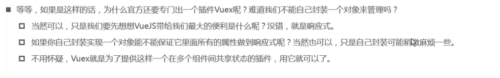

> 在Vuex中保存的状态（数据）是响应式的。


**应用场景👇**

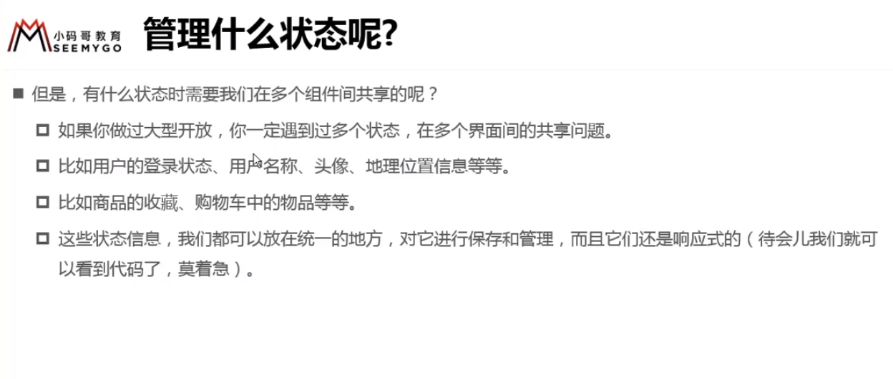

**单个组件的状态管理:**

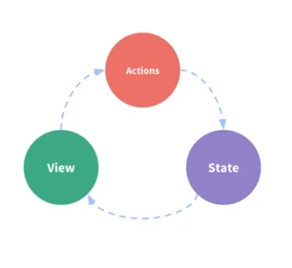

> Vue已经帮我们做好了单个页面的状态管理，即组件的数据是比较独立的，可以通过各种Action的回调函数去修改State（数据），并通过响应式去更新View。
>
> 但如果是多个界面（组件）的状态管理就可能需要Vuex。


**Vuex的基本思想：**

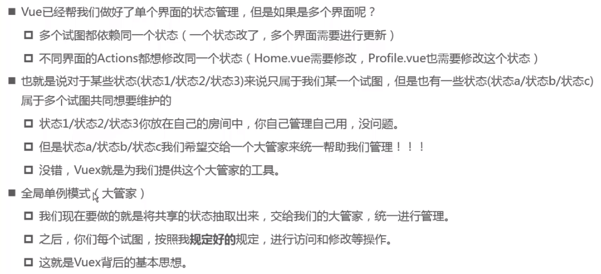

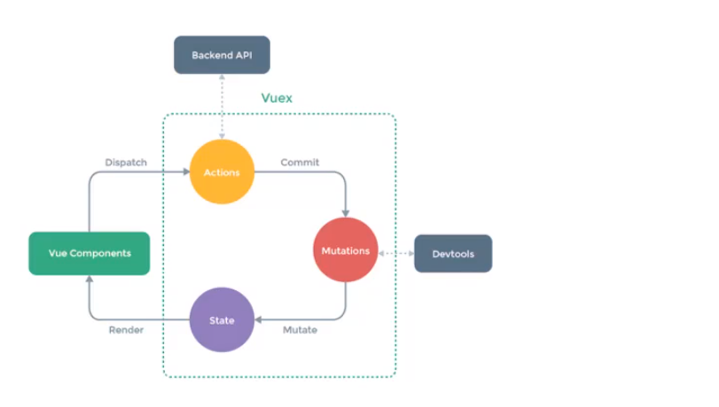


### 什么情况下应该使用Vuex？

Vuex 可以帮助我们管理共享状态，并附带了更多的概念和框架。这需要对短期和长期效益进行权衡。

如果不打算开发大型单页应用，应用够简单，最好不要使用 Vuex。一个简单的 [store 模式](https://cn.vuejs.org/v2/guide/state-management.html#简单状态管理起步使用)就足够了。但是，如果需要构建一个中大型单页应用，就要考虑如何更好地在组件外部管理状态，Vuex 是不错的选择。


### 基本使用

```bash
npm install vuex --save
```

在 Vue 的单页面应用中使用，需要使用`Vue.use(Vuex)`调用插件。

之后新建一个Vuex.Store实例，将其注入到Vue根实例中。

```javascript
import Vuex from 'vuex'
Vue.use(Vuex)
const store = new Vuex.Store({
  state: {
    count: 0
  },
  getter: {
    doneTodos: (state, getters) => {
      return state.todos.filter(todo => todo.done)
    }
  },
  mutations: {
    increment (state, payload) {
      state.count++
    }
  },
  actions: {
    addCount(context) {
      // 可以包含异步操作
      // context 是一个与 store 实例具有相同方法和属性的 context 对象
    }
  }
})
// 注入到根实例
new Vue({
  el: '#app',
  // 把 store 对象提供给 “store” 选项，这可以把 store 的实例注入所有的子组件
  store,
  template: '<App/>',
  components: { App }
})
```

然后通过mutations改变状态：

```javascript
this.$store.commit('increment')
```


> 在项目中使用Vuex，常常在src目录下创建store文件夹统一管理Vuex的单一状态树的内容。

------


### 核心

`State，Getter，Mutation，Action，Module，`

**Vuex 主要有四部分：**

1. state：包含了`store`中存储的各个状态。
2. getter: 类似于 Vue 中的计算属性，根据其他 getter 或 state 计算返回值。
3. mutation: 一组方法，是改变`store`中状态的执行者，**只能是同步操作**。
4. action: 一组方法，其中可以**包含异步操作**,但只允许通过提交mutations修改状态。

------


### state

Vuex 使用 `state` 来存储应用中需要共享的状态。

在根组件（Vue实例）以及子组件中使用`this.$store.state`访问共享状态。

```vue 
// Cpn.vue
/*
	const store = new Vuex.Store({
  		state: {
    		count: 0,
			obj: {name: 'mz', age: 23}
		}
	})
	
*/

<template>
	<div>
        <h2> {{count}} </h2> 
    </div>
</template>

<script>
	export default {
        name: 'Cpn',
        computed: {
            count(){
                return this.$store.state.count  // 访问state中的count
            }
        }
    }
</script>

<style></style>
```

> 在state初始化时就已经定义的数据以及数据的属性才会被添加到响应式系统。
>
> ( 在Vue中所有需要响应式的数据都是这样 )
>
> 所以通过this.$store.state.obj['xxx']的方式为数据添加额外的属性值时，虽然数据确实变化了，但不会更新View。
>
> 此时，需要通过Vue.set方法来修改状态的属性，可以确保数据是响应式的。
>
> Vue.set(obj, propName, value)
>
> 删除状态的属性需要通过Vue.delete方法实现响应式。
>
> Vue.delete(obj, propName)

------


### getters

类似于 Vue 中的 计算属性（可以认为是 store 的计算属性），getter 的返回值会根据它的依赖被缓存起来，且只有当它的依赖值发生了改变才会被重新计算。


getter 方法接受` state `作为其第一个参数，`state`参数即Store对象中的state：

```javascript
const store = new Vuex.Store({
  state: {
    todos: [
      { id: 1, text: '...', done: true },
      { id: 2, text: '...', done: false }
    ]
  },
  getters: {
    doneTodos: state => {
      return state.todos.filter(todo => todo.done)
    }
  }
})
```


getter 方法接受` getters `作为其第二个参数，`getters`参数即Store对象中的getters：

```javascript
const store = new Vuex.Store({
  state: {
    todos: [
      { id: 1, text: '...', done: true },
      { id: 2, text: '...', done: false }
    ]
  },
  getters: {
    doneTodos: state => {
      return state.todos.filter(todo => todo.done);
    },
    doneTodosCount: (state, getters) => {
        return getters.doneTodos.length;
    }
  }
})
```


**在组件中访问getters：**

```javascript
computed: {
    cpnDoneTodos(){
		return this.$store.getters.doneTodos;
	},
	cpnDoneTodosCount(){
		return this.$store.getters.doneTodosCount;	
	}
}
```


**getter方法返回一个函数，实现给getter传参：**

这种做法在对 store 里的数组进行查询时非常有用。

```javascript
getters: {
  // ...
  getTodoById: (state) => (id) => {
    return state.todos.find(todo => todo.id === id)
  }
}
```

在组件中为getter返回的函数传参：

```javascript
$store.getters.getTodoById(2) // -> { id: 2, text: '...', done: false }
```

------


### mutations

在Vuex中约定必须通过mutation修改状态，不允许通过`$store.state.xxx = xxx`的形式直接修改。（虽然这样没什么可怕的后果，只是通过mutation修改能保存修改日志与状态快照）

> `state`和`getter`都是状态值本身，`mutations`才是改变状态的执行者。
>
> **注意：`mutations`只能是同步地更改状态。**


Vuex 中的 mutation 非常类似于事件：每个 mutation 都有一个字符串的 **事件类型 (type)** 和 一个 **回调函数 (handler)**。这个回调函数就是我们实际进行状态更改的地方，并且它会接受 state 作为第一个参数：

```javascript
const store = new Vuex.Store({
  state: {
    count: 1
  },
  mutations: {
    increment (state) {
      // 变更状态
      state.count++
    }
  }
})
```


在组件中提交mutation，并执行回调函数：

```javascript
this.$store.commit('increment')
```

`commit`方法中第一个参数可以是`事件类型名(String)`；

第二个参数是传递的`载荷`，可以作为实参传递给mutation的回调函数，第二个参数`是可选的`。

> 提交mutation时，不可以像发送action一样能够获取mutation回调函数的返回值。
>
> 即在mutation的回调函数中返回值是无意义的。


**规范地提交mutation并传参：**

在规范中，mutation的回调函数支持传入第二个参数payload，作为载荷。载荷中可以保存向mutation回调函数传递的实参。

```javascript
// ...
mutations: {
    increment(state, payload) {
        state.count += payload.n //要求payload是一个对象，其中n为传递的加数
    }
}

```


```javascript
// 推荐的形式1：提交mutation的事件类型，传递载荷，触发回调函数
this.$store.commit('increment', {n: 1}); 👉 传递的实参的值： {n: 1}

// 推荐的形式2：使用对象风格的提交方式，传递参数名与值   
this.$store.commit({
    type: 'increment', 👉 传递的实参的值： {type:'increment', n: 1}
    n: 1
});
```


**向提交简单参数：**

```javascript
// ...
mutations: {
    increment(state, n) {
        state.count += n //要求payload是一个对象，其中n为传递的加数
    }
}
```

```javascript
// 不能再通过对象风格来传递参数
this.$store.commit('increment', 1);
```


> 总结： 在向mutation传递参数时，需要回调函数与提交方式的配合。

------


### actions

想要**异步地更改状态**，就需要使用`action`。`action`并不直接改变`state`，而是发起`mutation`。

> action既可以异步地提交mutation，也可以同步提交，但更主要的是利用它来异步修改状态

**注册一个简单的 action：**

```javascript
const store = new Vuex.Store({
  state: {
    count: 0
  },
  mutations: {
    increment (state) {
      state.count++
    }
  },
  actions: {
    asyncIncrement(context) {
      setTimeout( _ => {
          context.commit('increment')
      }, 1000);
    }
  }
})
```


**发起简单的action：**

发起`action`的方法形式和发起`mutation`一样，只是换了个名字`dispatch`。

```javascript
this.$store.dispatch('asyncIncrement')
```


**Actions 支持同样的载荷方式和对象方式`进行分发`并`传递参数`：**

Action 函数接受一个与 store 实例具有相同方法和属性的 context 对象，因此你可以调用 `context.commit` 提交一个 mutation，或者通过 `context.state` 和 `context.getters` 来获取 state 和 getters。当我们在之后介绍到 `Modules` 时，你就知道 context 对象为什么不是 store 实例本身了。

```javascript
// ...
	mutations:{
      increment(state, payload){
          state.count += payload.n
      }  
    },
	actions: {
      asyncIncrement(context, payload) {
         setTimeout( _ => {
            context.commit('increment', payload)  // 实参的类型要与mutation中的形参一致
         }, 1000);
    }
  }
```

```javascript
// 推荐使用载荷的方式向action传参
this.$store.dispatch('asyncIncrement', {n: 1})

// 不建议使用下面这种对象风格的方式，因为payload形参的type不再是mutation的type，需要进行调整
this.$store.dispatch({
    type: 'asyncIncrement',
    n: 1
})
```

> 可见，向action或mutation传参，以载荷的方式更直观，同时能避免差错。


**对context进行解构：**

实践中，我们会经常用到 ES2015 的 [参数解构](https://github.com/lukehoban/es6features#destructuring) 来简化代码（特别是我们需要调用 `commit` 很多次的时候）：

```javascript
actions: {
  increment ({ commit }) {
    commit('increment')
  }
}
```

> context具有store 实例的相同方法和属性，包括commit, dispatch, getters, state。
>
> 此外还具有rootGetters以及rootState；
>
> 这些属性和方法都可以进行解构获取。
>
> 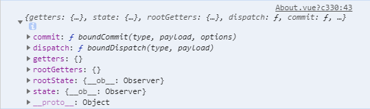 


#### Action处理异步的正确使用方式

想要使用`action`处理异步工作很简单，只需要将异步操作放到`action`中执行（如上面代码中的`setTimeout`）。

要想在异步操作完成后继续进行相应的流程操作，有两种方式:

1. 在action中返回一个Promise

   `store.dispatch`返回相应`action`的执行结果，而当action的处理函数返回的是一个Promise实例时，就可以写成：

   ```javascript
   this.$store.dispatch('actionA').then(() => {
     // ...
   })
   ```

   

   在另外一个 action 中也可以：

   ```javascript
   actions: {
     // ...
     actionB ({ dispatch, commit }) {
       return dispatch('actionA').then(() => {
         commit('someOtherMutation')
       })
     }
   }
   ```


2. 利用`async/await` 进行组合action。代码更加简洁。

   ```javascript
   // 假设 getData() 和 getOtherData() 返回的是 Promise
   
   actions: {
     async actionA ({ commit }) {
       commit('gotData', await getData())
     },
     async actionB ({ dispatch, commit }) {
       await dispatch('actionA') // 等待 actionA 完成
       commit('gotOtherData', await getOtherData())
     }
   }
   ```

   > 一个 `$store.dispatch` 在不同模块中可以触发多个 action 函数。在这种情况下，只有当所有触发函数完成后，返回的 Promise 才会执行。


# 原理

## 数据驱动

 